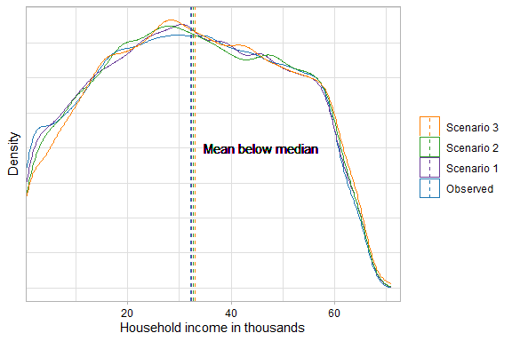
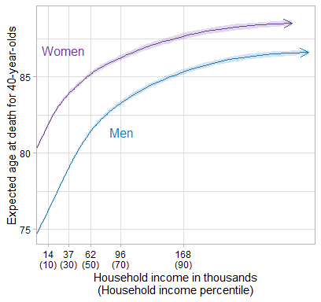
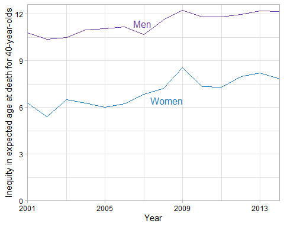

# Overview of primary analyses

## Data and methods

We based these simulations on 2001-2014 household (HH) income and expected age at death data from Chetty et al.'s 2016 JAMA paper (https://healthinequality.org/), EPI's 2017 report on MW violations (https://www.epi.org/publication/employers-steal-billions-from-workers-paychecks-each-year/), and Bernhardt et. al's 2009  report on all forms of wage theft (https://www.nelp.org/publication/broken-laws-unprotected-workers-violations-of-employment-and-labor-laws-in-americas-cities/). First, we fitted an OLS model to Chetty’s pooled 2001-2014 data (200 rows, one for each gender-income percentile), with race-ethnicity-adjusted expected age at death for 40-year-olds (expected age at death) as the dependent variable and a gender * HH income interaction term as the independent variable (with HH income specified as a 7-knot restricted cubic spline), weighted by the frequency counts in the Chetty data. Second, we created a large simulated population (1.4mm - 1/1000th the size of the underlying Chetty sample), with HH income as observed in the Chetty data, counts of respondents at each HH income level and gender stratum as observed in the Chetty data, and expected age at death in each stratum as predicted by the linear model. We also estimated expected age at death in a hypothetical population in which wage theft were eliminated. To do so, we used the same approach, but at each HH income level, we created a hypothetical income variable that added back in workers' stolen wages, and used that hypothetical income variable to predict expected age at death for each respondent in the population. We then estimated the difference in mean expected age at death in the observed versus counterfactual scenarios overall and within income deciles. We also multiplied these mean differences by the total age-40 U.S. population in a given stratum from 2001-2014 (https://usa.ipums.org/usa/) to estimate the Total years extended by our counterfactual scenarios among 40-year-olds in 2014. Finally, we estimated difference in differences (DiD), comparing differences in mean expected age at death in the observed versus counterfactual scenarios in the bottom decile versus in the top decile. We evaluated three scenarios regarding the prevalence and cost of wage theft for each gender and income stratum: 1) wage theft as common and costly as in the EPI data, 2) wage theft ~2.6x as common as in the EPI data, but the same cost (Bernhardt et al. estimated that while 26% of workers had experienced MW violations in the prior week, 68% had experienced any type of wage theft; Bernhardt et al. also estimated that total wage theft costed workers $2936 annually [2016 dollars], about the cost of MW violations alone in the EPI report), and 3) wage theft ~2.6x as common and ~1.7x as costly as in the EPI data (Bernhardt estimated that MW violations contributed to 58% of workers’ total stolen wages).

We estimated standard errors (SEs) for our overall mean expected age at death estimates for a given gender under a given scenario as follows:
<br />
<center> SE~Scenario~=[weighted mean(SE~Chetty~)]/√n </center>
<br />
where the weighted mean is weighted by the frequency counts provided by Chetty et al., SE~Chetty~ is the vector of SEs provided by Chetty et al. for expected age at death at each income percentile for a given gender, and n is the length of the vector. Meanwhile, we estimated SEs for our estimates regarding the difference in mean expected age at death across scenarios (e.g., scenario 1 versus observed scenario) as follows:
<br />  
<center> SE~Difference~=√(SE~Scenario1~^2 + SE~ObservedScenario~^2) </center>
<br />
Likewise, we estimated SEs for the DiD as follows:
<br />  
<center> SE~DiD~=√(SE~DifferenceDecile1~^2 + SE~DifferenceDecile10~^2) </center>
<br />

## Key assumptions regarding relationship between income and expected age at death

* Relationship estimated by Chetty is causal 
* Preventing wage theft would have affected life expectancy solely through income’s direct individual-level effects (e.g., no spillover effects within families, no contextual-level effects, no effects through pathways other than increased income, no loss of means-tested benefits)
* Income itself is what matters for life expectancy rather than income rank
* Those at the top of the income distribution would not have lost income if wage theft were prevented (a minor assumption, given the weak income-mortality association at higher incomes
* Cooper and Kroeger’s estimates apply to the same populations as Chetty et al.’s, including within subgroups


```r
library(tidyverse)
library(rms)
library(here)
library(kableExtra)
library(RColorBrewer)
library(patchwork)
library(directlabels)
library(stringr)
library(ggpubr)
library(nleqslv)
library(data.table)
library(broom)
options(scipen=100000) #prevent scientific notation in plots

#load chetty data
chetty <- read.csv(here('health_ineq_online_table_1.csv'))

#fix and recode some vars
chetty %>%
  mutate(gnd=factor(ifelse(gnd=="M", "Men", "Women"), levels=c("Women", "Men")),
         hh_inc=hh_inc*(352.6/337.3), #adjust Chetty estimates to 2016 dollars from 2012 dollars using CPI-U-RS to match EPI estimates (352.6 is the CPI-U-RS value used by EPI - it's been updated very slightly since then)
         hh_inc_cat=ifelse(hh_inc<10000, "<10000",
                           ifelse(hh_inc>=10000 & hh_inc<25000, "10000-24999",
                                  ifelse(hh_inc>=25000 & hh_inc<40000, "25000-39999",
                                         ifelse(hh_inc>=40000 & hh_inc<60000, "40000-59999",
                                                ifelse(hh_inc>=60000 & hh_inc<99999, "60000-99999",
                                                       ifelse(hh_inc>=100000 & hh_inc<150000, "100000-149999",
                                                              ifelse(hh_inc>=150000, "150000+", "del")))))))) -> chetty

#merge in ACS data on population counts from 2001-2014; restrict to those with non-zero incomes, age 40, and not living in group quarters (per IPUMS recommendation)
fread(here("ACS_IPUMS_2001_2014.csv")) %>%
  filter(FTOTINC>0 & AGE==40 & (GQ==1 | GQ==2)) %>% #family income yields similar estimates to household income, but assume "family income" is closer to Chetty's definition since joint tax filers are likely to be related
  mutate(gnd=ifelse(SEX==1, "Men", "Women")) %>%
  group_by(gnd) %>%
  summarise(ACS_pop=sum(PERWT)) %>%
  right_join(chetty, by="gnd") -> chetty #30-31 million of each gender
```

# Chetty data 

## Sample of data


```r
kable(chetty[1:10,c(1,3:11)], digits=2, format.args = list(big.mark = ",", scientific = FALSE)) %>% 
  kable_styling('striped')
```

<table class="table table-striped" style="margin-left: auto; margin-right: auto;">
 <thead>
  <tr>
   <th style="text-align:left;"> gnd </th>
   <th style="text-align:right;"> pctile </th>
   <th style="text-align:right;"> count </th>
   <th style="text-align:right;"> hh_inc </th>
   <th style="text-align:right;"> hh_inc_age40 </th>
   <th style="text-align:right;"> le_agg </th>
   <th style="text-align:right;"> le_raceadj </th>
   <th style="text-align:right;"> sd_le_agg </th>
   <th style="text-align:right;"> sd_le_raceadj </th>
   <th style="text-align:left;"> hh_inc_cat </th>
  </tr>
 </thead>
<tbody>
  <tr>
   <td style="text-align:left;"> Men </td>
   <td style="text-align:right;"> 1 </td>
   <td style="text-align:right;"> 6,767,752 </td>
   <td style="text-align:right;"> 372.39 </td>
   <td style="text-align:right;"> 284.15 </td>
   <td style="text-align:right;"> 72.37 </td>
   <td style="text-align:right;"> 72.74 </td>
   <td style="text-align:right;"> 0.04 </td>
   <td style="text-align:right;"> 0.06 </td>
   <td style="text-align:left;"> &lt;10000 </td>
  </tr>
  <tr>
   <td style="text-align:left;"> Men </td>
   <td style="text-align:right;"> 2 </td>
   <td style="text-align:right;"> 6,796,273 </td>
   <td style="text-align:right;"> 1,675.55 </td>
   <td style="text-align:right;"> 1,198.62 </td>
   <td style="text-align:right;"> 74.22 </td>
   <td style="text-align:right;"> 74.50 </td>
   <td style="text-align:right;"> 0.05 </td>
   <td style="text-align:right;"> 0.06 </td>
   <td style="text-align:left;"> &lt;10000 </td>
  </tr>
  <tr>
   <td style="text-align:left;"> Men </td>
   <td style="text-align:right;"> 3 </td>
   <td style="text-align:right;"> 6,810,846 </td>
   <td style="text-align:right;"> 3,368.36 </td>
   <td style="text-align:right;"> 2,463.72 </td>
   <td style="text-align:right;"> 75.25 </td>
   <td style="text-align:right;"> 75.45 </td>
   <td style="text-align:right;"> 0.05 </td>
   <td style="text-align:right;"> 0.06 </td>
   <td style="text-align:left;"> &lt;10000 </td>
  </tr>
  <tr>
   <td style="text-align:left;"> Men </td>
   <td style="text-align:right;"> 4 </td>
   <td style="text-align:right;"> 6,819,310 </td>
   <td style="text-align:right;"> 5,127.16 </td>
   <td style="text-align:right;"> 3,878.39 </td>
   <td style="text-align:right;"> 75.69 </td>
   <td style="text-align:right;"> 75.84 </td>
   <td style="text-align:right;"> 0.05 </td>
   <td style="text-align:right;"> 0.06 </td>
   <td style="text-align:left;"> &lt;10000 </td>
  </tr>
  <tr>
   <td style="text-align:left;"> Men </td>
   <td style="text-align:right;"> 5 </td>
   <td style="text-align:right;"> 6,823,613 </td>
   <td style="text-align:right;"> 6,848.59 </td>
   <td style="text-align:right;"> 5,331.47 </td>
   <td style="text-align:right;"> 75.93 </td>
   <td style="text-align:right;"> 76.03 </td>
   <td style="text-align:right;"> 0.05 </td>
   <td style="text-align:right;"> 0.06 </td>
   <td style="text-align:left;"> &lt;10000 </td>
  </tr>
  <tr>
   <td style="text-align:left;"> Men </td>
   <td style="text-align:right;"> 6 </td>
   <td style="text-align:right;"> 6,825,662 </td>
   <td style="text-align:right;"> 8,497.21 </td>
   <td style="text-align:right;"> 6,765.57 </td>
   <td style="text-align:right;"> 76.11 </td>
   <td style="text-align:right;"> 76.18 </td>
   <td style="text-align:right;"> 0.05 </td>
   <td style="text-align:right;"> 0.05 </td>
   <td style="text-align:left;"> &lt;10000 </td>
  </tr>
  <tr>
   <td style="text-align:left;"> Men </td>
   <td style="text-align:right;"> 7 </td>
   <td style="text-align:right;"> 6,829,004 </td>
   <td style="text-align:right;"> 10,089.01 </td>
   <td style="text-align:right;"> 8,171.84 </td>
   <td style="text-align:right;"> 76.23 </td>
   <td style="text-align:right;"> 76.28 </td>
   <td style="text-align:right;"> 0.05 </td>
   <td style="text-align:right;"> 0.06 </td>
   <td style="text-align:left;"> 10000-24999 </td>
  </tr>
  <tr>
   <td style="text-align:left;"> Men </td>
   <td style="text-align:right;"> 8 </td>
   <td style="text-align:right;"> 6,828,386 </td>
   <td style="text-align:right;"> 11,606.49 </td>
   <td style="text-align:right;"> 9,488.64 </td>
   <td style="text-align:right;"> 76.16 </td>
   <td style="text-align:right;"> 76.19 </td>
   <td style="text-align:right;"> 0.05 </td>
   <td style="text-align:right;"> 0.06 </td>
   <td style="text-align:left;"> 10000-24999 </td>
  </tr>
  <tr>
   <td style="text-align:left;"> Men </td>
   <td style="text-align:right;"> 9 </td>
   <td style="text-align:right;"> 6,831,289 </td>
   <td style="text-align:right;"> 13,099.41 </td>
   <td style="text-align:right;"> 10,751.09 </td>
   <td style="text-align:right;"> 76.33 </td>
   <td style="text-align:right;"> 76.35 </td>
   <td style="text-align:right;"> 0.05 </td>
   <td style="text-align:right;"> 0.05 </td>
   <td style="text-align:left;"> 10000-24999 </td>
  </tr>
  <tr>
   <td style="text-align:left;"> Men </td>
   <td style="text-align:right;"> 10 </td>
   <td style="text-align:right;"> 6,834,092 </td>
   <td style="text-align:right;"> 14,566.50 </td>
   <td style="text-align:right;"> 12,055.41 </td>
   <td style="text-align:right;"> 76.38 </td>
   <td style="text-align:right;"> 76.39 </td>
   <td style="text-align:right;"> 0.05 </td>
   <td style="text-align:right;"> 0.06 </td>
   <td style="text-align:left;"> 10000-24999 </td>
  </tr>
</tbody>
</table>

## Observed relationship between income and expected age at death in Chetty data


```r
#labels
xlabels <- c("14\n(10)", "37\n(30)", "62\n(50)", "96\n(70)", "168\n(90)")

ggplot(subset(chetty, hh_inc<311000), aes(x=hh_inc, y=le_raceadj, group=gnd, color=gnd, label=gnd, fill=gnd)) + 
  geom_line(arrow = arrow(length=unit(0.30,"cm"), ends="last", type = "open")) + 
  geom_ribbon(aes(ymin=le_raceadj-1.96*sd_le_raceadj, ymax=le_raceadj+1.96*sd_le_raceadj), alpha=0.2, lty=0) +
  geom_dl(method='smart.grid') +
  scale_color_manual(values=c("#1F78B4", "#6A3D9A")) +
  scale_fill_manual(values=c("#1F78B4", "#6A3D9A")) +
  ylab("Expected age at death for 40-year-olds") + 
  xlab("Household income in thousands\n(Household income percentile)") +
  scale_y_continuous(limits=c(72.5, 89.5), expand=expansion(mult=c(0.0,0.01))) +
  scale_x_continuous(breaks=c(14000, 37000, 62000, 96000, 168000), labels=xlabels, minor_breaks=NULL, expand=expansion(mult=c(0,0.025))) +
  theme_light() +
  theme(legend.position="none", axis.text.x=element_text(color="black"), axis.text.y=element_text(color="black"))
```

<!-- -->

# EPI data on MW violations

The EPI are estimates are based on CPS data from 2013-2015. The estimates in the EPI data and the Chetty data generalize to different populations - the EPI estimates came from a sample of MW-eligible workers (88% of all workers) of any age at each family income level in the 10 largest U.S. cities, while the Chetty estimates are age-40 life expectancy among positive earners in the entire U.S. population at each HH income level.  

The EPI data contains the income-pooled ratio of the prevalence of wage theft among women versus men (4.9% vs 3.5%; similar in NELP data), the gender-pooled prevalence of wage theft among each household income strata, the gender-pooled cost of wage theft among each household income strata, and the gender composition of MW eligible workers (women are 46.6% of MW eligible workers). To calculate the gender-specific prevalence of wage theft among each household income strata, we used simultaneous equations, assuming the overall women/men wage theft prevalence ratio held within income strata. It probably doesn't precisely, since one reason women experience more wage theft than men is that they're segregated into lower-income jobs (although the distribution of family income across genders doesn't vary much). We assumed the cost of wage theft within each household income strata was the same across genders, which the EPI data suggests is approximately true, income aside. 


```r
theft <- read.csv(here('epi_data_national.csv'), fileEncoding="UTF-8-BOM")

#estimate prevalence of theft among women and men within each income category using simultaneous equations
binded <- NULL
for(i in 1:length(theft$gnd_ratio)){
  fn <- function(x){
    eq1 <- x[1]/x[2] - theft$gnd_ratio[i]
    eq2 <- (0.466*x[1] + 0.534*x[2]) -  theft$prop_theft[i]
    return(c(eq1, eq2))
  }
  binded <- rbind(binded, nleqslv(c(1,5), fn)$x)
}

#stack gender-specific datasets
theft <- rbind(theft[,c(1:2,5:6)],
               data.frame(hh_inc_cat=theft$hh_inc_cat, prop_theft=binded[,1], yr_theft=theft$yr_theft, gnd="Women"),
               data.frame(hh_inc_cat=theft$hh_inc_cat, prop_theft=binded[,2], yr_theft=theft$yr_theft, gnd="Men"))

#print
kable(theft, col.names=c("Family income", "Percent wage theft", "Annual underpayment", "Gender"), digits=2, format.args = list(big.mark = ",", scientific = FALSE)) %>% 
  kable_styling("striped") %>%
  group_rows("Overall", 1, 7) %>%
  group_rows("Women (estimated)", 8, 14) %>%
  group_rows("Men (estimated)", 15, 21) %>%
  scroll_box(width = "100%", height = "500px") 
```

<div style="border: 1px solid #ddd; padding: 0px; overflow-y: scroll; height:500px; overflow-x: scroll; width:100%; "><table class="table table-striped" style="margin-left: auto; margin-right: auto;">
 <thead>
  <tr>
   <th style="text-align:left;position: sticky; top:0; background-color: #FFFFFF;"> Family income </th>
   <th style="text-align:right;position: sticky; top:0; background-color: #FFFFFF;"> Percent wage theft </th>
   <th style="text-align:right;position: sticky; top:0; background-color: #FFFFFF;"> Annual underpayment </th>
   <th style="text-align:left;position: sticky; top:0; background-color: #FFFFFF;"> Gender </th>
  </tr>
 </thead>
<tbody>
  <tr grouplength="7"><td colspan="4" style="border-bottom: 1px solid;"><strong>Overall</strong></td></tr>
<tr>
   <td style="text-align:left;padding-left: 2em;" indentlevel="1"> &lt;10000 </td>
   <td style="text-align:right;"> 0.08 </td>
   <td style="text-align:right;"> 3,500 </td>
   <td style="text-align:left;"> Overall </td>
  </tr>
  <tr>
   <td style="text-align:left;padding-left: 2em;" indentlevel="1"> 10000-24999 </td>
   <td style="text-align:right;"> 0.07 </td>
   <td style="text-align:right;"> 3,200 </td>
   <td style="text-align:left;"> Overall </td>
  </tr>
  <tr>
   <td style="text-align:left;padding-left: 2em;" indentlevel="1"> 25000-39999 </td>
   <td style="text-align:right;"> 0.05 </td>
   <td style="text-align:right;"> 3,200 </td>
   <td style="text-align:left;"> Overall </td>
  </tr>
  <tr>
   <td style="text-align:left;padding-left: 2em;" indentlevel="1"> 40000-59999 </td>
   <td style="text-align:right;"> 0.04 </td>
   <td style="text-align:right;"> 3,300 </td>
   <td style="text-align:left;"> Overall </td>
  </tr>
  <tr>
   <td style="text-align:left;padding-left: 2em;" indentlevel="1"> 60000-99999 </td>
   <td style="text-align:right;"> 0.03 </td>
   <td style="text-align:right;"> 3,200 </td>
   <td style="text-align:left;"> Overall </td>
  </tr>
  <tr>
   <td style="text-align:left;padding-left: 2em;" indentlevel="1"> 100000-149999 </td>
   <td style="text-align:right;"> 0.03 </td>
   <td style="text-align:right;"> 3,200 </td>
   <td style="text-align:left;"> Overall </td>
  </tr>
  <tr>
   <td style="text-align:left;padding-left: 2em;" indentlevel="1"> 150000+ </td>
   <td style="text-align:right;"> 0.03 </td>
   <td style="text-align:right;"> 3,700 </td>
   <td style="text-align:left;"> Overall </td>
  </tr>
  <tr grouplength="7"><td colspan="4" style="border-bottom: 1px solid;"><strong>Women (estimated)</strong></td></tr>
<tr>
   <td style="text-align:left;padding-left: 2em;" indentlevel="1"> &lt;10000 </td>
   <td style="text-align:right;"> 0.10 </td>
   <td style="text-align:right;"> 3,500 </td>
   <td style="text-align:left;"> Women </td>
  </tr>
  <tr>
   <td style="text-align:left;padding-left: 2em;" indentlevel="1"> 10000-24999 </td>
   <td style="text-align:right;"> 0.09 </td>
   <td style="text-align:right;"> 3,200 </td>
   <td style="text-align:left;"> Women </td>
  </tr>
  <tr>
   <td style="text-align:left;padding-left: 2em;" indentlevel="1"> 25000-39999 </td>
   <td style="text-align:right;"> 0.06 </td>
   <td style="text-align:right;"> 3,200 </td>
   <td style="text-align:left;"> Women </td>
  </tr>
  <tr>
   <td style="text-align:left;padding-left: 2em;" indentlevel="1"> 40000-59999 </td>
   <td style="text-align:right;"> 0.05 </td>
   <td style="text-align:right;"> 3,300 </td>
   <td style="text-align:left;"> Women </td>
  </tr>
  <tr>
   <td style="text-align:left;padding-left: 2em;" indentlevel="1"> 60000-99999 </td>
   <td style="text-align:right;"> 0.04 </td>
   <td style="text-align:right;"> 3,200 </td>
   <td style="text-align:left;"> Women </td>
  </tr>
  <tr>
   <td style="text-align:left;padding-left: 2em;" indentlevel="1"> 100000-149999 </td>
   <td style="text-align:right;"> 0.03 </td>
   <td style="text-align:right;"> 3,200 </td>
   <td style="text-align:left;"> Women </td>
  </tr>
  <tr>
   <td style="text-align:left;padding-left: 2em;" indentlevel="1"> 150000+ </td>
   <td style="text-align:right;"> 0.03 </td>
   <td style="text-align:right;"> 3,700 </td>
   <td style="text-align:left;"> Women </td>
  </tr>
  <tr grouplength="7"><td colspan="4" style="border-bottom: 1px solid;"><strong>Men (estimated)</strong></td></tr>
<tr>
   <td style="text-align:left;padding-left: 2em;" indentlevel="1"> &lt;10000 </td>
   <td style="text-align:right;"> 0.07 </td>
   <td style="text-align:right;"> 3,500 </td>
   <td style="text-align:left;"> Men </td>
  </tr>
  <tr>
   <td style="text-align:left;padding-left: 2em;" indentlevel="1"> 10000-24999 </td>
   <td style="text-align:right;"> 0.06 </td>
   <td style="text-align:right;"> 3,200 </td>
   <td style="text-align:left;"> Men </td>
  </tr>
  <tr>
   <td style="text-align:left;padding-left: 2em;" indentlevel="1"> 25000-39999 </td>
   <td style="text-align:right;"> 0.04 </td>
   <td style="text-align:right;"> 3,200 </td>
   <td style="text-align:left;"> Men </td>
  </tr>
  <tr>
   <td style="text-align:left;padding-left: 2em;" indentlevel="1"> 40000-59999 </td>
   <td style="text-align:right;"> 0.03 </td>
   <td style="text-align:right;"> 3,300 </td>
   <td style="text-align:left;"> Men </td>
  </tr>
  <tr>
   <td style="text-align:left;padding-left: 2em;" indentlevel="1"> 60000-99999 </td>
   <td style="text-align:right;"> 0.03 </td>
   <td style="text-align:right;"> 3,200 </td>
   <td style="text-align:left;"> Men </td>
  </tr>
  <tr>
   <td style="text-align:left;padding-left: 2em;" indentlevel="1"> 100000-149999 </td>
   <td style="text-align:right;"> 0.02 </td>
   <td style="text-align:right;"> 3,200 </td>
   <td style="text-align:left;"> Men </td>
  </tr>
  <tr>
   <td style="text-align:left;padding-left: 2em;" indentlevel="1"> 150000+ </td>
   <td style="text-align:right;"> 0.02 </td>
   <td style="text-align:right;"> 3,700 </td>
   <td style="text-align:left;"> Men </td>
  </tr>
</tbody>
</table></div>

```r
#merge the EPI and chetty data
merge(chetty, theft, c("hh_inc_cat", "gnd")) %>% 
  arrange(gnd, pctile) -> chetty
```

# Primary analyses 


```r
#scenario function
int_func_primary <- function(prop, inc, scenario){#prop and inc are multipliers for EPI theft prevalence and cost estimates
  
  #seed
  set.seed(4325)
  
  #create sample
  chetty_tot %>%
    group_by(gnd, hh_inc_cat) %>%
    sample_frac(size=prop_theft*prop, replace=F) %>%
    mutate(hh_inc_rev=hh_inc + inc*yr_theft) %>%
    ungroup() %>% 
    dplyr::select('id', 'hh_inc_rev') -> chetty_samps
  
  #create hypothetical income variable
  chetty_tot %>%
    left_join(chetty_samps, by='id') %>%
    mutate(hh_inc=ifelse(!is.na(hh_inc_rev), hh_inc_rev, hh_inc)) %>%
    dplyr::select(-hh_inc_rev) -> chetty_tot_int
  
  #simulate LE using fitted model and hypothetical income 
  int1 <- cbind(chetty_tot_int, data.frame(sim_1=predict(fit, newdata = chetty_tot_int, type="response")), data.frame(type=scenario))
}

#7 spline knots since underlying data are based on over a billion observations; 7 is upper bound of what Harrell suggests  
knots_7 <- as.numeric(quantile(chetty$hh_inc, c(.025, .1833, .3417, .5, .6583, .8167, .975)))

#fit models to Chetty data to interpolate across chunky income values and smooth across random dips
fit <- lm(le_raceadj ~ rcs(hh_inc, parms=knots_7)*gnd, data=chetty, w=count)

#create large expanded Chetty dataset -> we'll use this to get weighed average estimates for our various scenarios
data.frame(pctile=rep(chetty$pctile, chetty$count/1000), 
           hh_inc=rep(chetty$hh_inc, chetty$count/1000),
           hh_inc_cat=rep(chetty$hh_inc_cat, chetty$count/1000),
           prop_theft=rep(chetty$prop_theft, chetty$count/1000),
           yr_theft=rep(chetty$yr_theft, chetty$count/1000),
           gnd=rep(chetty$gnd, chetty$count/1000),
           sd=rep(chetty$sd_le_raceadj, chetty$count/1000),
           ACS_pop=rep(chetty$ACS_pop, chetty$count/1000)) %>%
  mutate(id=row_number()) -> chetty_tot

#observed income-LE relationship from fitted model
obs <- cbind(chetty_tot, data.frame(sim_1=predict(fit, newdata = chetty_tot, type="response")), data.frame(type="Observed"))

#predicted LE under hypothetical scenarios
int1 <- int_func_primary(prop=1, inc=1, scenario="Scenario 1")
int2 <- int_func_primary(prop=(68/26), inc=1, scenario="Scenario 2")
int3 <- int_func_primary(prop=(68/26), inc=(1/0.58), scenario="Scenario 3")

#bind together
binded <- rbind(obs, int1, int2, int3)
```

## Model output


```r
tidy(fit) %>%
  dplyr::select(c(term, estimate, std.error, p.value)) %>%
  mutate(estimate=ifelse(term=="gndWomen" | term=="(Intercept)", estimate, estimate*1000),
         std.error=ifelse(term=="gndWomen" | term=="(Intercept)", std.error, std.error*1000)) %>%
  kable(digits=2, caption="Income coefficients correspond to effects of changes in 1000s of dollars") %>%
  kable_styling("striped")
```

<table class="table table-striped" style="margin-left: auto; margin-right: auto;">
<caption>Income coefficients correspond to effects of changes in 1000s of dollars</caption>
 <thead>
  <tr>
   <th style="text-align:left;"> term </th>
   <th style="text-align:right;"> estimate </th>
   <th style="text-align:right;"> std.error </th>
   <th style="text-align:right;"> p.value </th>
  </tr>
 </thead>
<tbody>
  <tr>
   <td style="text-align:left;"> (Intercept) </td>
   <td style="text-align:right;"> 74.57 </td>
   <td style="text-align:right;"> 0.11 </td>
   <td style="text-align:right;"> 0.00 </td>
  </tr>
  <tr>
   <td style="text-align:left;"> rcs(hh_inc, parms = knots_7)hh_inc </td>
   <td style="text-align:right;"> 0.12 </td>
   <td style="text-align:right;"> 0.01 </td>
   <td style="text-align:right;"> 0.00 </td>
  </tr>
  <tr>
   <td style="text-align:left;"> rcs(hh_inc, parms = knots_7)hh_inc' </td>
   <td style="text-align:right;"> 0.06 </td>
   <td style="text-align:right;"> 0.86 </td>
   <td style="text-align:right;"> 0.95 </td>
  </tr>
  <tr>
   <td style="text-align:left;"> rcs(hh_inc, parms = knots_7)hh_inc'' </td>
   <td style="text-align:right;"> -2.04 </td>
   <td style="text-align:right;"> 2.82 </td>
   <td style="text-align:right;"> 0.47 </td>
  </tr>
  <tr>
   <td style="text-align:left;"> rcs(hh_inc, parms = knots_7)hh_inc''' </td>
   <td style="text-align:right;"> 2.03 </td>
   <td style="text-align:right;"> 3.40 </td>
   <td style="text-align:right;"> 0.55 </td>
  </tr>
  <tr>
   <td style="text-align:left;"> rcs(hh_inc, parms = knots_7)hh_inc'''' </td>
   <td style="text-align:right;"> 0.81 </td>
   <td style="text-align:right;"> 2.08 </td>
   <td style="text-align:right;"> 0.70 </td>
  </tr>
  <tr>
   <td style="text-align:left;"> rcs(hh_inc, parms = knots_7)hh_inc''''' </td>
   <td style="text-align:right;"> -0.69 </td>
   <td style="text-align:right;"> 0.73 </td>
   <td style="text-align:right;"> 0.35 </td>
  </tr>
  <tr>
   <td style="text-align:left;"> gndWomen </td>
   <td style="text-align:right;"> 5.66 </td>
   <td style="text-align:right;"> 0.16 </td>
   <td style="text-align:right;"> 0.00 </td>
  </tr>
  <tr>
   <td style="text-align:left;"> rcs(hh_inc, parms = knots_7)hh_inc:gndWomen </td>
   <td style="text-align:right;"> 0.00 </td>
   <td style="text-align:right;"> 0.01 </td>
   <td style="text-align:right;"> 0.92 </td>
  </tr>
  <tr>
   <td style="text-align:left;"> rcs(hh_inc, parms = knots_7)hh_inc':gndWomen </td>
   <td style="text-align:right;"> -3.33 </td>
   <td style="text-align:right;"> 1.19 </td>
   <td style="text-align:right;"> 0.01 </td>
  </tr>
  <tr>
   <td style="text-align:left;"> rcs(hh_inc, parms = knots_7)hh_inc'':gndWomen </td>
   <td style="text-align:right;"> 8.82 </td>
   <td style="text-align:right;"> 3.90 </td>
   <td style="text-align:right;"> 0.02 </td>
  </tr>
  <tr>
   <td style="text-align:left;"> rcs(hh_inc, parms = knots_7)hh_inc''':gndWomen </td>
   <td style="text-align:right;"> -6.29 </td>
   <td style="text-align:right;"> 4.72 </td>
   <td style="text-align:right;"> 0.18 </td>
  </tr>
  <tr>
   <td style="text-align:left;"> rcs(hh_inc, parms = knots_7)hh_inc'''':gndWomen </td>
   <td style="text-align:right;"> 0.61 </td>
   <td style="text-align:right;"> 2.91 </td>
   <td style="text-align:right;"> 0.83 </td>
  </tr>
  <tr>
   <td style="text-align:left;"> rcs(hh_inc, parms = knots_7)hh_inc''''':gndWomen </td>
   <td style="text-align:right;"> 0.01 </td>
   <td style="text-align:right;"> 1.02 </td>
   <td style="text-align:right;"> 0.99 </td>
  </tr>
</tbody>
</table>

```r
glance(fit) %>%
  kable(digits=3) %>%
  kable_styling("striped")
```

<table class="table table-striped" style="margin-left: auto; margin-right: auto;">
 <thead>
  <tr>
   <th style="text-align:right;"> r.squared </th>
   <th style="text-align:right;"> adj.r.squared </th>
   <th style="text-align:right;"> sigma </th>
   <th style="text-align:right;"> statistic </th>
   <th style="text-align:right;"> p.value </th>
   <th style="text-align:right;"> df </th>
   <th style="text-align:right;"> logLik </th>
   <th style="text-align:right;"> AIC </th>
   <th style="text-align:right;"> BIC </th>
   <th style="text-align:right;"> deviance </th>
   <th style="text-align:right;"> df.residual </th>
   <th style="text-align:right;"> nobs </th>
  </tr>
 </thead>
<tbody>
  <tr>
   <td style="text-align:right;"> 0.996 </td>
   <td style="text-align:right;"> 0.995 </td>
   <td style="text-align:right;"> 606.707 </td>
   <td style="text-align:right;"> 3200.633 </td>
   <td style="text-align:right;"> 0 </td>
   <td style="text-align:right;"> 13 </td>
   <td style="text-align:right;"> 18.571 </td>
   <td style="text-align:right;"> -7.142 </td>
   <td style="text-align:right;"> 42.333 </td>
   <td style="text-align:right;"> 68465344 </td>
   <td style="text-align:right;"> 186 </td>
   <td style="text-align:right;"> 200 </td>
  </tr>
</tbody>
</table>

## Density of income distribution below median across scenarios 


```r
#estimate mean income in each scenario in bottom half of income distribution
#don't need to sample everyone for geom_density, and not doing so speeds things up a bunch
binded %>%
  filter(pctile<=50) %>%
  group_by(type) %>%
  summarise(mean_hh_inc=mean(hh_inc)) %>%
  left_join(binded, 'type') %>%
  sample_frac(0.05, replace=F) -> binded_sub

#plot
ggplot(subset(binded_sub, pctile<=50), aes(x=hh_inc/1000)) +
  geom_density(aes(color=type, group=type)) +
  geom_text(aes(x=46, y=0.01, label="Mean below median")) +
  geom_vline(aes(xintercept=mean_hh_inc/1000, group=type, color=type), lty=2) +
  xlab("Household income in thousands") +
  ylab("Density") +
  scale_color_manual(values=c("#1F78B4", "#6A3D9A", "#33A02C", "#FF7F00")) +
  scale_x_continuous(expand=expansion(mult=c(0,0.025))) +
  theme_light() +
  theme(legend.title=element_blank(), axis.text.y=element_blank(), axis.ticks.y=element_blank(), axis.text.x=element_text(color="black"),
        strip.background=element_rect(color="darkgrey", fill=NA), strip.text=element_text(color="black")) + 
  guides(color=guide_legend(reverse=T), fill=guide_legend(reverse=T))
```

<!-- -->

## Estimated relationship between income and expected age at death under observed scenario


```r
#remove duplicated rows since they're identical for each income level
obs %>% 
  filter(!duplicated(paste(gnd, pctile))) -> obs_sub

#labels
xlabels <- c("14\n(10)", "37\n(30)", "62\n(50)", "96\n(70)", "168\n(90)")

ggplot(subset(obs_sub, hh_inc<311000), aes(x=hh_inc, y=sim_1, group=gnd, color=gnd, label=gnd, fill=gnd)) + 
  geom_line(arrow = arrow(length=unit(0.30,"cm"), ends="last", type = "open")) + 
  geom_ribbon(aes(ymin=sim_1 - 1.96 * sd, ymax=sim_1 + 1.96 * sd), alpha=0.2, lty=0) +
  geom_dl(method='smart.grid') +
  scale_color_manual(values=c("#1F78B4", "#6A3D9A")) +
  scale_fill_manual(values=c("#1F78B4", "#6A3D9A")) +
  ylab("Expected age at death for 40-year-olds") + 
  xlab("Household income in thousands\n(Household income percentile)") +
  scale_y_continuous(limits=c(74, 89.5), expand=expansion(mult=c(0.0,0.01))) +
  scale_x_continuous(breaks=c(14000, 37000, 62000, 96000, 168000), labels=xlabels, minor_breaks=NULL, expand=expansion(mult=c(0,0.025))) +
  theme_light() +
  theme(legend.position="none", axis.text.x=element_text(color="black"), axis.text.y=element_text(color="black"))
```

<!-- -->

```r
ggsave('fig_1.jpg', height=4, width=4.25, dpi=600)
```

## Point estimates


```r
#point estimates function
point_ests <- function(pctiled1, pctiled2, rooted, fractioned){
  binded %>% 
    filter(pctile<=pctiled1) %>%
    filter(pctile>=pctiled2) %>%
    group_by(type, gnd) %>%
    summarise(meaned=mean(sim_1),
              sdd=mean(sd),
              ACS_pop=mean(ACS_pop)) %>%
    ungroup() %>%
    arrange(desc(gnd), type) %>%   
    group_by(gnd) %>%
    mutate(meaned=meaned, #SE for mean expected age at death is mean SE divided by sqrt of number of SE estimates [mean(SE)/sqrt(number of SE estimates, e.g., 100 in full sample; 10 w/in deciles)] 
           meaned_lower=meaned-(1.96 * (sdd/sqrt(rooted))),
           meaned_upper=meaned+(1.96 * (sdd/sqrt(rooted))),
           diff=meaned-first(meaned), #SE for difference in mean expected age at death is sqrt(2)*[mean(SE)/sqrt(number of SE estimates)] (reduced from formula for SE of diff: sqrt[(SE 1st)^2*(SE 2nd)^2])  
           diff_lower=diff-(1.96 * (sqrt(2)*(sdd/sqrt(rooted)))),
           diff_upper=diff+(1.96 * (sqrt(2)*(sdd/sqrt(rooted)))),
           diff_pop=diff*ACS_pop*fractioned,
           diff_lower_pop=diff_lower*ACS_pop*fractioned,
           diff_upper_pop=diff_upper*ACS_pop*fractioned) %>% 
    dplyr::select('gnd', 'type', 'meaned', 'meaned_lower', 'meaned_upper', 'diff', 'diff_lower', "diff_upper", 'diff_pop', 'diff_lower_pop', "diff_upper_pop")
}

#DiD function
did_ests <- function(datted=chetty){
  cbind(affected, unaffected) %>%
    filter(type...2 != "Observed") %>%
    right_join(datted[c(1,101),c("ACS_pop", "gnd")], by=c('gnd...1'='gnd')) %>%
    mutate(se_d1=(diff...6-diff_lower...7)/1.96,
           se_d10=(diff...17-diff_lower...18)/1.96,
           did=diff...6-diff...17,
           did_lower=did-1.96*sqrt(se_d1^2+se_d10^2),
           did_upper=did+1.96*sqrt(se_d1^2+se_d10^2),
           did_pop=did*ACS_pop*0.10,
           did_lower_pop=did_lower*ACS_pop*0.10,
           did_upper_pop=did_upper*ACS_pop*0.10) %>%
    select(gnd...1, type...2, did, did_lower, did_upper, did_pop, did_lower_pop, did_upper_pop) %>%
    rename(gnd=gnd...1, type=type...2)
}

#point estimates for difference in mean expected age at death across scenarios
overall <- point_ests(pctiled1=100, pctiled2=1, rooted=100, fractioned=1)

#point estimates for difference in mean expected age at death across scenarios within affected group
affected <- point_ests(pctiled1=10, pctiled2=1, rooted=10, fractioned=0.1)

#point estimates for difference in mean expected age at death across scenarios within unaffected group
unaffected <- point_ests(pctiled1=100, pctiled2=91, rooted=10, fractioned=0.1)

#DiD ests
did <- did_ests()

#print point ests
kable(rbind(overall, affected, unaffected), digits=c(2,2,2,2,2,2,2,2,0,0,0), format.args = list(big.mark = ",", scientific = FALSE),
      col.names=c("", "Scenario", "Estimate", "Lower", "Upper", "Estimate", "Lower", "Upper", "Estimate", "Lower", "Upper")) %>%
  kable_styling("striped") %>%
  add_header_above(c(" "=2, "Mean expected age at death"=3, "Diff in expected age at death"=3, "Total years extended"=3)) %>%
  group_rows("Overall", 1, 8) %>%
  group_rows("Lower HH income decile", 9, 16) %>%
  group_rows("Upper HH income decile", 17, 24)
```

<table class="table table-striped" style="margin-left: auto; margin-right: auto;">
 <thead>
<tr>
<th style="empty-cells: hide;border-bottom:hidden;" colspan="2"></th>
<th style="border-bottom:hidden;padding-bottom:0; padding-left:3px;padding-right:3px;text-align: center; " colspan="3"><div style="border-bottom: 1px solid #ddd; padding-bottom: 5px; ">Mean expected age at death</div></th>
<th style="border-bottom:hidden;padding-bottom:0; padding-left:3px;padding-right:3px;text-align: center; " colspan="3"><div style="border-bottom: 1px solid #ddd; padding-bottom: 5px; ">Diff in expected age at death</div></th>
<th style="border-bottom:hidden;padding-bottom:0; padding-left:3px;padding-right:3px;text-align: center; " colspan="3"><div style="border-bottom: 1px solid #ddd; padding-bottom: 5px; ">Total years extended</div></th>
</tr>
  <tr>
   <th style="text-align:left;">  </th>
   <th style="text-align:left;"> Scenario </th>
   <th style="text-align:right;"> Estimate </th>
   <th style="text-align:right;"> Lower </th>
   <th style="text-align:right;"> Upper </th>
   <th style="text-align:right;"> Estimate </th>
   <th style="text-align:right;"> Lower </th>
   <th style="text-align:right;"> Upper </th>
   <th style="text-align:right;"> Estimate </th>
   <th style="text-align:right;"> Lower </th>
   <th style="text-align:right;"> Upper </th>
  </tr>
 </thead>
<tbody>
  <tr grouplength="8"><td colspan="11" style="border-bottom: 1px solid;"><strong>Overall</strong></td></tr>
<tr>
   <td style="text-align:left;padding-left: 2em;" indentlevel="1"> Women </td>
   <td style="text-align:left;"> Observed </td>
   <td style="text-align:right;"> 84.93 </td>
   <td style="text-align:right;"> 84.91 </td>
   <td style="text-align:right;"> 84.95 </td>
   <td style="text-align:right;"> 0.00 </td>
   <td style="text-align:right;"> -0.02 </td>
   <td style="text-align:right;"> 0.02 </td>
   <td style="text-align:right;"> 0 </td>
   <td style="text-align:right;"> -696,558 </td>
   <td style="text-align:right;"> 696,558 </td>
  </tr>
  <tr>
   <td style="text-align:left;padding-left: 2em;" indentlevel="1"> Women </td>
   <td style="text-align:left;"> Scenario 1 </td>
   <td style="text-align:right;"> 84.94 </td>
   <td style="text-align:right;"> 84.93 </td>
   <td style="text-align:right;"> 84.96 </td>
   <td style="text-align:right;"> 0.01 </td>
   <td style="text-align:right;"> -0.01 </td>
   <td style="text-align:right;"> 0.03 </td>
   <td style="text-align:right;"> 333,163 </td>
   <td style="text-align:right;"> -363,395 </td>
   <td style="text-align:right;"> 1,029,721 </td>
  </tr>
  <tr>
   <td style="text-align:left;padding-left: 2em;" indentlevel="1"> Women </td>
   <td style="text-align:left;"> Scenario 2 </td>
   <td style="text-align:right;"> 84.96 </td>
   <td style="text-align:right;"> 84.94 </td>
   <td style="text-align:right;"> 84.97 </td>
   <td style="text-align:right;"> 0.03 </td>
   <td style="text-align:right;"> 0.01 </td>
   <td style="text-align:right;"> 0.05 </td>
   <td style="text-align:right;"> 871,072 </td>
   <td style="text-align:right;"> 174,513 </td>
   <td style="text-align:right;"> 1,567,630 </td>
  </tr>
  <tr>
   <td style="text-align:left;padding-left: 2em;" indentlevel="1"> Women </td>
   <td style="text-align:left;"> Scenario 3 </td>
   <td style="text-align:right;"> 84.98 </td>
   <td style="text-align:right;"> 84.96 </td>
   <td style="text-align:right;"> 84.99 </td>
   <td style="text-align:right;"> 0.05 </td>
   <td style="text-align:right;"> 0.02 </td>
   <td style="text-align:right;"> 0.07 </td>
   <td style="text-align:right;"> 1,471,717 </td>
   <td style="text-align:right;"> 775,159 </td>
   <td style="text-align:right;"> 2,168,275 </td>
  </tr>
  <tr>
   <td style="text-align:left;padding-left: 2em;" indentlevel="1"> Men </td>
   <td style="text-align:left;"> Observed </td>
   <td style="text-align:right;"> 81.28 </td>
   <td style="text-align:right;"> 81.27 </td>
   <td style="text-align:right;"> 81.30 </td>
   <td style="text-align:right;"> 0.00 </td>
   <td style="text-align:right;"> -0.02 </td>
   <td style="text-align:right;"> 0.02 </td>
   <td style="text-align:right;"> 0 </td>
   <td style="text-align:right;"> -593,409 </td>
   <td style="text-align:right;"> 593,409 </td>
  </tr>
  <tr>
   <td style="text-align:left;padding-left: 2em;" indentlevel="1"> Men </td>
   <td style="text-align:left;"> Scenario 1 </td>
   <td style="text-align:right;"> 81.29 </td>
   <td style="text-align:right;"> 81.28 </td>
   <td style="text-align:right;"> 81.30 </td>
   <td style="text-align:right;"> 0.01 </td>
   <td style="text-align:right;"> -0.01 </td>
   <td style="text-align:right;"> 0.03 </td>
   <td style="text-align:right;"> 294,502 </td>
   <td style="text-align:right;"> -298,906 </td>
   <td style="text-align:right;"> 887,911 </td>
  </tr>
  <tr>
   <td style="text-align:left;padding-left: 2em;" indentlevel="1"> Men </td>
   <td style="text-align:left;"> Scenario 2 </td>
   <td style="text-align:right;"> 81.31 </td>
   <td style="text-align:right;"> 81.29 </td>
   <td style="text-align:right;"> 81.32 </td>
   <td style="text-align:right;"> 0.02 </td>
   <td style="text-align:right;"> 0.01 </td>
   <td style="text-align:right;"> 0.04 </td>
   <td style="text-align:right;"> 770,457 </td>
   <td style="text-align:right;"> 177,048 </td>
   <td style="text-align:right;"> 1,363,866 </td>
  </tr>
  <tr>
   <td style="text-align:left;padding-left: 2em;" indentlevel="1"> Men </td>
   <td style="text-align:left;"> Scenario 3 </td>
   <td style="text-align:right;"> 81.32 </td>
   <td style="text-align:right;"> 81.31 </td>
   <td style="text-align:right;"> 81.34 </td>
   <td style="text-align:right;"> 0.04 </td>
   <td style="text-align:right;"> 0.02 </td>
   <td style="text-align:right;"> 0.06 </td>
   <td style="text-align:right;"> 1,317,428 </td>
   <td style="text-align:right;"> 724,019 </td>
   <td style="text-align:right;"> 1,910,837 </td>
  </tr>
  <tr grouplength="8"><td colspan="11" style="border-bottom: 1px solid;"><strong>Lower HH income decile</strong></td></tr>
<tr>
   <td style="text-align:left;padding-left: 2em;" indentlevel="1"> Women </td>
   <td style="text-align:left;"> Observed </td>
   <td style="text-align:right;"> 81.16 </td>
   <td style="text-align:right;"> 81.12 </td>
   <td style="text-align:right;"> 81.20 </td>
   <td style="text-align:right;"> 0.00 </td>
   <td style="text-align:right;"> -0.06 </td>
   <td style="text-align:right;"> 0.06 </td>
   <td style="text-align:right;"> 0 </td>
   <td style="text-align:right;"> -182,668 </td>
   <td style="text-align:right;"> 182,668 </td>
  </tr>
  <tr>
   <td style="text-align:left;padding-left: 2em;" indentlevel="1"> Women </td>
   <td style="text-align:left;"> Scenario 1 </td>
   <td style="text-align:right;"> 81.20 </td>
   <td style="text-align:right;"> 81.16 </td>
   <td style="text-align:right;"> 81.24 </td>
   <td style="text-align:right;"> 0.04 </td>
   <td style="text-align:right;"> -0.02 </td>
   <td style="text-align:right;"> 0.10 </td>
   <td style="text-align:right;"> 119,848 </td>
   <td style="text-align:right;"> -62,819 </td>
   <td style="text-align:right;"> 302,516 </td>
  </tr>
  <tr>
   <td style="text-align:left;padding-left: 2em;" indentlevel="1"> Women </td>
   <td style="text-align:left;"> Scenario 2 </td>
   <td style="text-align:right;"> 81.26 </td>
   <td style="text-align:right;"> 81.22 </td>
   <td style="text-align:right;"> 81.30 </td>
   <td style="text-align:right;"> 0.10 </td>
   <td style="text-align:right;"> 0.04 </td>
   <td style="text-align:right;"> 0.16 </td>
   <td style="text-align:right;"> 309,916 </td>
   <td style="text-align:right;"> 127,248 </td>
   <td style="text-align:right;"> 492,583 </td>
  </tr>
  <tr>
   <td style="text-align:left;padding-left: 2em;" indentlevel="1"> Women </td>
   <td style="text-align:left;"> Scenario 3 </td>
   <td style="text-align:right;"> 81.33 </td>
   <td style="text-align:right;"> 81.29 </td>
   <td style="text-align:right;"> 81.37 </td>
   <td style="text-align:right;"> 0.17 </td>
   <td style="text-align:right;"> 0.11 </td>
   <td style="text-align:right;"> 0.22 </td>
   <td style="text-align:right;"> 528,685 </td>
   <td style="text-align:right;"> 346,018 </td>
   <td style="text-align:right;"> 711,353 </td>
  </tr>
  <tr>
   <td style="text-align:left;padding-left: 2em;" indentlevel="1"> Men </td>
   <td style="text-align:left;"> Observed </td>
   <td style="text-align:right;"> 75.48 </td>
   <td style="text-align:right;"> 75.44 </td>
   <td style="text-align:right;"> 75.51 </td>
   <td style="text-align:right;"> 0.00 </td>
   <td style="text-align:right;"> -0.05 </td>
   <td style="text-align:right;"> 0.05 </td>
   <td style="text-align:right;"> 0 </td>
   <td style="text-align:right;"> -150,872 </td>
   <td style="text-align:right;"> 150,872 </td>
  </tr>
  <tr>
   <td style="text-align:left;padding-left: 2em;" indentlevel="1"> Men </td>
   <td style="text-align:left;"> Scenario 1 </td>
   <td style="text-align:right;"> 75.50 </td>
   <td style="text-align:right;"> 75.47 </td>
   <td style="text-align:right;"> 75.54 </td>
   <td style="text-align:right;"> 0.03 </td>
   <td style="text-align:right;"> -0.02 </td>
   <td style="text-align:right;"> 0.08 </td>
   <td style="text-align:right;"> 84,130 </td>
   <td style="text-align:right;"> -66,742 </td>
   <td style="text-align:right;"> 235,003 </td>
  </tr>
  <tr>
   <td style="text-align:left;padding-left: 2em;" indentlevel="1"> Men </td>
   <td style="text-align:left;"> Scenario 2 </td>
   <td style="text-align:right;"> 75.55 </td>
   <td style="text-align:right;"> 75.51 </td>
   <td style="text-align:right;"> 75.58 </td>
   <td style="text-align:right;"> 0.07 </td>
   <td style="text-align:right;"> 0.02 </td>
   <td style="text-align:right;"> 0.12 </td>
   <td style="text-align:right;"> 220,652 </td>
   <td style="text-align:right;"> 69,780 </td>
   <td style="text-align:right;"> 371,524 </td>
  </tr>
  <tr>
   <td style="text-align:left;padding-left: 2em;" indentlevel="1"> Men </td>
   <td style="text-align:left;"> Scenario 3 </td>
   <td style="text-align:right;"> 75.60 </td>
   <td style="text-align:right;"> 75.57 </td>
   <td style="text-align:right;"> 75.63 </td>
   <td style="text-align:right;"> 0.12 </td>
   <td style="text-align:right;"> 0.07 </td>
   <td style="text-align:right;"> 0.17 </td>
   <td style="text-align:right;"> 380,502 </td>
   <td style="text-align:right;"> 229,630 </td>
   <td style="text-align:right;"> 531,374 </td>
  </tr>
  <tr grouplength="8"><td colspan="11" style="border-bottom: 1px solid;"><strong>Upper HH income decile</strong></td></tr>
<tr>
   <td style="text-align:left;padding-left: 2em;" indentlevel="1"> Women </td>
   <td style="text-align:left;"> Observed </td>
   <td style="text-align:right;"> 88.29 </td>
   <td style="text-align:right;"> 88.23 </td>
   <td style="text-align:right;"> 88.35 </td>
   <td style="text-align:right;"> 0.00 </td>
   <td style="text-align:right;"> -0.09 </td>
   <td style="text-align:right;"> 0.09 </td>
   <td style="text-align:right;"> 0 </td>
   <td style="text-align:right;"> -269,771 </td>
   <td style="text-align:right;"> 269,771 </td>
  </tr>
  <tr>
   <td style="text-align:left;padding-left: 2em;" indentlevel="1"> Women </td>
   <td style="text-align:left;"> Scenario 1 </td>
   <td style="text-align:right;"> 88.29 </td>
   <td style="text-align:right;"> 88.23 </td>
   <td style="text-align:right;"> 88.35 </td>
   <td style="text-align:right;"> 0.00 </td>
   <td style="text-align:right;"> -0.08 </td>
   <td style="text-align:right;"> 0.09 </td>
   <td style="text-align:right;"> 1,995 </td>
   <td style="text-align:right;"> -267,775 </td>
   <td style="text-align:right;"> 271,766 </td>
  </tr>
  <tr>
   <td style="text-align:left;padding-left: 2em;" indentlevel="1"> Women </td>
   <td style="text-align:left;"> Scenario 2 </td>
   <td style="text-align:right;"> 88.29 </td>
   <td style="text-align:right;"> 88.23 </td>
   <td style="text-align:right;"> 88.35 </td>
   <td style="text-align:right;"> 0.00 </td>
   <td style="text-align:right;"> -0.08 </td>
   <td style="text-align:right;"> 0.09 </td>
   <td style="text-align:right;"> 5,088 </td>
   <td style="text-align:right;"> -264,683 </td>
   <td style="text-align:right;"> 274,859 </td>
  </tr>
  <tr>
   <td style="text-align:left;padding-left: 2em;" indentlevel="1"> Women </td>
   <td style="text-align:left;"> Scenario 3 </td>
   <td style="text-align:right;"> 88.29 </td>
   <td style="text-align:right;"> 88.23 </td>
   <td style="text-align:right;"> 88.35 </td>
   <td style="text-align:right;"> 0.00 </td>
   <td style="text-align:right;"> -0.08 </td>
   <td style="text-align:right;"> 0.09 </td>
   <td style="text-align:right;"> 8,622 </td>
   <td style="text-align:right;"> -261,149 </td>
   <td style="text-align:right;"> 278,392 </td>
  </tr>
  <tr>
   <td style="text-align:left;padding-left: 2em;" indentlevel="1"> Men </td>
   <td style="text-align:left;"> Observed </td>
   <td style="text-align:right;"> 86.35 </td>
   <td style="text-align:right;"> 86.30 </td>
   <td style="text-align:right;"> 86.40 </td>
   <td style="text-align:right;"> 0.00 </td>
   <td style="text-align:right;"> -0.07 </td>
   <td style="text-align:right;"> 0.07 </td>
   <td style="text-align:right;"> 0 </td>
   <td style="text-align:right;"> -228,262 </td>
   <td style="text-align:right;"> 228,262 </td>
  </tr>
  <tr>
   <td style="text-align:left;padding-left: 2em;" indentlevel="1"> Men </td>
   <td style="text-align:left;"> Scenario 1 </td>
   <td style="text-align:right;"> 86.35 </td>
   <td style="text-align:right;"> 86.30 </td>
   <td style="text-align:right;"> 86.40 </td>
   <td style="text-align:right;"> 0.00 </td>
   <td style="text-align:right;"> -0.07 </td>
   <td style="text-align:right;"> 0.07 </td>
   <td style="text-align:right;"> 1,641 </td>
   <td style="text-align:right;"> -226,620 </td>
   <td style="text-align:right;"> 229,903 </td>
  </tr>
  <tr>
   <td style="text-align:left;padding-left: 2em;" indentlevel="1"> Men </td>
   <td style="text-align:left;"> Scenario 2 </td>
   <td style="text-align:right;"> 86.35 </td>
   <td style="text-align:right;"> 86.30 </td>
   <td style="text-align:right;"> 86.40 </td>
   <td style="text-align:right;"> 0.00 </td>
   <td style="text-align:right;"> -0.07 </td>
   <td style="text-align:right;"> 0.08 </td>
   <td style="text-align:right;"> 4,314 </td>
   <td style="text-align:right;"> -223,948 </td>
   <td style="text-align:right;"> 232,576 </td>
  </tr>
  <tr>
   <td style="text-align:left;padding-left: 2em;" indentlevel="1"> Men </td>
   <td style="text-align:left;"> Scenario 3 </td>
   <td style="text-align:right;"> 86.35 </td>
   <td style="text-align:right;"> 86.30 </td>
   <td style="text-align:right;"> 86.41 </td>
   <td style="text-align:right;"> 0.00 </td>
   <td style="text-align:right;"> -0.07 </td>
   <td style="text-align:right;"> 0.08 </td>
   <td style="text-align:right;"> 7,304 </td>
   <td style="text-align:right;"> -220,957 </td>
   <td style="text-align:right;"> 235,566 </td>
  </tr>
</tbody>
</table>

```r
#print did
kable(did, digits=c(2,2,2,2,2,0,0,0), format.args = list(big.mark = ",", scientific = FALSE),
      col.names=c("", "Scenario", "Estimate", "Lower", "Upper", "Estimate", "Lower", "Upper")) %>%
  kable_styling("striped") %>%
  add_header_above(c(" "=2, "DiD in expected age at death"=3, "DiD in years extended"=3))
```

<table class="table table-striped" style="margin-left: auto; margin-right: auto;">
 <thead>
<tr>
<th style="empty-cells: hide;border-bottom:hidden;" colspan="2"></th>
<th style="border-bottom:hidden;padding-bottom:0; padding-left:3px;padding-right:3px;text-align: center; " colspan="3"><div style="border-bottom: 1px solid #ddd; padding-bottom: 5px; ">DiD in expected age at death</div></th>
<th style="border-bottom:hidden;padding-bottom:0; padding-left:3px;padding-right:3px;text-align: center; " colspan="3"><div style="border-bottom: 1px solid #ddd; padding-bottom: 5px; ">DiD in years extended</div></th>
</tr>
  <tr>
   <th style="text-align:left;">  </th>
   <th style="text-align:left;"> Scenario </th>
   <th style="text-align:right;"> Estimate </th>
   <th style="text-align:right;"> Lower </th>
   <th style="text-align:right;"> Upper </th>
   <th style="text-align:right;"> Estimate </th>
   <th style="text-align:right;"> Lower </th>
   <th style="text-align:right;"> Upper </th>
  </tr>
 </thead>
<tbody>
  <tr>
   <td style="text-align:left;"> Women </td>
   <td style="text-align:left;"> Scenario 1 </td>
   <td style="text-align:right;"> 0.04 </td>
   <td style="text-align:right;"> -0.07 </td>
   <td style="text-align:right;"> 0.14 </td>
   <td style="text-align:right;"> 117,853 </td>
   <td style="text-align:right;"> -207,944 </td>
   <td style="text-align:right;"> 443,650 </td>
  </tr>
  <tr>
   <td style="text-align:left;"> Women </td>
   <td style="text-align:left;"> Scenario 2 </td>
   <td style="text-align:right;"> 0.10 </td>
   <td style="text-align:right;"> -0.01 </td>
   <td style="text-align:right;"> 0.20 </td>
   <td style="text-align:right;"> 304,828 </td>
   <td style="text-align:right;"> -20,969 </td>
   <td style="text-align:right;"> 630,625 </td>
  </tr>
  <tr>
   <td style="text-align:left;"> Women </td>
   <td style="text-align:left;"> Scenario 3 </td>
   <td style="text-align:right;"> 0.16 </td>
   <td style="text-align:right;"> 0.06 </td>
   <td style="text-align:right;"> 0.27 </td>
   <td style="text-align:right;"> 520,064 </td>
   <td style="text-align:right;"> 194,267 </td>
   <td style="text-align:right;"> 845,861 </td>
  </tr>
  <tr>
   <td style="text-align:left;"> Men </td>
   <td style="text-align:left;"> Scenario 1 </td>
   <td style="text-align:right;"> 0.03 </td>
   <td style="text-align:right;"> -0.06 </td>
   <td style="text-align:right;"> 0.12 </td>
   <td style="text-align:right;"> 82,489 </td>
   <td style="text-align:right;"> -191,127 </td>
   <td style="text-align:right;"> 356,105 </td>
  </tr>
  <tr>
   <td style="text-align:left;"> Men </td>
   <td style="text-align:left;"> Scenario 2 </td>
   <td style="text-align:right;"> 0.07 </td>
   <td style="text-align:right;"> -0.02 </td>
   <td style="text-align:right;"> 0.16 </td>
   <td style="text-align:right;"> 216,338 </td>
   <td style="text-align:right;"> -57,278 </td>
   <td style="text-align:right;"> 489,955 </td>
  </tr>
  <tr>
   <td style="text-align:left;"> Men </td>
   <td style="text-align:left;"> Scenario 3 </td>
   <td style="text-align:right;"> 0.12 </td>
   <td style="text-align:right;"> 0.03 </td>
   <td style="text-align:right;"> 0.21 </td>
   <td style="text-align:right;"> 373,198 </td>
   <td style="text-align:right;"> 99,581 </td>
   <td style="text-align:right;"> 646,814 </td>
  </tr>
</tbody>
</table>

## Plots


```r
#point estimates by decile function
point_ests_plots <- function(){
  binded %>% 
    mutate(decile=cut_interval(pctile, 10),
           gnd=factor(gnd, levels=c("Women", "Men"))) %>%
    group_by(gnd, decile, type) %>%
    summarise(meaned=mean(sim_1),
              sdd=mean(sd),
              ACS_pop=mean(ACS_pop)) %>%
    arrange(gnd, decile, type) %>%
    ungroup() %>%
    group_by(gnd, decile) %>%
    mutate(diff=meaned-first(meaned), #SE for difference in mean expected age at death is sqrt(2)*[mean(SE)/sqrt(number of SE estimates)] (reduced from formula for SE of diff: sqrt[(SE 1st)^2*(SE 2nd)^2])  
           diff_lower=diff-(1.96 * (sqrt(2)*(sdd/sqrt(10)))),
           diff_upper=diff+(1.96 * (sqrt(2)*(sdd/sqrt(10)))),
           diff_pop=diff*ACS_pop*0.1,
           diff_lower_pop=diff_lower*ACS_pop*0.1,
           diff_upper_pop=diff_upper*ACS_pop*0.1) %>% 
    filter(type!="Observed") %>%
    dplyr::select('gnd', 'type', 'decile', 'diff', 'diff_lower', "diff_upper", 'diff_pop', 'diff_lower_pop', "diff_upper_pop", "ACS_pop")
}

#plot point estimates by decile function
plot_deciles_est <- function(vals=c("#6A3D9A", "#33A02C", "#FF7F00"), vals_shape=c(16,15,17), fattened=3, widthed=0.8){
  ggplot(deciles, aes(x=decile, y=diff, group=type, color=type, fill=type, shape=type)) + 
    facet_wrap(~gnd) +
    geom_hline(yintercept=0, lty=2, color="darkgrey") +
    geom_pointrange(aes(y=diff, ymin=diff_lower, ymax=diff_upper), size=0.56, fatten=fattened, position=position_dodge(width=widthed)) +  
    scale_color_manual(values=vals) +
    scale_fill_manual(values=vals) +
    scale_shape_manual(values=vals_shape) +
    ylab("Diff. in expected age at death (years)") +
    scale_y_continuous(expand=expansion(mult=c(0.0, 0.01)),  limits=c(min(deciles$diff_lower), max(deciles$diff_upper))) +
    theme_light() +
    theme(strip.background=element_rect(color="darkgrey", fill=NA), strip.text=element_text(color="black"),
          axis.title.x=element_blank(), axis.text.x=element_blank(), axis.ticks.x=element_blank(), axis.text.y=element_text(color="black"))
}

#plot total years extended by decile function
plot_deciles_tot <- function(vals=c("#6A3D9A", "#33A02C", "#FF7F00"), vals_shape=c(16,15,17), fattened=3, widthed=0.8){
  ggplot(deciles, aes(x=decile, y=diff_pop, group=type, color=type, fill=type, shape=type)) + 
    facet_wrap(~gnd) +
    geom_hline(yintercept=0, lty=2, color="darkgrey") +
    geom_pointrange(aes(y=diff_pop, ymin=diff_lower_pop, ymax=diff_upper_pop), size=0.56, fatten=fattened, position=position_dodge(width=widthed)) + 
    scale_color_manual(values=vals) +
    scale_fill_manual(values=vals) +
    scale_shape_manual(values=vals_shape) +
    ylab("Total years extended") +
    xlab("Household income decile") +
    scale_y_continuous(expand=expansion(mult=c(0.0, 0.01)),  limits=c(min(deciles$diff_lower_pop), max(deciles$diff_upper_pop))) +
    scale_x_discrete(labels=c('1', "2", "3", "4", "5", "6", "7", "8", "9", "10")) +
    theme_light() +
    theme(strip.background=element_blank(), strip.text=element_blank(), axis.text.x=element_text(color="black"), axis.text.y=element_text(color="black"))
}

#decile point estimates
deciles <- point_ests_plots()

#plot
p1 <- plot_deciles_est()
p2 <- plot_deciles_tot()

p1 + p2 + plot_layout(guides = "collect", nrow=2) & theme(legend.position = "right", legend.title=element_blank()) & guides(color=guide_legend(reverse=T), fill=guide_legend(reverse=T), shape=guide_legend(reverse=T))
```

<!-- -->

```r
ggsave('fig_2.jpg', height=6, width=8.5, dpi=600)
```

# Supplementary analyses

## Using loess to model income rather than a spline


```r
#scenario function
int_func_loess <- function(prop, inc, scenario){#prop and inc are multipliers for EPI theft prevalence and cost estimates
  
  #seed
  set.seed(4325)
  
  #create sample
  chetty_tot %>%
    group_by(gnd, hh_inc_cat) %>%
    sample_frac(size=prop_theft*prop, replace=F) %>%
    mutate(hh_inc_rev=hh_inc + inc*yr_theft) %>%
    ungroup() %>% 
    dplyr::select('id', 'hh_inc_rev') -> chetty_samps
  
  #create hypothetical income variable
  chetty_tot %>%
    left_join(chetty_samps, by='id') %>%
    mutate(hh_inc=ifelse(!is.na(hh_inc_rev), hh_inc_rev, hh_inc)) %>%
    dplyr::select(-hh_inc_rev) -> chetty_tot_int
  
  #simulate LE using fitted model and hypothetical income 
  int1 <- rbind(cbind(subset(chetty_tot_int, gnd=="Women"), data.frame(sim_1=predict(fit_women, newdata = subset(chetty_tot_int, gnd=="Women"), type="response")), data.frame(type=scenario)),
                cbind(subset(chetty_tot_int, gnd=="Men"), data.frame(sim_1=predict(fit_men, newdata = subset(chetty_tot_int, gnd=="Men"), type="response")), data.frame(type=scenario)))
}

#fit models to Chetty data to interpolate across chunky income values; might as well use very small span, given purpose of this sensitivity analysis
fit_women <- loess(le_raceadj ~ hh_inc, span=0.05, control=loess.control(surface='direct'), data=subset(chetty, gnd=="Women"), w=count)
fit_men <- loess(le_raceadj ~ hh_inc, span=0.05, control=loess.control(surface='direct'), data=subset(chetty, gnd=="Men"), w=count)

#create large expanded Chetty dataset -> we'll use this to get weighed average estimates for our various scenarios
data.frame(pctile=rep(chetty$pctile, chetty$count/1000), 
           hh_inc=rep(chetty$hh_inc, chetty$count/1000),
           hh_inc_cat=rep(chetty$hh_inc_cat, chetty$count/1000),
           prop_theft=rep(chetty$prop_theft, chetty$count/1000),
           yr_theft=rep(chetty$yr_theft, chetty$count/1000),
           gnd=rep(chetty$gnd, chetty$count/1000),
           sd=rep(chetty$sd_le_raceadj, chetty$count/1000),
           ACS_pop=rep(chetty$ACS_pop, chetty$count/1000)) %>%
  mutate(id=row_number()) -> chetty_tot

#observed relationship between income and expected age at death from fitted model
obs <- rbind(cbind(subset(chetty_tot, gnd=="Women"), data.frame(sim_1=predict(fit_women, newdata = subset(chetty_tot, gnd=="Women"), type="response")), data.frame(type="Observed")),
             cbind(subset(chetty_tot, gnd=="Men"), data.frame(sim_1=predict(fit_men, newdata = subset(chetty_tot, gnd=="Men"), type="response")), data.frame(type="Observed")))

#predicted expected age at death under hypothetical scenarios
int1 <- int_func_loess(prop=1, inc=1, scenario="Scenario 1")
int2 <- int_func_loess(prop=(68/26), inc=1, scenario="Scenario 2")
int3 <- int_func_loess(prop=(68/26), inc=(1/0.58), scenario="Scenario 3")

#bind together
binded <- rbind(obs, int1, int2, int3)
```

### Estimated relationship between income and expected age at death under observed scenario


```r
#remove duplicated rows since they're identical for each income level
obs %>% 
  filter(!duplicated(paste(gnd, pctile))) %>%
  right_join(chetty[,c("hh_inc", "le_raceadj", "gnd")], by=c("gnd", "hh_inc")) -> obs_sub

#labels
xlabels <- c("14\n(10)", "37\n(30)", "62\n(50)", "96\n(70)", "168\n(90)")

ggplot(subset(obs_sub, hh_inc<311000), aes(x=hh_inc, y=sim_1, group=gnd, color=gnd, label=gnd, fill=gnd)) + 
  geom_point(aes(y=le_raceadj), size=0.35) +
  geom_line(size=0.2, arrow = arrow(length=unit(0.30,"cm"), ends="last", type = "open")) + 
  geom_ribbon(aes(ymin=sim_1 - 1.96 * sd, ymax=sim_1 + 1.96 * sd), alpha=0.2, lty=0) +
  geom_dl(method='smart.grid') +
  scale_color_manual(values=c("#1F78B4", "#6A3D9A")) +
  scale_fill_manual(values=c("#1F78B4", "#6A3D9A")) +
  ylab("Expected age at death for 40-year-olds") + 
  xlab("Household income in thousands\n(Household income percentile)") +
  scale_y_continuous(limits=c(72.7, 88.9), expand=expansion(mult=c(0.0,0.01))) +
  scale_x_continuous(breaks=c(14000, 37000, 62000, 96000, 168000), labels=xlabels, minor_breaks=NULL, expand=expansion(mult=c(0.005,0.025))) +
  theme_light() +
  theme(legend.position="none", axis.text.x=element_text(color="black"), axis.text.y=element_text(color="black"))
```

<!-- -->

```r
ggsave('appendix_1a.png', height=4, width=6, dpi=600)
```

### Point estimates


```r
#point estimates for difference in mean expected age at death across scenarios
overall <- point_ests(pctiled1=100, pctiled2=1, rooted=100, fractioned=1)

#point estimates for difference in mean expected age at death across scenarios within affected group
affected <- point_ests(pctiled1=10, pctiled2=1, rooted=10, fractioned=0.1)

#point estimates for difference in mean expected age at death across scenarios within unaffected group
unaffected <- point_ests(pctiled1=100, pctiled2=91, rooted=10, fractioned=0.1)

#DiD ests
did <- did_ests()

#print point ests
kable(rbind(overall, affected, unaffected), digits=c(2,2,2,2,2,2,2,2,0,0,0), format.args = list(big.mark = ",", scientific = FALSE),
      col.names=c("", "Scenario", "Estimate", "Lower", "Upper", "Estimate", "Lower", "Upper", "Estimate", "Lower", "Upper")) %>%
  kable_styling("striped") %>%
  add_header_above(c(" "=2, "Mean expected age at death"=3, "Diff in expected age at death"=3, "Total years extended"=3)) %>%
  group_rows("Overall", 1, 8) %>%
  group_rows("Lower HH income decile", 9, 16) %>%
  group_rows("Upper HH income decile", 17, 24)
```

<table class="table table-striped" style="margin-left: auto; margin-right: auto;">
 <thead>
<tr>
<th style="empty-cells: hide;border-bottom:hidden;" colspan="2"></th>
<th style="border-bottom:hidden;padding-bottom:0; padding-left:3px;padding-right:3px;text-align: center; " colspan="3"><div style="border-bottom: 1px solid #ddd; padding-bottom: 5px; ">Mean expected age at death</div></th>
<th style="border-bottom:hidden;padding-bottom:0; padding-left:3px;padding-right:3px;text-align: center; " colspan="3"><div style="border-bottom: 1px solid #ddd; padding-bottom: 5px; ">Diff in expected age at death</div></th>
<th style="border-bottom:hidden;padding-bottom:0; padding-left:3px;padding-right:3px;text-align: center; " colspan="3"><div style="border-bottom: 1px solid #ddd; padding-bottom: 5px; ">Total years extended</div></th>
</tr>
  <tr>
   <th style="text-align:left;">  </th>
   <th style="text-align:left;"> Scenario </th>
   <th style="text-align:right;"> Estimate </th>
   <th style="text-align:right;"> Lower </th>
   <th style="text-align:right;"> Upper </th>
   <th style="text-align:right;"> Estimate </th>
   <th style="text-align:right;"> Lower </th>
   <th style="text-align:right;"> Upper </th>
   <th style="text-align:right;"> Estimate </th>
   <th style="text-align:right;"> Lower </th>
   <th style="text-align:right;"> Upper </th>
  </tr>
 </thead>
<tbody>
  <tr grouplength="8"><td colspan="11" style="border-bottom: 1px solid;"><strong>Overall</strong></td></tr>
<tr>
   <td style="text-align:left;padding-left: 2em;" indentlevel="1"> Women </td>
   <td style="text-align:left;"> Observed </td>
   <td style="text-align:right;"> 84.93 </td>
   <td style="text-align:right;"> 84.91 </td>
   <td style="text-align:right;"> 84.95 </td>
   <td style="text-align:right;"> 0.00 </td>
   <td style="text-align:right;"> -0.02 </td>
   <td style="text-align:right;"> 0.02 </td>
   <td style="text-align:right;"> 0 </td>
   <td style="text-align:right;"> -696,558 </td>
   <td style="text-align:right;"> 696,558 </td>
  </tr>
  <tr>
   <td style="text-align:left;padding-left: 2em;" indentlevel="1"> Women </td>
   <td style="text-align:left;"> Scenario 1 </td>
   <td style="text-align:right;"> 84.94 </td>
   <td style="text-align:right;"> 84.93 </td>
   <td style="text-align:right;"> 84.96 </td>
   <td style="text-align:right;"> 0.01 </td>
   <td style="text-align:right;"> -0.01 </td>
   <td style="text-align:right;"> 0.03 </td>
   <td style="text-align:right;"> 374,883 </td>
   <td style="text-align:right;"> -321,675 </td>
   <td style="text-align:right;"> 1,071,442 </td>
  </tr>
  <tr>
   <td style="text-align:left;padding-left: 2em;" indentlevel="1"> Women </td>
   <td style="text-align:left;"> Scenario 2 </td>
   <td style="text-align:right;"> 84.96 </td>
   <td style="text-align:right;"> 84.95 </td>
   <td style="text-align:right;"> 84.98 </td>
   <td style="text-align:right;"> 0.03 </td>
   <td style="text-align:right;"> 0.01 </td>
   <td style="text-align:right;"> 0.05 </td>
   <td style="text-align:right;"> 987,199 </td>
   <td style="text-align:right;"> 290,641 </td>
   <td style="text-align:right;"> 1,683,757 </td>
  </tr>
  <tr>
   <td style="text-align:left;padding-left: 2em;" indentlevel="1"> Women </td>
   <td style="text-align:left;"> Scenario 3 </td>
   <td style="text-align:right;"> 84.98 </td>
   <td style="text-align:right;"> 84.96 </td>
   <td style="text-align:right;"> 84.99 </td>
   <td style="text-align:right;"> 0.05 </td>
   <td style="text-align:right;"> 0.03 </td>
   <td style="text-align:right;"> 0.07 </td>
   <td style="text-align:right;"> 1,523,183 </td>
   <td style="text-align:right;"> 826,625 </td>
   <td style="text-align:right;"> 2,219,741 </td>
  </tr>
  <tr>
   <td style="text-align:left;padding-left: 2em;" indentlevel="1"> Men </td>
   <td style="text-align:left;"> Observed </td>
   <td style="text-align:right;"> 81.28 </td>
   <td style="text-align:right;"> 81.27 </td>
   <td style="text-align:right;"> 81.30 </td>
   <td style="text-align:right;"> 0.00 </td>
   <td style="text-align:right;"> -0.02 </td>
   <td style="text-align:right;"> 0.02 </td>
   <td style="text-align:right;"> 0 </td>
   <td style="text-align:right;"> -593,409 </td>
   <td style="text-align:right;"> 593,409 </td>
  </tr>
  <tr>
   <td style="text-align:left;padding-left: 2em;" indentlevel="1"> Men </td>
   <td style="text-align:left;"> Scenario 1 </td>
   <td style="text-align:right;"> 81.29 </td>
   <td style="text-align:right;"> 81.28 </td>
   <td style="text-align:right;"> 81.31 </td>
   <td style="text-align:right;"> 0.01 </td>
   <td style="text-align:right;"> -0.01 </td>
   <td style="text-align:right;"> 0.03 </td>
   <td style="text-align:right;"> 342,150 </td>
   <td style="text-align:right;"> -251,259 </td>
   <td style="text-align:right;"> 935,558 </td>
  </tr>
  <tr>
   <td style="text-align:left;padding-left: 2em;" indentlevel="1"> Men </td>
   <td style="text-align:left;"> Scenario 2 </td>
   <td style="text-align:right;"> 81.31 </td>
   <td style="text-align:right;"> 81.30 </td>
   <td style="text-align:right;"> 81.32 </td>
   <td style="text-align:right;"> 0.03 </td>
   <td style="text-align:right;"> 0.01 </td>
   <td style="text-align:right;"> 0.05 </td>
   <td style="text-align:right;"> 893,032 </td>
   <td style="text-align:right;"> 299,623 </td>
   <td style="text-align:right;"> 1,486,441 </td>
  </tr>
  <tr>
   <td style="text-align:left;padding-left: 2em;" indentlevel="1"> Men </td>
   <td style="text-align:left;"> Scenario 3 </td>
   <td style="text-align:right;"> 81.33 </td>
   <td style="text-align:right;"> 81.31 </td>
   <td style="text-align:right;"> 81.34 </td>
   <td style="text-align:right;"> 0.05 </td>
   <td style="text-align:right;"> 0.03 </td>
   <td style="text-align:right;"> 0.06 </td>
   <td style="text-align:right;"> 1,393,546 </td>
   <td style="text-align:right;"> 800,137 </td>
   <td style="text-align:right;"> 1,986,955 </td>
  </tr>
  <tr grouplength="8"><td colspan="11" style="border-bottom: 1px solid;"><strong>Lower HH income decile</strong></td></tr>
<tr>
   <td style="text-align:left;padding-left: 2em;" indentlevel="1"> Women </td>
   <td style="text-align:left;"> Observed </td>
   <td style="text-align:right;"> 81.22 </td>
   <td style="text-align:right;"> 81.18 </td>
   <td style="text-align:right;"> 81.26 </td>
   <td style="text-align:right;"> 0.00 </td>
   <td style="text-align:right;"> -0.06 </td>
   <td style="text-align:right;"> 0.06 </td>
   <td style="text-align:right;"> 0 </td>
   <td style="text-align:right;"> -182,668 </td>
   <td style="text-align:right;"> 182,668 </td>
  </tr>
  <tr>
   <td style="text-align:left;padding-left: 2em;" indentlevel="1"> Women </td>
   <td style="text-align:left;"> Scenario 1 </td>
   <td style="text-align:right;"> 81.27 </td>
   <td style="text-align:right;"> 81.23 </td>
   <td style="text-align:right;"> 81.31 </td>
   <td style="text-align:right;"> 0.05 </td>
   <td style="text-align:right;"> -0.01 </td>
   <td style="text-align:right;"> 0.11 </td>
   <td style="text-align:right;"> 164,665 </td>
   <td style="text-align:right;"> -18,002 </td>
   <td style="text-align:right;"> 347,333 </td>
  </tr>
  <tr>
   <td style="text-align:left;padding-left: 2em;" indentlevel="1"> Women </td>
   <td style="text-align:left;"> Scenario 2 </td>
   <td style="text-align:right;"> 81.35 </td>
   <td style="text-align:right;"> 81.31 </td>
   <td style="text-align:right;"> 81.39 </td>
   <td style="text-align:right;"> 0.14 </td>
   <td style="text-align:right;"> 0.08 </td>
   <td style="text-align:right;"> 0.20 </td>
   <td style="text-align:right;"> 436,051 </td>
   <td style="text-align:right;"> 253,383 </td>
   <td style="text-align:right;"> 618,718 </td>
  </tr>
  <tr>
   <td style="text-align:left;padding-left: 2em;" indentlevel="1"> Women </td>
   <td style="text-align:left;"> Scenario 3 </td>
   <td style="text-align:right;"> 81.40 </td>
   <td style="text-align:right;"> 81.36 </td>
   <td style="text-align:right;"> 81.44 </td>
   <td style="text-align:right;"> 0.18 </td>
   <td style="text-align:right;"> 0.13 </td>
   <td style="text-align:right;"> 0.24 </td>
   <td style="text-align:right;"> 585,885 </td>
   <td style="text-align:right;"> 403,217 </td>
   <td style="text-align:right;"> 768,553 </td>
  </tr>
  <tr>
   <td style="text-align:left;padding-left: 2em;" indentlevel="1"> Men </td>
   <td style="text-align:left;"> Observed </td>
   <td style="text-align:right;"> 75.59 </td>
   <td style="text-align:right;"> 75.56 </td>
   <td style="text-align:right;"> 75.63 </td>
   <td style="text-align:right;"> 0.00 </td>
   <td style="text-align:right;"> -0.05 </td>
   <td style="text-align:right;"> 0.05 </td>
   <td style="text-align:right;"> 0 </td>
   <td style="text-align:right;"> -150,872 </td>
   <td style="text-align:right;"> 150,872 </td>
  </tr>
  <tr>
   <td style="text-align:left;padding-left: 2em;" indentlevel="1"> Men </td>
   <td style="text-align:left;"> Scenario 1 </td>
   <td style="text-align:right;"> 75.64 </td>
   <td style="text-align:right;"> 75.60 </td>
   <td style="text-align:right;"> 75.67 </td>
   <td style="text-align:right;"> 0.04 </td>
   <td style="text-align:right;"> -0.01 </td>
   <td style="text-align:right;"> 0.09 </td>
   <td style="text-align:right;"> 129,719 </td>
   <td style="text-align:right;"> -21,153 </td>
   <td style="text-align:right;"> 280,591 </td>
  </tr>
  <tr>
   <td style="text-align:left;padding-left: 2em;" indentlevel="1"> Men </td>
   <td style="text-align:left;"> Scenario 2 </td>
   <td style="text-align:right;"> 75.71 </td>
   <td style="text-align:right;"> 75.67 </td>
   <td style="text-align:right;"> 75.74 </td>
   <td style="text-align:right;"> 0.11 </td>
   <td style="text-align:right;"> 0.06 </td>
   <td style="text-align:right;"> 0.16 </td>
   <td style="text-align:right;"> 341,127 </td>
   <td style="text-align:right;"> 190,255 </td>
   <td style="text-align:right;"> 492,000 </td>
  </tr>
  <tr>
   <td style="text-align:left;padding-left: 2em;" indentlevel="1"> Men </td>
   <td style="text-align:left;"> Scenario 3 </td>
   <td style="text-align:right;"> 75.74 </td>
   <td style="text-align:right;"> 75.70 </td>
   <td style="text-align:right;"> 75.77 </td>
   <td style="text-align:right;"> 0.14 </td>
   <td style="text-align:right;"> 0.09 </td>
   <td style="text-align:right;"> 0.19 </td>
   <td style="text-align:right;"> 441,827 </td>
   <td style="text-align:right;"> 290,955 </td>
   <td style="text-align:right;"> 592,699 </td>
  </tr>
  <tr grouplength="8"><td colspan="11" style="border-bottom: 1px solid;"><strong>Upper HH income decile</strong></td></tr>
<tr>
   <td style="text-align:left;padding-left: 2em;" indentlevel="1"> Women </td>
   <td style="text-align:left;"> Observed </td>
   <td style="text-align:right;"> 88.28 </td>
   <td style="text-align:right;"> 88.22 </td>
   <td style="text-align:right;"> 88.34 </td>
   <td style="text-align:right;"> 0.00 </td>
   <td style="text-align:right;"> -0.09 </td>
   <td style="text-align:right;"> 0.09 </td>
   <td style="text-align:right;"> 0 </td>
   <td style="text-align:right;"> -269,771 </td>
   <td style="text-align:right;"> 269,771 </td>
  </tr>
  <tr>
   <td style="text-align:left;padding-left: 2em;" indentlevel="1"> Women </td>
   <td style="text-align:left;"> Scenario 1 </td>
   <td style="text-align:right;"> 88.29 </td>
   <td style="text-align:right;"> 88.22 </td>
   <td style="text-align:right;"> 88.35 </td>
   <td style="text-align:right;"> 0.00 </td>
   <td style="text-align:right;"> -0.08 </td>
   <td style="text-align:right;"> 0.09 </td>
   <td style="text-align:right;"> 2,092 </td>
   <td style="text-align:right;"> -267,678 </td>
   <td style="text-align:right;"> 271,863 </td>
  </tr>
  <tr>
   <td style="text-align:left;padding-left: 2em;" indentlevel="1"> Women </td>
   <td style="text-align:left;"> Scenario 2 </td>
   <td style="text-align:right;"> 88.29 </td>
   <td style="text-align:right;"> 88.23 </td>
   <td style="text-align:right;"> 88.35 </td>
   <td style="text-align:right;"> 0.00 </td>
   <td style="text-align:right;"> -0.08 </td>
   <td style="text-align:right;"> 0.09 </td>
   <td style="text-align:right;"> 5,454 </td>
   <td style="text-align:right;"> -264,316 </td>
   <td style="text-align:right;"> 275,225 </td>
  </tr>
  <tr>
   <td style="text-align:left;padding-left: 2em;" indentlevel="1"> Women </td>
   <td style="text-align:left;"> Scenario 3 </td>
   <td style="text-align:right;"> 88.29 </td>
   <td style="text-align:right;"> 88.23 </td>
   <td style="text-align:right;"> 88.35 </td>
   <td style="text-align:right;"> 0.00 </td>
   <td style="text-align:right;"> -0.08 </td>
   <td style="text-align:right;"> 0.09 </td>
   <td style="text-align:right;"> 8,710 </td>
   <td style="text-align:right;"> -261,061 </td>
   <td style="text-align:right;"> 278,480 </td>
  </tr>
  <tr>
   <td style="text-align:left;padding-left: 2em;" indentlevel="1"> Men </td>
   <td style="text-align:left;"> Observed </td>
   <td style="text-align:right;"> 86.36 </td>
   <td style="text-align:right;"> 86.30 </td>
   <td style="text-align:right;"> 86.41 </td>
   <td style="text-align:right;"> 0.00 </td>
   <td style="text-align:right;"> -0.07 </td>
   <td style="text-align:right;"> 0.07 </td>
   <td style="text-align:right;"> 0 </td>
   <td style="text-align:right;"> -228,262 </td>
   <td style="text-align:right;"> 228,262 </td>
  </tr>
  <tr>
   <td style="text-align:left;padding-left: 2em;" indentlevel="1"> Men </td>
   <td style="text-align:left;"> Scenario 1 </td>
   <td style="text-align:right;"> 86.36 </td>
   <td style="text-align:right;"> 86.30 </td>
   <td style="text-align:right;"> 86.41 </td>
   <td style="text-align:right;"> 0.00 </td>
   <td style="text-align:right;"> -0.07 </td>
   <td style="text-align:right;"> 0.07 </td>
   <td style="text-align:right;"> 1,601 </td>
   <td style="text-align:right;"> -226,661 </td>
   <td style="text-align:right;"> 229,862 </td>
  </tr>
  <tr>
   <td style="text-align:left;padding-left: 2em;" indentlevel="1"> Men </td>
   <td style="text-align:left;"> Scenario 2 </td>
   <td style="text-align:right;"> 86.36 </td>
   <td style="text-align:right;"> 86.31 </td>
   <td style="text-align:right;"> 86.41 </td>
   <td style="text-align:right;"> 0.00 </td>
   <td style="text-align:right;"> -0.07 </td>
   <td style="text-align:right;"> 0.08 </td>
   <td style="text-align:right;"> 4,249 </td>
   <td style="text-align:right;"> -224,013 </td>
   <td style="text-align:right;"> 232,511 </td>
  </tr>
  <tr>
   <td style="text-align:left;padding-left: 2em;" indentlevel="1"> Men </td>
   <td style="text-align:left;"> Scenario 3 </td>
   <td style="text-align:right;"> 86.36 </td>
   <td style="text-align:right;"> 86.31 </td>
   <td style="text-align:right;"> 86.41 </td>
   <td style="text-align:right;"> 0.00 </td>
   <td style="text-align:right;"> -0.07 </td>
   <td style="text-align:right;"> 0.08 </td>
   <td style="text-align:right;"> 6,619 </td>
   <td style="text-align:right;"> -221,643 </td>
   <td style="text-align:right;"> 234,880 </td>
  </tr>
</tbody>
</table>

```r
#print did
kable(did, digits=c(2,2,2,2,2,0,0,0), format.args = list(big.mark = ",", scientific = FALSE),
      col.names=c("", "Scenario", "Estimate", "Lower", "Upper", "Estimate", "Lower", "Upper")) %>%
  kable_styling("striped") %>%
  add_header_above(c(" "=2, "DiD in expected age at death"=3, "DiD in years extended"=3))
```

<table class="table table-striped" style="margin-left: auto; margin-right: auto;">
 <thead>
<tr>
<th style="empty-cells: hide;border-bottom:hidden;" colspan="2"></th>
<th style="border-bottom:hidden;padding-bottom:0; padding-left:3px;padding-right:3px;text-align: center; " colspan="3"><div style="border-bottom: 1px solid #ddd; padding-bottom: 5px; ">DiD in expected age at death</div></th>
<th style="border-bottom:hidden;padding-bottom:0; padding-left:3px;padding-right:3px;text-align: center; " colspan="3"><div style="border-bottom: 1px solid #ddd; padding-bottom: 5px; ">DiD in years extended</div></th>
</tr>
  <tr>
   <th style="text-align:left;">  </th>
   <th style="text-align:left;"> Scenario </th>
   <th style="text-align:right;"> Estimate </th>
   <th style="text-align:right;"> Lower </th>
   <th style="text-align:right;"> Upper </th>
   <th style="text-align:right;"> Estimate </th>
   <th style="text-align:right;"> Lower </th>
   <th style="text-align:right;"> Upper </th>
  </tr>
 </thead>
<tbody>
  <tr>
   <td style="text-align:left;"> Women </td>
   <td style="text-align:left;"> Scenario 1 </td>
   <td style="text-align:right;"> 0.05 </td>
   <td style="text-align:right;"> -0.05 </td>
   <td style="text-align:right;"> 0.15 </td>
   <td style="text-align:right;"> 162,573 </td>
   <td style="text-align:right;"> -163,224 </td>
   <td style="text-align:right;"> 488,370 </td>
  </tr>
  <tr>
   <td style="text-align:left;"> Women </td>
   <td style="text-align:left;"> Scenario 2 </td>
   <td style="text-align:right;"> 0.14 </td>
   <td style="text-align:right;"> 0.03 </td>
   <td style="text-align:right;"> 0.24 </td>
   <td style="text-align:right;"> 430,596 </td>
   <td style="text-align:right;"> 104,799 </td>
   <td style="text-align:right;"> 756,393 </td>
  </tr>
  <tr>
   <td style="text-align:left;"> Women </td>
   <td style="text-align:left;"> Scenario 3 </td>
   <td style="text-align:right;"> 0.18 </td>
   <td style="text-align:right;"> 0.08 </td>
   <td style="text-align:right;"> 0.28 </td>
   <td style="text-align:right;"> 577,175 </td>
   <td style="text-align:right;"> 251,378 </td>
   <td style="text-align:right;"> 902,972 </td>
  </tr>
  <tr>
   <td style="text-align:left;"> Men </td>
   <td style="text-align:left;"> Scenario 1 </td>
   <td style="text-align:right;"> 0.04 </td>
   <td style="text-align:right;"> -0.05 </td>
   <td style="text-align:right;"> 0.13 </td>
   <td style="text-align:right;"> 128,118 </td>
   <td style="text-align:right;"> -145,498 </td>
   <td style="text-align:right;"> 401,735 </td>
  </tr>
  <tr>
   <td style="text-align:left;"> Men </td>
   <td style="text-align:left;"> Scenario 2 </td>
   <td style="text-align:right;"> 0.11 </td>
   <td style="text-align:right;"> 0.02 </td>
   <td style="text-align:right;"> 0.20 </td>
   <td style="text-align:right;"> 336,878 </td>
   <td style="text-align:right;"> 63,262 </td>
   <td style="text-align:right;"> 610,494 </td>
  </tr>
  <tr>
   <td style="text-align:left;"> Men </td>
   <td style="text-align:left;"> Scenario 3 </td>
   <td style="text-align:right;"> 0.14 </td>
   <td style="text-align:right;"> 0.05 </td>
   <td style="text-align:right;"> 0.23 </td>
   <td style="text-align:right;"> 435,208 </td>
   <td style="text-align:right;"> 161,592 </td>
   <td style="text-align:right;"> 708,825 </td>
  </tr>
</tbody>
</table>

### Plots


```r
#decile point estimates
deciles <- point_ests_plots()

#plot
p1 <- plot_deciles_est()
p2 <- plot_deciles_tot()

p1 + p2 + plot_layout(guides = "collect", nrow=2) & theme(legend.position = "right", legend.title=element_blank()) & guides(color=guide_legend(reverse=T), fill=guide_legend(reverse=T), shape=guide_legend(reverse=T))
```

<!-- -->

```r
ggsave('appendix_1d.png', height=6, width=8.5, dpi=600)
```

## Using 2014 data alone


```r
#######create 2014 dataset
####
#
read.csv(here('health_ineq_online_table_2.csv')) %>%
  filter(year==2014) %>%
  mutate(gnd=factor(ifelse(gnd=="M", "Men", "Women"), levels=c("Women", "Men")),
         hh_inc=hh_inc*(352.6/337.3), #adjust Chetty estimates to 2016 dollars from 2012 dollars using CPI-U-RS (Chetty estimates in 2012 dollars, EPI estimates in 2016??)
         hh_inc_cat=ifelse(hh_inc<10000, "<10000",
                           ifelse(hh_inc>=10000 & hh_inc<25000, "10000-24999",
                                  ifelse(hh_inc>=25000 & hh_inc<40000, "25000-39999",
                                         ifelse(hh_inc>=40000 & hh_inc<60000, "40000-59999",
                                                ifelse(hh_inc>=60000 & hh_inc<99999, "60000-99999",
                                                       ifelse(hh_inc>=100000 & hh_inc<150000, "100000-149999",
                                                              ifelse(hh_inc>=150000, "150000+", "del")))))))) -> chetty_2014

#merge in ACS data on population counts in 2014; restrict to those with non-zero incomes, age 40, and not living in group quarters (per IPUMS recommendation)
fread(here("ACS_IPUMS_2001_2014.csv")) %>%
  filter(FTOTINC>0 & AGE==40 & YEAR==2014 & (GQ==1 | GQ==2)) %>% #family income yields similar estimates to household income, but assume "family income" is a bit closer to Chetty's definition since joint tax filers are likely to be related
  mutate(gnd=ifelse(SEX==1, "Men", "Women")) %>%
  group_by(gnd) %>%
  summarise(ACS_pop=sum(PERWT)) %>%
  right_join(chetty_2014, by="gnd") -> chetty_2014 #~2.05-2.1 million of each gender

#merge the EPI and chetty data
merge(chetty_2014, theft, c("hh_inc_cat", "gnd")) %>% 
  arrange(gnd, pctile) -> chetty_2014
```


```r
#scenario function
int_func_2014 <- function(prop, inc, scenario){#prop and inc are multipliers for EPI theft prevalence and cost estimates
  
  #seed
  set.seed(4325)
  
  #create sample
  chetty_tot_2014 %>%
    group_by(gnd, hh_inc_cat) %>%
    sample_frac(size=prop_theft*prop, replace=F) %>%
    mutate(hh_inc_rev=hh_inc + inc*yr_theft) %>%
    ungroup() %>% 
    dplyr::select('id', 'hh_inc_rev') -> chetty_samps_2014
  
  #create hypothetical income variable
  chetty_tot_2014 %>%
    left_join(chetty_samps_2014, by='id') %>%
    mutate(hh_inc=ifelse(!is.na(hh_inc_rev), hh_inc_rev, hh_inc)) %>%
    dplyr::select(-hh_inc_rev) -> chetty_tot_int_2014
  
  #simulate LE using fitted model and hypothetical income 
  int1 <- cbind(chetty_tot_int_2014, data.frame(sim_1=predict(fit, newdata = chetty_tot_int_2014, type="response")), data.frame(type=scenario))
}

#7 spline knots since underlying data are based on over a billion observations  
knots_7 <- as.numeric(quantile(chetty_2014$hh_inc, c(.025, .1833, .3417, .5, .6583, .8167, .975)))

#fit models to Chetty data to interpolate across chunky income values and smooth across random dips
fit <- lm(le_raceadj ~ rcs(hh_inc, parms=knots_7)*gnd, data=chetty_2014, w=count)

#create large expanded Chetty dataset -> we'll use this to get weighed average estimates for our various scenarios
data.frame(pctile=rep(chetty_2014$pctile, chetty_2014$count/100), 
           hh_inc=rep(chetty_2014$hh_inc, chetty_2014$count/100),
           hh_inc_cat=rep(chetty_2014$hh_inc_cat, chetty_2014$count/100),
           prop_theft=rep(chetty_2014$prop_theft, chetty_2014$count/100),
           yr_theft=rep(chetty_2014$yr_theft, chetty_2014$count/100),
           gnd=rep(chetty_2014$gnd, chetty_2014$count/100),
           sd=rep(chetty_2014$sd_le_raceadj, chetty_2014$count/100),
           ACS_pop=rep(chetty_2014$ACS_pop, chetty_2014$count/100)) %>%
  mutate(id=row_number()) -> chetty_tot_2014

#observed relationship between income and expected age at death from fitted model
obs <- cbind(chetty_tot_2014, data.frame(sim_1=predict(fit, newdata = chetty_tot_2014, type="response")), data.frame(type="Observed"))

#predicted expected age at death under hypothetical scenarios
int1 <- int_func_2014(prop=1, inc=1, scenario="Scenario 1")
int2 <- int_func_2014(prop=(68/26), inc=1, scenario="Scenario 2")
int3 <- int_func_2014(prop=(68/26), inc=(1/0.58), scenario="Scenario 3")

#bind together
binded <- rbind(obs, int1, int2, int3)
```

### Model output


```r
tidy(fit) %>%
  dplyr::select(c(term, estimate, std.error, p.value)) %>%
  mutate(estimate=ifelse(term=="gndWomen" | term=="(Intercept)", estimate, estimate*1000),
         std.error=ifelse(term=="gndWomen" | term=="(Intercept)", std.error, std.error*1000)) %>%
  kable(digits=2, caption="Income coefficients correspond to effects of changes in 1000s of dollars") %>%
  kable_styling("striped")
```

<table class="table table-striped" style="margin-left: auto; margin-right: auto;">
<caption>Income coefficients correspond to effects of changes in 1000s of dollars</caption>
 <thead>
  <tr>
   <th style="text-align:left;"> term </th>
   <th style="text-align:right;"> estimate </th>
   <th style="text-align:right;"> std.error </th>
   <th style="text-align:right;"> p.value </th>
  </tr>
 </thead>
<tbody>
  <tr>
   <td style="text-align:left;"> (Intercept) </td>
   <td style="text-align:right;"> 74.91 </td>
   <td style="text-align:right;"> 0.26 </td>
   <td style="text-align:right;"> 0.00 </td>
  </tr>
  <tr>
   <td style="text-align:left;"> rcs(hh_inc, parms = knots_7)hh_inc </td>
   <td style="text-align:right;"> 0.16 </td>
   <td style="text-align:right;"> 0.02 </td>
   <td style="text-align:right;"> 0.00 </td>
  </tr>
  <tr>
   <td style="text-align:left;"> rcs(hh_inc, parms = knots_7)hh_inc' </td>
   <td style="text-align:right;"> -2.22 </td>
   <td style="text-align:right;"> 2.04 </td>
   <td style="text-align:right;"> 0.28 </td>
  </tr>
  <tr>
   <td style="text-align:left;"> rcs(hh_inc, parms = knots_7)hh_inc'' </td>
   <td style="text-align:right;"> 5.74 </td>
   <td style="text-align:right;"> 6.39 </td>
   <td style="text-align:right;"> 0.37 </td>
  </tr>
  <tr>
   <td style="text-align:left;"> rcs(hh_inc, parms = knots_7)hh_inc''' </td>
   <td style="text-align:right;"> -6.93 </td>
   <td style="text-align:right;"> 7.13 </td>
   <td style="text-align:right;"> 0.33 </td>
  </tr>
  <tr>
   <td style="text-align:left;"> rcs(hh_inc, parms = knots_7)hh_inc'''' </td>
   <td style="text-align:right;"> 4.76 </td>
   <td style="text-align:right;"> 3.93 </td>
   <td style="text-align:right;"> 0.23 </td>
  </tr>
  <tr>
   <td style="text-align:left;"> rcs(hh_inc, parms = knots_7)hh_inc''''' </td>
   <td style="text-align:right;"> -1.06 </td>
   <td style="text-align:right;"> 1.31 </td>
   <td style="text-align:right;"> 0.42 </td>
  </tr>
  <tr>
   <td style="text-align:left;"> gndWomen </td>
   <td style="text-align:right;"> 5.84 </td>
   <td style="text-align:right;"> 0.36 </td>
   <td style="text-align:right;"> 0.00 </td>
  </tr>
  <tr>
   <td style="text-align:left;"> rcs(hh_inc, parms = knots_7)hh_inc:gndWomen </td>
   <td style="text-align:right;"> 0.03 </td>
   <td style="text-align:right;"> 0.03 </td>
   <td style="text-align:right;"> 0.23 </td>
  </tr>
  <tr>
   <td style="text-align:left;"> rcs(hh_inc, parms = knots_7)hh_inc':gndWomen </td>
   <td style="text-align:right;"> -5.25 </td>
   <td style="text-align:right;"> 2.82 </td>
   <td style="text-align:right;"> 0.06 </td>
  </tr>
  <tr>
   <td style="text-align:left;"> rcs(hh_inc, parms = knots_7)hh_inc'':gndWomen </td>
   <td style="text-align:right;"> 11.69 </td>
   <td style="text-align:right;"> 8.83 </td>
   <td style="text-align:right;"> 0.19 </td>
  </tr>
  <tr>
   <td style="text-align:left;"> rcs(hh_inc, parms = knots_7)hh_inc''':gndWomen </td>
   <td style="text-align:right;"> -6.15 </td>
   <td style="text-align:right;"> 9.88 </td>
   <td style="text-align:right;"> 0.53 </td>
  </tr>
  <tr>
   <td style="text-align:left;"> rcs(hh_inc, parms = knots_7)hh_inc'''':gndWomen </td>
   <td style="text-align:right;"> -0.20 </td>
   <td style="text-align:right;"> 5.50 </td>
   <td style="text-align:right;"> 0.97 </td>
  </tr>
  <tr>
   <td style="text-align:left;"> rcs(hh_inc, parms = knots_7)hh_inc''''':gndWomen </td>
   <td style="text-align:right;"> -0.48 </td>
   <td style="text-align:right;"> 1.85 </td>
   <td style="text-align:right;"> 0.80 </td>
  </tr>
</tbody>
</table>

```r
glance(fit) %>%
  kable(digits=3) %>%
  kable_styling("striped")
```

<table class="table table-striped" style="margin-left: auto; margin-right: auto;">
 <thead>
  <tr>
   <th style="text-align:right;"> r.squared </th>
   <th style="text-align:right;"> adj.r.squared </th>
   <th style="text-align:right;"> sigma </th>
   <th style="text-align:right;"> statistic </th>
   <th style="text-align:right;"> p.value </th>
   <th style="text-align:right;"> df </th>
   <th style="text-align:right;"> logLik </th>
   <th style="text-align:right;"> AIC </th>
   <th style="text-align:right;"> BIC </th>
   <th style="text-align:right;"> deviance </th>
   <th style="text-align:right;"> df.residual </th>
   <th style="text-align:right;"> nobs </th>
  </tr>
 </thead>
<tbody>
  <tr>
   <td style="text-align:right;"> 0.982 </td>
   <td style="text-align:right;"> 0.98 </td>
   <td style="text-align:right;"> 343.3 </td>
   <td style="text-align:right;"> 765.229 </td>
   <td style="text-align:right;"> 0 </td>
   <td style="text-align:right;"> 13 </td>
   <td style="text-align:right;"> -146.956 </td>
   <td style="text-align:right;"> 323.912 </td>
   <td style="text-align:right;"> 373.387 </td>
   <td style="text-align:right;"> 21921002 </td>
   <td style="text-align:right;"> 186 </td>
   <td style="text-align:right;"> 200 </td>
  </tr>
</tbody>
</table>

### Relationship between income and expected age at death by year


```r
read.csv(here('health_ineq_online_table_2.csv')) %>%
  mutate(hh_inc=hh_inc*(352.6/337.3), #adjust Chetty estimates to 2016 dollars from 2012 dollars using CPI-U-RS (Chetty estimates in 2012 dollars, EPI estimates in 2016??)
         gnd=factor(ifelse(gnd=="M", "Men", "Women"), levels=c("Women", "Men"))) -> chetty_annual

ggplot(subset(chetty_annual, pctile<=80), aes(x=hh_inc, y=le_raceadj, group=gnd, color=gnd, label=gnd, fill=gnd)) + 
  facet_wrap(~year, nrow=2) +
  geom_line() + 
  scale_color_manual(values=c("#1F78B4", "#6A3D9A")) +
  scale_fill_manual(values=c("#1F78B4", "#6A3D9A")) +
  ylab("Expected age at death for 40-year-olds") +
  xlab("Household income in thousands (excluding top decile)") +
  scale_y_continuous(expand=expansion(mult=c(0.0,0.1))) +
  scale_x_continuous(breaks=c(0, 30000, 60000, 90000, 120000), labels=c("0", "30", "60", "90", "120"), expand=expansion(mult=c(0.0,0.04))) +
  theme_light() +
  guides(color=guide_legend(nrow=2,byrow=TRUE)) +
  theme(strip.background=element_rect(color="darkgrey", fill=NA), strip.text=element_text(color="black"), legend.title=element_blank(), 
        axis.text.x=element_text(color="black"), axis.text.y=element_text(color="black"))
```

<!-- -->

```r
ggsave("appendix_2.png", height=5, width=13, dpi=600)
```

### Estimated relationship between income and expected age at death for 40-year-olds under observed scenario in 2014


```r
#remove duplicated rows since they're identical for each income level
obs %>% 
  filter(!duplicated(paste(gnd, pctile))) -> obs_sub

#labels
xlabels <- c("13\n(10)", "34\n(30)", "58\n(50)", "92\n(70)", "164\n(90)")

ggplot(subset(obs_sub, hh_inc<311000), aes(x=hh_inc, y=sim_1, group=gnd, color=gnd, label=gnd, fill=gnd)) + 
  geom_line(arrow = arrow(length=unit(0.30,"cm"), ends="last", type = "open")) + 
  geom_ribbon(aes(ymin=sim_1 - 1.96 * sd, ymax=sim_1 + 1.96 * sd), alpha=0.2, lty=0) +
  geom_dl(method='smart.grid') +
  scale_color_manual(values=c("#1F78B4", "#6A3D9A")) +
  scale_fill_manual(values=c("#1F78B4", "#6A3D9A")) +
  ylab("Expected age at death for 40-year-olds") + 
  xlab("Household income in thousands\n(Household income percentile)") +
  scale_y_continuous(limits=c(74, 91.5), expand=expansion(mult=c(0.0,0.01))) +
  scale_x_continuous(breaks=c(13000, 34000, 58000, 92000, 164000), labels=xlabels, minor_breaks=NULL, expand=expansion(mult=c(0,0.025))) +
  theme_light() +
  theme(legend.position="none", axis.text.x=element_text(color="black"), axis.text.y=element_text(color="black"))
```

<!-- -->

```r
ggsave('appendix_3a.png', height=4, width=4.25, dpi=600)
```

### Point estimates


```r
#point estimates for difference in mean expected age at death across scenarios
overall <- point_ests(pctiled1=100, pctiled2=1, rooted=100, fractioned=1)

#point estimates for difference in mean expected age at death across scenarios within affected group
affected <- point_ests(pctiled1=10, pctiled2=1, rooted=10, fractioned=0.1)

#point estimates for difference in mean expected age at death across scenarios within unaffected group
unaffected <- point_ests(pctiled1=100, pctiled2=91, rooted=10, fractioned=0.1)

#DiD ests
did <- did_ests(datted=chetty_2014)

#print point ests
kable(rbind(overall, affected, unaffected), digits=c(2,2,2,2,2,2,2,2,0,0,0), format.args = list(big.mark = ",", scientific = FALSE),
      col.names=c("", "Scenario", "Estimate", "Lower", "Upper", "Estimate", "Lower", "Upper", "Estimate", "Lower", "Upper")) %>%
  kable_styling("striped") %>%
  add_header_above(c(" "=2, "Mean expected age at death"=3, "Diff in expected age at death"=3, "Total years extended"=3)) %>%
  group_rows("Overall", 1, 8) %>%
  group_rows("Lower HH income decile", 9, 16) %>%
  group_rows("Upper HH income decile", 17, 24)
```

<table class="table table-striped" style="margin-left: auto; margin-right: auto;">
 <thead>
<tr>
<th style="empty-cells: hide;border-bottom:hidden;" colspan="2"></th>
<th style="border-bottom:hidden;padding-bottom:0; padding-left:3px;padding-right:3px;text-align: center; " colspan="3"><div style="border-bottom: 1px solid #ddd; padding-bottom: 5px; ">Mean expected age at death</div></th>
<th style="border-bottom:hidden;padding-bottom:0; padding-left:3px;padding-right:3px;text-align: center; " colspan="3"><div style="border-bottom: 1px solid #ddd; padding-bottom: 5px; ">Diff in expected age at death</div></th>
<th style="border-bottom:hidden;padding-bottom:0; padding-left:3px;padding-right:3px;text-align: center; " colspan="3"><div style="border-bottom: 1px solid #ddd; padding-bottom: 5px; ">Total years extended</div></th>
</tr>
  <tr>
   <th style="text-align:left;">  </th>
   <th style="text-align:left;"> Scenario </th>
   <th style="text-align:right;"> Estimate </th>
   <th style="text-align:right;"> Lower </th>
   <th style="text-align:right;"> Upper </th>
   <th style="text-align:right;"> Estimate </th>
   <th style="text-align:right;"> Lower </th>
   <th style="text-align:right;"> Upper </th>
   <th style="text-align:right;"> Estimate </th>
   <th style="text-align:right;"> Lower </th>
   <th style="text-align:right;"> Upper </th>
  </tr>
 </thead>
<tbody>
  <tr grouplength="8"><td colspan="11" style="border-bottom: 1px solid;"><strong>Overall</strong></td></tr>
<tr>
   <td style="text-align:left;padding-left: 2em;" indentlevel="1"> Women </td>
   <td style="text-align:left;"> Observed </td>
   <td style="text-align:right;"> 86.55 </td>
   <td style="text-align:right;"> 86.45 </td>
   <td style="text-align:right;"> 86.66 </td>
   <td style="text-align:right;"> 0.00 </td>
   <td style="text-align:right;"> -0.15 </td>
   <td style="text-align:right;"> 0.15 </td>
   <td style="text-align:right;"> 0 </td>
   <td style="text-align:right;"> -306,335 </td>
   <td style="text-align:right;"> 306,335 </td>
  </tr>
  <tr>
   <td style="text-align:left;padding-left: 2em;" indentlevel="1"> Women </td>
   <td style="text-align:left;"> Scenario 1 </td>
   <td style="text-align:right;"> 86.57 </td>
   <td style="text-align:right;"> 86.46 </td>
   <td style="text-align:right;"> 86.67 </td>
   <td style="text-align:right;"> 0.01 </td>
   <td style="text-align:right;"> -0.13 </td>
   <td style="text-align:right;"> 0.16 </td>
   <td style="text-align:right;"> 30,900 </td>
   <td style="text-align:right;"> -275,435 </td>
   <td style="text-align:right;"> 337,235 </td>
  </tr>
  <tr>
   <td style="text-align:left;padding-left: 2em;" indentlevel="1"> Women </td>
   <td style="text-align:left;"> Scenario 2 </td>
   <td style="text-align:right;"> 86.59 </td>
   <td style="text-align:right;"> 86.49 </td>
   <td style="text-align:right;"> 86.69 </td>
   <td style="text-align:right;"> 0.04 </td>
   <td style="text-align:right;"> -0.11 </td>
   <td style="text-align:right;"> 0.19 </td>
   <td style="text-align:right;"> 80,614 </td>
   <td style="text-align:right;"> -225,721 </td>
   <td style="text-align:right;"> 386,949 </td>
  </tr>
  <tr>
   <td style="text-align:left;padding-left: 2em;" indentlevel="1"> Women </td>
   <td style="text-align:left;"> Scenario 3 </td>
   <td style="text-align:right;"> 86.62 </td>
   <td style="text-align:right;"> 86.51 </td>
   <td style="text-align:right;"> 86.72 </td>
   <td style="text-align:right;"> 0.06 </td>
   <td style="text-align:right;"> -0.08 </td>
   <td style="text-align:right;"> 0.21 </td>
   <td style="text-align:right;"> 134,458 </td>
   <td style="text-align:right;"> -171,877 </td>
   <td style="text-align:right;"> 440,793 </td>
  </tr>
  <tr>
   <td style="text-align:left;padding-left: 2em;" indentlevel="1"> Men </td>
   <td style="text-align:left;"> Observed </td>
   <td style="text-align:right;"> 82.68 </td>
   <td style="text-align:right;"> 82.58 </td>
   <td style="text-align:right;"> 82.78 </td>
   <td style="text-align:right;"> 0.00 </td>
   <td style="text-align:right;"> -0.14 </td>
   <td style="text-align:right;"> 0.14 </td>
   <td style="text-align:right;"> 0 </td>
   <td style="text-align:right;"> -277,762 </td>
   <td style="text-align:right;"> 277,762 </td>
  </tr>
  <tr>
   <td style="text-align:left;padding-left: 2em;" indentlevel="1"> Men </td>
   <td style="text-align:left;"> Scenario 1 </td>
   <td style="text-align:right;"> 82.69 </td>
   <td style="text-align:right;"> 82.59 </td>
   <td style="text-align:right;"> 82.79 </td>
   <td style="text-align:right;"> 0.01 </td>
   <td style="text-align:right;"> -0.13 </td>
   <td style="text-align:right;"> 0.15 </td>
   <td style="text-align:right;"> 24,401 </td>
   <td style="text-align:right;"> -253,360 </td>
   <td style="text-align:right;"> 302,163 </td>
  </tr>
  <tr>
   <td style="text-align:left;padding-left: 2em;" indentlevel="1"> Men </td>
   <td style="text-align:left;"> Scenario 2 </td>
   <td style="text-align:right;"> 82.71 </td>
   <td style="text-align:right;"> 82.61 </td>
   <td style="text-align:right;"> 82.81 </td>
   <td style="text-align:right;"> 0.03 </td>
   <td style="text-align:right;"> -0.11 </td>
   <td style="text-align:right;"> 0.17 </td>
   <td style="text-align:right;"> 63,830 </td>
   <td style="text-align:right;"> -213,931 </td>
   <td style="text-align:right;"> 341,592 </td>
  </tr>
  <tr>
   <td style="text-align:left;padding-left: 2em;" indentlevel="1"> Men </td>
   <td style="text-align:left;"> Scenario 3 </td>
   <td style="text-align:right;"> 82.73 </td>
   <td style="text-align:right;"> 82.63 </td>
   <td style="text-align:right;"> 82.83 </td>
   <td style="text-align:right;"> 0.05 </td>
   <td style="text-align:right;"> -0.09 </td>
   <td style="text-align:right;"> 0.19 </td>
   <td style="text-align:right;"> 108,780 </td>
   <td style="text-align:right;"> -168,981 </td>
   <td style="text-align:right;"> 386,542 </td>
  </tr>
  <tr grouplength="8"><td colspan="11" style="border-bottom: 1px solid;"><strong>Lower HH income decile</strong></td></tr>
<tr>
   <td style="text-align:left;padding-left: 2em;" indentlevel="1"> Women </td>
   <td style="text-align:left;"> Observed </td>
   <td style="text-align:right;"> 82.07 </td>
   <td style="text-align:right;"> 81.81 </td>
   <td style="text-align:right;"> 82.33 </td>
   <td style="text-align:right;"> 0.00 </td>
   <td style="text-align:right;"> -0.37 </td>
   <td style="text-align:right;"> 0.37 </td>
   <td style="text-align:right;"> 0 </td>
   <td style="text-align:right;"> -76,316 </td>
   <td style="text-align:right;"> 76,316 </td>
  </tr>
  <tr>
   <td style="text-align:left;padding-left: 2em;" indentlevel="1"> Women </td>
   <td style="text-align:left;"> Scenario 1 </td>
   <td style="text-align:right;"> 82.13 </td>
   <td style="text-align:right;"> 81.87 </td>
   <td style="text-align:right;"> 82.39 </td>
   <td style="text-align:right;"> 0.06 </td>
   <td style="text-align:right;"> -0.31 </td>
   <td style="text-align:right;"> 0.43 </td>
   <td style="text-align:right;"> 12,813 </td>
   <td style="text-align:right;"> -63,503 </td>
   <td style="text-align:right;"> 89,129 </td>
  </tr>
  <tr>
   <td style="text-align:left;padding-left: 2em;" indentlevel="1"> Women </td>
   <td style="text-align:left;"> Scenario 2 </td>
   <td style="text-align:right;"> 82.23 </td>
   <td style="text-align:right;"> 81.97 </td>
   <td style="text-align:right;"> 82.49 </td>
   <td style="text-align:right;"> 0.16 </td>
   <td style="text-align:right;"> -0.21 </td>
   <td style="text-align:right;"> 0.53 </td>
   <td style="text-align:right;"> 33,378 </td>
   <td style="text-align:right;"> -42,938 </td>
   <td style="text-align:right;"> 109,694 </td>
  </tr>
  <tr>
   <td style="text-align:left;padding-left: 2em;" indentlevel="1"> Women </td>
   <td style="text-align:left;"> Scenario 3 </td>
   <td style="text-align:right;"> 82.34 </td>
   <td style="text-align:right;"> 82.08 </td>
   <td style="text-align:right;"> 82.60 </td>
   <td style="text-align:right;"> 0.27 </td>
   <td style="text-align:right;"> -0.10 </td>
   <td style="text-align:right;"> 0.64 </td>
   <td style="text-align:right;"> 56,466 </td>
   <td style="text-align:right;"> -19,850 </td>
   <td style="text-align:right;"> 132,782 </td>
  </tr>
  <tr>
   <td style="text-align:left;padding-left: 2em;" indentlevel="1"> Men </td>
   <td style="text-align:left;"> Observed </td>
   <td style="text-align:right;"> 75.98 </td>
   <td style="text-align:right;"> 75.77 </td>
   <td style="text-align:right;"> 76.19 </td>
   <td style="text-align:right;"> 0.00 </td>
   <td style="text-align:right;"> -0.30 </td>
   <td style="text-align:right;"> 0.30 </td>
   <td style="text-align:right;"> 0 </td>
   <td style="text-align:right;"> -58,924 </td>
   <td style="text-align:right;"> 58,924 </td>
  </tr>
  <tr>
   <td style="text-align:left;padding-left: 2em;" indentlevel="1"> Men </td>
   <td style="text-align:left;"> Scenario 1 </td>
   <td style="text-align:right;"> 76.01 </td>
   <td style="text-align:right;"> 75.80 </td>
   <td style="text-align:right;"> 76.22 </td>
   <td style="text-align:right;"> 0.04 </td>
   <td style="text-align:right;"> -0.26 </td>
   <td style="text-align:right;"> 0.33 </td>
   <td style="text-align:right;"> 7,414 </td>
   <td style="text-align:right;"> -51,511 </td>
   <td style="text-align:right;"> 66,338 </td>
  </tr>
  <tr>
   <td style="text-align:left;padding-left: 2em;" indentlevel="1"> Men </td>
   <td style="text-align:left;"> Scenario 2 </td>
   <td style="text-align:right;"> 76.07 </td>
   <td style="text-align:right;"> 75.86 </td>
   <td style="text-align:right;"> 76.28 </td>
   <td style="text-align:right;"> 0.10 </td>
   <td style="text-align:right;"> -0.20 </td>
   <td style="text-align:right;"> 0.39 </td>
   <td style="text-align:right;"> 19,355 </td>
   <td style="text-align:right;"> -39,570 </td>
   <td style="text-align:right;"> 78,279 </td>
  </tr>
  <tr>
   <td style="text-align:left;padding-left: 2em;" indentlevel="1"> Men </td>
   <td style="text-align:left;"> Scenario 3 </td>
   <td style="text-align:right;"> 76.14 </td>
   <td style="text-align:right;"> 75.93 </td>
   <td style="text-align:right;"> 76.35 </td>
   <td style="text-align:right;"> 0.17 </td>
   <td style="text-align:right;"> -0.13 </td>
   <td style="text-align:right;"> 0.46 </td>
   <td style="text-align:right;"> 33,158 </td>
   <td style="text-align:right;"> -25,766 </td>
   <td style="text-align:right;"> 92,083 </td>
  </tr>
  <tr grouplength="8"><td colspan="11" style="border-bottom: 1px solid;"><strong>Upper HH income decile</strong></td></tr>
<tr>
   <td style="text-align:left;padding-left: 2em;" indentlevel="1"> Women </td>
   <td style="text-align:left;"> Observed </td>
   <td style="text-align:right;"> 89.90 </td>
   <td style="text-align:right;"> 89.53 </td>
   <td style="text-align:right;"> 90.28 </td>
   <td style="text-align:right;"> 0.00 </td>
   <td style="text-align:right;"> -0.53 </td>
   <td style="text-align:right;"> 0.53 </td>
   <td style="text-align:right;"> 0 </td>
   <td style="text-align:right;"> -110,719 </td>
   <td style="text-align:right;"> 110,719 </td>
  </tr>
  <tr>
   <td style="text-align:left;padding-left: 2em;" indentlevel="1"> Women </td>
   <td style="text-align:left;"> Scenario 1 </td>
   <td style="text-align:right;"> 89.90 </td>
   <td style="text-align:right;"> 89.53 </td>
   <td style="text-align:right;"> 90.28 </td>
   <td style="text-align:right;"> 0.00 </td>
   <td style="text-align:right;"> -0.53 </td>
   <td style="text-align:right;"> 0.53 </td>
   <td style="text-align:right;"> 125 </td>
   <td style="text-align:right;"> -110,594 </td>
   <td style="text-align:right;"> 110,844 </td>
  </tr>
  <tr>
   <td style="text-align:left;padding-left: 2em;" indentlevel="1"> Women </td>
   <td style="text-align:left;"> Scenario 2 </td>
   <td style="text-align:right;"> 89.90 </td>
   <td style="text-align:right;"> 89.53 </td>
   <td style="text-align:right;"> 90.28 </td>
   <td style="text-align:right;"> 0.00 </td>
   <td style="text-align:right;"> -0.53 </td>
   <td style="text-align:right;"> 0.53 </td>
   <td style="text-align:right;"> 320 </td>
   <td style="text-align:right;"> -110,399 </td>
   <td style="text-align:right;"> 111,039 </td>
  </tr>
  <tr>
   <td style="text-align:left;padding-left: 2em;" indentlevel="1"> Women </td>
   <td style="text-align:left;"> Scenario 3 </td>
   <td style="text-align:right;"> 89.90 </td>
   <td style="text-align:right;"> 89.53 </td>
   <td style="text-align:right;"> 90.28 </td>
   <td style="text-align:right;"> 0.00 </td>
   <td style="text-align:right;"> -0.53 </td>
   <td style="text-align:right;"> 0.54 </td>
   <td style="text-align:right;"> 542 </td>
   <td style="text-align:right;"> -110,177 </td>
   <td style="text-align:right;"> 111,261 </td>
  </tr>
  <tr>
   <td style="text-align:left;padding-left: 2em;" indentlevel="1"> Men </td>
   <td style="text-align:left;"> Observed </td>
   <td style="text-align:right;"> 88.21 </td>
   <td style="text-align:right;"> 87.86 </td>
   <td style="text-align:right;"> 88.56 </td>
   <td style="text-align:right;"> 0.00 </td>
   <td style="text-align:right;"> -0.49 </td>
   <td style="text-align:right;"> 0.49 </td>
   <td style="text-align:right;"> 0 </td>
   <td style="text-align:right;"> -98,293 </td>
   <td style="text-align:right;"> 98,293 </td>
  </tr>
  <tr>
   <td style="text-align:left;padding-left: 2em;" indentlevel="1"> Men </td>
   <td style="text-align:left;"> Scenario 1 </td>
   <td style="text-align:right;"> 88.21 </td>
   <td style="text-align:right;"> 87.86 </td>
   <td style="text-align:right;"> 88.56 </td>
   <td style="text-align:right;"> 0.00 </td>
   <td style="text-align:right;"> -0.49 </td>
   <td style="text-align:right;"> 0.50 </td>
   <td style="text-align:right;"> 99 </td>
   <td style="text-align:right;"> -98,194 </td>
   <td style="text-align:right;"> 98,392 </td>
  </tr>
  <tr>
   <td style="text-align:left;padding-left: 2em;" indentlevel="1"> Men </td>
   <td style="text-align:left;"> Scenario 2 </td>
   <td style="text-align:right;"> 88.21 </td>
   <td style="text-align:right;"> 87.86 </td>
   <td style="text-align:right;"> 88.56 </td>
   <td style="text-align:right;"> 0.00 </td>
   <td style="text-align:right;"> -0.49 </td>
   <td style="text-align:right;"> 0.50 </td>
   <td style="text-align:right;"> 265 </td>
   <td style="text-align:right;"> -98,028 </td>
   <td style="text-align:right;"> 98,558 </td>
  </tr>
  <tr>
   <td style="text-align:left;padding-left: 2em;" indentlevel="1"> Men </td>
   <td style="text-align:left;"> Scenario 3 </td>
   <td style="text-align:right;"> 88.21 </td>
   <td style="text-align:right;"> 87.86 </td>
   <td style="text-align:right;"> 88.56 </td>
   <td style="text-align:right;"> 0.00 </td>
   <td style="text-align:right;"> -0.49 </td>
   <td style="text-align:right;"> 0.50 </td>
   <td style="text-align:right;"> 448 </td>
   <td style="text-align:right;"> -97,845 </td>
   <td style="text-align:right;"> 98,741 </td>
  </tr>
</tbody>
</table>

```r
#print did
kable(did, digits=c(2,2,2,2,2,0,0,0), format.args = list(big.mark = ",", scientific = FALSE),
      col.names=c("", "Scenario", "Estimate", "Lower", "Upper", "Estimate", "Lower", "Upper")) %>%
  kable_styling("striped") %>%
  add_header_above(c(" "=2, "DiD in expected age at death"=3, "DiD in years extended"=3))
```

<table class="table table-striped" style="margin-left: auto; margin-right: auto;">
 <thead>
<tr>
<th style="empty-cells: hide;border-bottom:hidden;" colspan="2"></th>
<th style="border-bottom:hidden;padding-bottom:0; padding-left:3px;padding-right:3px;text-align: center; " colspan="3"><div style="border-bottom: 1px solid #ddd; padding-bottom: 5px; ">DiD in expected age at death</div></th>
<th style="border-bottom:hidden;padding-bottom:0; padding-left:3px;padding-right:3px;text-align: center; " colspan="3"><div style="border-bottom: 1px solid #ddd; padding-bottom: 5px; ">DiD in years extended</div></th>
</tr>
  <tr>
   <th style="text-align:left;">  </th>
   <th style="text-align:left;"> Scenario </th>
   <th style="text-align:right;"> Estimate </th>
   <th style="text-align:right;"> Lower </th>
   <th style="text-align:right;"> Upper </th>
   <th style="text-align:right;"> Estimate </th>
   <th style="text-align:right;"> Lower </th>
   <th style="text-align:right;"> Upper </th>
  </tr>
 </thead>
<tbody>
  <tr>
   <td style="text-align:left;"> Women </td>
   <td style="text-align:left;"> Scenario 1 </td>
   <td style="text-align:right;"> 0.06 </td>
   <td style="text-align:right;"> -0.59 </td>
   <td style="text-align:right;"> 0.71 </td>
   <td style="text-align:right;"> 12,687 </td>
   <td style="text-align:right;"> -121,785 </td>
   <td style="text-align:right;"> 147,160 </td>
  </tr>
  <tr>
   <td style="text-align:left;"> Women </td>
   <td style="text-align:left;"> Scenario 2 </td>
   <td style="text-align:right;"> 0.16 </td>
   <td style="text-align:right;"> -0.49 </td>
   <td style="text-align:right;"> 0.81 </td>
   <td style="text-align:right;"> 33,058 </td>
   <td style="text-align:right;"> -101,414 </td>
   <td style="text-align:right;"> 167,530 </td>
  </tr>
  <tr>
   <td style="text-align:left;"> Women </td>
   <td style="text-align:left;"> Scenario 3 </td>
   <td style="text-align:right;"> 0.27 </td>
   <td style="text-align:right;"> -0.38 </td>
   <td style="text-align:right;"> 0.92 </td>
   <td style="text-align:right;"> 55,924 </td>
   <td style="text-align:right;"> -78,548 </td>
   <td style="text-align:right;"> 190,397 </td>
  </tr>
  <tr>
   <td style="text-align:left;"> Men </td>
   <td style="text-align:left;"> Scenario 1 </td>
   <td style="text-align:right;"> 0.04 </td>
   <td style="text-align:right;"> -0.54 </td>
   <td style="text-align:right;"> 0.61 </td>
   <td style="text-align:right;"> 7,315 </td>
   <td style="text-align:right;"> -107,287 </td>
   <td style="text-align:right;"> 121,917 </td>
  </tr>
  <tr>
   <td style="text-align:left;"> Men </td>
   <td style="text-align:left;"> Scenario 2 </td>
   <td style="text-align:right;"> 0.10 </td>
   <td style="text-align:right;"> -0.48 </td>
   <td style="text-align:right;"> 0.67 </td>
   <td style="text-align:right;"> 19,089 </td>
   <td style="text-align:right;"> -95,512 </td>
   <td style="text-align:right;"> 133,691 </td>
  </tr>
  <tr>
   <td style="text-align:left;"> Men </td>
   <td style="text-align:left;"> Scenario 3 </td>
   <td style="text-align:right;"> 0.16 </td>
   <td style="text-align:right;"> -0.41 </td>
   <td style="text-align:right;"> 0.74 </td>
   <td style="text-align:right;"> 32,710 </td>
   <td style="text-align:right;"> -81,892 </td>
   <td style="text-align:right;"> 147,312 </td>
  </tr>
</tbody>
</table>

### Plots


```r
#decile point estimates
deciles <- point_ests_plots()

#plot
p1 <- plot_deciles_est()
p2 <- plot_deciles_tot()

p1 + p2 + plot_layout(guides = "collect", nrow=2) & theme(legend.position = "right", legend.title=element_blank()) & guides(color=guide_legend(reverse=T), fill=guide_legend(reverse=T), shape=guide_legend(reverse=T))
```

<!-- -->

```r
ggsave('appendix_3d.png', height=6, width=8.5, dpi=600)
```

## Modifying strength of income-mortality relationship

Effects of scenarios if we assume income only affects expected age at death for 1/2 of respondents (i.e., we keep 1/2 of respondents’ incomes as observed in the data rather than returning their stolen wages)


```r
#7 spline knots since underlying data are based on over a billion observations  
knots_7 <- as.numeric(quantile(chetty$hh_inc, c(.025, .1833, .3417, .5, .6583, .8167, .975)))

#fit models to Chetty data to interpolate across chunky income values and smooth across random dips
fit <- lm(le_raceadj ~ rcs(hh_inc, parms=knots_7)*gnd, data=chetty, w=count)

#create large expanded Chetty dataset -> we'll use this to get weighed average estimates for our various scenarios
data.frame(pctile=rep(chetty$pctile, chetty$count/1000), 
           hh_inc=rep(chetty$hh_inc, chetty$count/1000),
           hh_inc_cat=rep(chetty$hh_inc_cat, chetty$count/1000),
           prop_theft=rep(chetty$prop_theft, chetty$count/1000),
           yr_theft=rep(chetty$yr_theft, chetty$count/1000),
           gnd=rep(chetty$gnd, chetty$count/1000),
           sd=rep(chetty$sd_le_raceadj, chetty$count/1000),
           ACS_pop=rep(chetty$ACS_pop, chetty$count/1000)) %>%
  mutate(id=row_number()) -> chetty_tot

#predict expected age at death using fitted model and observed income values in expanded Chetty data
obs <- cbind(chetty_tot, data.frame(sim_1=predict(fit, newdata = chetty_tot, type="response")), data.frame(type="Observed"))
  
#simulate expected age at death under hypothetical scenarios
int1 <- int_func_primary(prop=1/2, inc=1, scenario="Scenario 1: 1/2")
int2 <- int_func_primary(prop=2/2, inc=1, scenario="Scenario 1: 2/2")
int3 <- int_func_primary(prop=1/2*(68/26), inc=1, scenario="Scenario 2: 1/2")
int4 <- int_func_primary(prop=2/2*(68/26), inc=1, scenario="Scenario 2: 2/2")
int5 <- int_func_primary(prop=1/2*(68/26), inc=(1/0.58), scenario="Scenario 3: 1/2")
int6 <- int_func_primary(prop=2/2*(68/26), inc=(1/0.58), scenario="Scenario 3: 2/2")

#bind together
binded <- rbind(obs, int1, int2, int3, int4, int5, int6)
```

### Point estimates


```r
#point estimates for difference in mean expected age at death across scenarios
overall <- point_ests(pctiled1=100, pctiled2=1, rooted=100, fractioned=1)

#point estimates for difference in mean expected age at death across scenarios within affected group
affected <- point_ests(pctiled1=10, pctiled2=1, rooted=10, fractioned=0.1)

#point estimates for difference in mean expected age at death across scenarios within unaffected group
unaffected <- point_ests(pctiled1=100, pctiled2=91, rooted=10, fractioned=0.1)

#DiD ests
did <- did_ests()

#print point ests
kable(rbind(overall, affected, unaffected), digits=c(2,2,2,2,2,2,2,2,0,0,0), format.args = list(big.mark = ",", scientific = FALSE),
      col.names=c("", "Scenario", "Estimate", "Lower", "Upper", "Estimate", "Lower", "Upper", "Estimate", "Lower", "Upper")) %>%
  kable_styling("striped") %>%
  add_header_above(c(" "=2, "Mean expected age at death"=3, "Diff in expected age at death"=3, "Total years extended"=3)) %>%
  group_rows("Overall", 1, 14) %>%
  group_rows("Lower HH income decile", 15, 28) %>%
  group_rows("Upper HH income decile", 29, 42)
```

<table class="table table-striped" style="margin-left: auto; margin-right: auto;">
 <thead>
<tr>
<th style="empty-cells: hide;border-bottom:hidden;" colspan="2"></th>
<th style="border-bottom:hidden;padding-bottom:0; padding-left:3px;padding-right:3px;text-align: center; " colspan="3"><div style="border-bottom: 1px solid #ddd; padding-bottom: 5px; ">Mean expected age at death</div></th>
<th style="border-bottom:hidden;padding-bottom:0; padding-left:3px;padding-right:3px;text-align: center; " colspan="3"><div style="border-bottom: 1px solid #ddd; padding-bottom: 5px; ">Diff in expected age at death</div></th>
<th style="border-bottom:hidden;padding-bottom:0; padding-left:3px;padding-right:3px;text-align: center; " colspan="3"><div style="border-bottom: 1px solid #ddd; padding-bottom: 5px; ">Total years extended</div></th>
</tr>
  <tr>
   <th style="text-align:left;">  </th>
   <th style="text-align:left;"> Scenario </th>
   <th style="text-align:right;"> Estimate </th>
   <th style="text-align:right;"> Lower </th>
   <th style="text-align:right;"> Upper </th>
   <th style="text-align:right;"> Estimate </th>
   <th style="text-align:right;"> Lower </th>
   <th style="text-align:right;"> Upper </th>
   <th style="text-align:right;"> Estimate </th>
   <th style="text-align:right;"> Lower </th>
   <th style="text-align:right;"> Upper </th>
  </tr>
 </thead>
<tbody>
  <tr grouplength="14"><td colspan="11" style="border-bottom: 1px solid;"><strong>Overall</strong></td></tr>
<tr>
   <td style="text-align:left;padding-left: 2em;" indentlevel="1"> Women </td>
   <td style="text-align:left;"> Observed </td>
   <td style="text-align:right;"> 84.93 </td>
   <td style="text-align:right;"> 84.91 </td>
   <td style="text-align:right;"> 84.95 </td>
   <td style="text-align:right;"> 0.00 </td>
   <td style="text-align:right;"> -0.02 </td>
   <td style="text-align:right;"> 0.02 </td>
   <td style="text-align:right;"> 0 </td>
   <td style="text-align:right;"> -696,558 </td>
   <td style="text-align:right;"> 696,558 </td>
  </tr>
  <tr>
   <td style="text-align:left;padding-left: 2em;" indentlevel="1"> Women </td>
   <td style="text-align:left;"> Scenario 1: 1/2 </td>
   <td style="text-align:right;"> 84.94 </td>
   <td style="text-align:right;"> 84.92 </td>
   <td style="text-align:right;"> 84.95 </td>
   <td style="text-align:right;"> 0.01 </td>
   <td style="text-align:right;"> -0.02 </td>
   <td style="text-align:right;"> 0.03 </td>
   <td style="text-align:right;"> 166,571 </td>
   <td style="text-align:right;"> -529,987 </td>
   <td style="text-align:right;"> 863,130 </td>
  </tr>
  <tr>
   <td style="text-align:left;padding-left: 2em;" indentlevel="1"> Women </td>
   <td style="text-align:left;"> Scenario 1: 2/2 </td>
   <td style="text-align:right;"> 84.94 </td>
   <td style="text-align:right;"> 84.93 </td>
   <td style="text-align:right;"> 84.96 </td>
   <td style="text-align:right;"> 0.01 </td>
   <td style="text-align:right;"> -0.01 </td>
   <td style="text-align:right;"> 0.03 </td>
   <td style="text-align:right;"> 333,163 </td>
   <td style="text-align:right;"> -363,395 </td>
   <td style="text-align:right;"> 1,029,721 </td>
  </tr>
  <tr>
   <td style="text-align:left;padding-left: 2em;" indentlevel="1"> Women </td>
   <td style="text-align:left;"> Scenario 2: 1/2 </td>
   <td style="text-align:right;"> 84.94 </td>
   <td style="text-align:right;"> 84.93 </td>
   <td style="text-align:right;"> 84.96 </td>
   <td style="text-align:right;"> 0.01 </td>
   <td style="text-align:right;"> -0.01 </td>
   <td style="text-align:right;"> 0.04 </td>
   <td style="text-align:right;"> 435,454 </td>
   <td style="text-align:right;"> -261,104 </td>
   <td style="text-align:right;"> 1,132,013 </td>
  </tr>
  <tr>
   <td style="text-align:left;padding-left: 2em;" indentlevel="1"> Women </td>
   <td style="text-align:left;"> Scenario 2: 2/2 </td>
   <td style="text-align:right;"> 84.96 </td>
   <td style="text-align:right;"> 84.94 </td>
   <td style="text-align:right;"> 84.97 </td>
   <td style="text-align:right;"> 0.03 </td>
   <td style="text-align:right;"> 0.01 </td>
   <td style="text-align:right;"> 0.05 </td>
   <td style="text-align:right;"> 871,072 </td>
   <td style="text-align:right;"> 174,513 </td>
   <td style="text-align:right;"> 1,567,630 </td>
  </tr>
  <tr>
   <td style="text-align:left;padding-left: 2em;" indentlevel="1"> Women </td>
   <td style="text-align:left;"> Scenario 3: 1/2 </td>
   <td style="text-align:right;"> 84.95 </td>
   <td style="text-align:right;"> 84.94 </td>
   <td style="text-align:right;"> 84.97 </td>
   <td style="text-align:right;"> 0.02 </td>
   <td style="text-align:right;"> 0.00 </td>
   <td style="text-align:right;"> 0.05 </td>
   <td style="text-align:right;"> 735,725 </td>
   <td style="text-align:right;"> 39,167 </td>
   <td style="text-align:right;"> 1,432,283 </td>
  </tr>
  <tr>
   <td style="text-align:left;padding-left: 2em;" indentlevel="1"> Women </td>
   <td style="text-align:left;"> Scenario 3: 2/2 </td>
   <td style="text-align:right;"> 84.98 </td>
   <td style="text-align:right;"> 84.96 </td>
   <td style="text-align:right;"> 84.99 </td>
   <td style="text-align:right;"> 0.05 </td>
   <td style="text-align:right;"> 0.02 </td>
   <td style="text-align:right;"> 0.07 </td>
   <td style="text-align:right;"> 1,471,717 </td>
   <td style="text-align:right;"> 775,159 </td>
   <td style="text-align:right;"> 2,168,275 </td>
  </tr>
  <tr>
   <td style="text-align:left;padding-left: 2em;" indentlevel="1"> Men </td>
   <td style="text-align:left;"> Observed </td>
   <td style="text-align:right;"> 81.28 </td>
   <td style="text-align:right;"> 81.27 </td>
   <td style="text-align:right;"> 81.30 </td>
   <td style="text-align:right;"> 0.00 </td>
   <td style="text-align:right;"> -0.02 </td>
   <td style="text-align:right;"> 0.02 </td>
   <td style="text-align:right;"> 0 </td>
   <td style="text-align:right;"> -593,409 </td>
   <td style="text-align:right;"> 593,409 </td>
  </tr>
  <tr>
   <td style="text-align:left;padding-left: 2em;" indentlevel="1"> Men </td>
   <td style="text-align:left;"> Scenario 1: 1/2 </td>
   <td style="text-align:right;"> 81.29 </td>
   <td style="text-align:right;"> 81.27 </td>
   <td style="text-align:right;"> 81.30 </td>
   <td style="text-align:right;"> 0.00 </td>
   <td style="text-align:right;"> -0.01 </td>
   <td style="text-align:right;"> 0.02 </td>
   <td style="text-align:right;"> 147,206 </td>
   <td style="text-align:right;"> -446,203 </td>
   <td style="text-align:right;"> 740,614 </td>
  </tr>
  <tr>
   <td style="text-align:left;padding-left: 2em;" indentlevel="1"> Men </td>
   <td style="text-align:left;"> Scenario 1: 2/2 </td>
   <td style="text-align:right;"> 81.29 </td>
   <td style="text-align:right;"> 81.28 </td>
   <td style="text-align:right;"> 81.30 </td>
   <td style="text-align:right;"> 0.01 </td>
   <td style="text-align:right;"> -0.01 </td>
   <td style="text-align:right;"> 0.03 </td>
   <td style="text-align:right;"> 294,502 </td>
   <td style="text-align:right;"> -298,906 </td>
   <td style="text-align:right;"> 887,911 </td>
  </tr>
  <tr>
   <td style="text-align:left;padding-left: 2em;" indentlevel="1"> Men </td>
   <td style="text-align:left;"> Scenario 2: 1/2 </td>
   <td style="text-align:right;"> 81.29 </td>
   <td style="text-align:right;"> 81.28 </td>
   <td style="text-align:right;"> 81.31 </td>
   <td style="text-align:right;"> 0.01 </td>
   <td style="text-align:right;"> -0.01 </td>
   <td style="text-align:right;"> 0.03 </td>
   <td style="text-align:right;"> 385,110 </td>
   <td style="text-align:right;"> -208,299 </td>
   <td style="text-align:right;"> 978,519 </td>
  </tr>
  <tr>
   <td style="text-align:left;padding-left: 2em;" indentlevel="1"> Men </td>
   <td style="text-align:left;"> Scenario 2: 2/2 </td>
   <td style="text-align:right;"> 81.31 </td>
   <td style="text-align:right;"> 81.29 </td>
   <td style="text-align:right;"> 81.32 </td>
   <td style="text-align:right;"> 0.02 </td>
   <td style="text-align:right;"> 0.01 </td>
   <td style="text-align:right;"> 0.04 </td>
   <td style="text-align:right;"> 770,457 </td>
   <td style="text-align:right;"> 177,048 </td>
   <td style="text-align:right;"> 1,363,866 </td>
  </tr>
  <tr>
   <td style="text-align:left;padding-left: 2em;" indentlevel="1"> Men </td>
   <td style="text-align:left;"> Scenario 3: 1/2 </td>
   <td style="text-align:right;"> 81.30 </td>
   <td style="text-align:right;"> 81.29 </td>
   <td style="text-align:right;"> 81.32 </td>
   <td style="text-align:right;"> 0.02 </td>
   <td style="text-align:right;"> 0.00 </td>
   <td style="text-align:right;"> 0.04 </td>
   <td style="text-align:right;"> 658,527 </td>
   <td style="text-align:right;"> 65,118 </td>
   <td style="text-align:right;"> 1,251,936 </td>
  </tr>
  <tr>
   <td style="text-align:left;padding-left: 2em;" indentlevel="1"> Men </td>
   <td style="text-align:left;"> Scenario 3: 2/2 </td>
   <td style="text-align:right;"> 81.32 </td>
   <td style="text-align:right;"> 81.31 </td>
   <td style="text-align:right;"> 81.34 </td>
   <td style="text-align:right;"> 0.04 </td>
   <td style="text-align:right;"> 0.02 </td>
   <td style="text-align:right;"> 0.06 </td>
   <td style="text-align:right;"> 1,317,428 </td>
   <td style="text-align:right;"> 724,019 </td>
   <td style="text-align:right;"> 1,910,837 </td>
  </tr>
  <tr grouplength="14"><td colspan="11" style="border-bottom: 1px solid;"><strong>Lower HH income decile</strong></td></tr>
<tr>
   <td style="text-align:left;padding-left: 2em;" indentlevel="1"> Women </td>
   <td style="text-align:left;"> Observed </td>
   <td style="text-align:right;"> 81.16 </td>
   <td style="text-align:right;"> 81.12 </td>
   <td style="text-align:right;"> 81.20 </td>
   <td style="text-align:right;"> 0.00 </td>
   <td style="text-align:right;"> -0.06 </td>
   <td style="text-align:right;"> 0.06 </td>
   <td style="text-align:right;"> 0 </td>
   <td style="text-align:right;"> -182,668 </td>
   <td style="text-align:right;"> 182,668 </td>
  </tr>
  <tr>
   <td style="text-align:left;padding-left: 2em;" indentlevel="1"> Women </td>
   <td style="text-align:left;"> Scenario 1: 1/2 </td>
   <td style="text-align:right;"> 81.18 </td>
   <td style="text-align:right;"> 81.14 </td>
   <td style="text-align:right;"> 81.22 </td>
   <td style="text-align:right;"> 0.02 </td>
   <td style="text-align:right;"> -0.04 </td>
   <td style="text-align:right;"> 0.08 </td>
   <td style="text-align:right;"> 59,858 </td>
   <td style="text-align:right;"> -122,809 </td>
   <td style="text-align:right;"> 242,526 </td>
  </tr>
  <tr>
   <td style="text-align:left;padding-left: 2em;" indentlevel="1"> Women </td>
   <td style="text-align:left;"> Scenario 1: 2/2 </td>
   <td style="text-align:right;"> 81.20 </td>
   <td style="text-align:right;"> 81.16 </td>
   <td style="text-align:right;"> 81.24 </td>
   <td style="text-align:right;"> 0.04 </td>
   <td style="text-align:right;"> -0.02 </td>
   <td style="text-align:right;"> 0.10 </td>
   <td style="text-align:right;"> 119,848 </td>
   <td style="text-align:right;"> -62,819 </td>
   <td style="text-align:right;"> 302,516 </td>
  </tr>
  <tr>
   <td style="text-align:left;padding-left: 2em;" indentlevel="1"> Women </td>
   <td style="text-align:left;"> Scenario 2: 1/2 </td>
   <td style="text-align:right;"> 81.21 </td>
   <td style="text-align:right;"> 81.17 </td>
   <td style="text-align:right;"> 81.25 </td>
   <td style="text-align:right;"> 0.05 </td>
   <td style="text-align:right;"> -0.01 </td>
   <td style="text-align:right;"> 0.11 </td>
   <td style="text-align:right;"> 155,773 </td>
   <td style="text-align:right;"> -26,894 </td>
   <td style="text-align:right;"> 338,441 </td>
  </tr>
  <tr>
   <td style="text-align:left;padding-left: 2em;" indentlevel="1"> Women </td>
   <td style="text-align:left;"> Scenario 2: 2/2 </td>
   <td style="text-align:right;"> 81.26 </td>
   <td style="text-align:right;"> 81.22 </td>
   <td style="text-align:right;"> 81.30 </td>
   <td style="text-align:right;"> 0.10 </td>
   <td style="text-align:right;"> 0.04 </td>
   <td style="text-align:right;"> 0.16 </td>
   <td style="text-align:right;"> 309,916 </td>
   <td style="text-align:right;"> 127,248 </td>
   <td style="text-align:right;"> 492,583 </td>
  </tr>
  <tr>
   <td style="text-align:left;padding-left: 2em;" indentlevel="1"> Women </td>
   <td style="text-align:left;"> Scenario 3: 1/2 </td>
   <td style="text-align:right;"> 81.25 </td>
   <td style="text-align:right;"> 81.21 </td>
   <td style="text-align:right;"> 81.29 </td>
   <td style="text-align:right;"> 0.08 </td>
   <td style="text-align:right;"> 0.03 </td>
   <td style="text-align:right;"> 0.14 </td>
   <td style="text-align:right;"> 265,729 </td>
   <td style="text-align:right;"> 83,061 </td>
   <td style="text-align:right;"> 448,396 </td>
  </tr>
  <tr>
   <td style="text-align:left;padding-left: 2em;" indentlevel="1"> Women </td>
   <td style="text-align:left;"> Scenario 3: 2/2 </td>
   <td style="text-align:right;"> 81.33 </td>
   <td style="text-align:right;"> 81.29 </td>
   <td style="text-align:right;"> 81.37 </td>
   <td style="text-align:right;"> 0.17 </td>
   <td style="text-align:right;"> 0.11 </td>
   <td style="text-align:right;"> 0.22 </td>
   <td style="text-align:right;"> 528,685 </td>
   <td style="text-align:right;"> 346,018 </td>
   <td style="text-align:right;"> 711,353 </td>
  </tr>
  <tr>
   <td style="text-align:left;padding-left: 2em;" indentlevel="1"> Men </td>
   <td style="text-align:left;"> Observed </td>
   <td style="text-align:right;"> 75.48 </td>
   <td style="text-align:right;"> 75.44 </td>
   <td style="text-align:right;"> 75.51 </td>
   <td style="text-align:right;"> 0.00 </td>
   <td style="text-align:right;"> -0.05 </td>
   <td style="text-align:right;"> 0.05 </td>
   <td style="text-align:right;"> 0 </td>
   <td style="text-align:right;"> -150,872 </td>
   <td style="text-align:right;"> 150,872 </td>
  </tr>
  <tr>
   <td style="text-align:left;padding-left: 2em;" indentlevel="1"> Men </td>
   <td style="text-align:left;"> Scenario 1: 1/2 </td>
   <td style="text-align:right;"> 75.49 </td>
   <td style="text-align:right;"> 75.46 </td>
   <td style="text-align:right;"> 75.52 </td>
   <td style="text-align:right;"> 0.01 </td>
   <td style="text-align:right;"> -0.04 </td>
   <td style="text-align:right;"> 0.06 </td>
   <td style="text-align:right;"> 41,751 </td>
   <td style="text-align:right;"> -109,121 </td>
   <td style="text-align:right;"> 192,624 </td>
  </tr>
  <tr>
   <td style="text-align:left;padding-left: 2em;" indentlevel="1"> Men </td>
   <td style="text-align:left;"> Scenario 1: 2/2 </td>
   <td style="text-align:right;"> 75.50 </td>
   <td style="text-align:right;"> 75.47 </td>
   <td style="text-align:right;"> 75.54 </td>
   <td style="text-align:right;"> 0.03 </td>
   <td style="text-align:right;"> -0.02 </td>
   <td style="text-align:right;"> 0.08 </td>
   <td style="text-align:right;"> 84,130 </td>
   <td style="text-align:right;"> -66,742 </td>
   <td style="text-align:right;"> 235,003 </td>
  </tr>
  <tr>
   <td style="text-align:left;padding-left: 2em;" indentlevel="1"> Men </td>
   <td style="text-align:left;"> Scenario 2: 1/2 </td>
   <td style="text-align:right;"> 75.51 </td>
   <td style="text-align:right;"> 75.48 </td>
   <td style="text-align:right;"> 75.55 </td>
   <td style="text-align:right;"> 0.04 </td>
   <td style="text-align:right;"> -0.01 </td>
   <td style="text-align:right;"> 0.08 </td>
   <td style="text-align:right;"> 109,777 </td>
   <td style="text-align:right;"> -41,096 </td>
   <td style="text-align:right;"> 260,649 </td>
  </tr>
  <tr>
   <td style="text-align:left;padding-left: 2em;" indentlevel="1"> Men </td>
   <td style="text-align:left;"> Scenario 2: 2/2 </td>
   <td style="text-align:right;"> 75.55 </td>
   <td style="text-align:right;"> 75.51 </td>
   <td style="text-align:right;"> 75.58 </td>
   <td style="text-align:right;"> 0.07 </td>
   <td style="text-align:right;"> 0.02 </td>
   <td style="text-align:right;"> 0.12 </td>
   <td style="text-align:right;"> 220,652 </td>
   <td style="text-align:right;"> 69,780 </td>
   <td style="text-align:right;"> 371,524 </td>
  </tr>
  <tr>
   <td style="text-align:left;padding-left: 2em;" indentlevel="1"> Men </td>
   <td style="text-align:left;"> Scenario 3: 1/2 </td>
   <td style="text-align:right;"> 75.54 </td>
   <td style="text-align:right;"> 75.50 </td>
   <td style="text-align:right;"> 75.57 </td>
   <td style="text-align:right;"> 0.06 </td>
   <td style="text-align:right;"> 0.01 </td>
   <td style="text-align:right;"> 0.11 </td>
   <td style="text-align:right;"> 189,304 </td>
   <td style="text-align:right;"> 38,431 </td>
   <td style="text-align:right;"> 340,176 </td>
  </tr>
  <tr>
   <td style="text-align:left;padding-left: 2em;" indentlevel="1"> Men </td>
   <td style="text-align:left;"> Scenario 3: 2/2 </td>
   <td style="text-align:right;"> 75.60 </td>
   <td style="text-align:right;"> 75.57 </td>
   <td style="text-align:right;"> 75.63 </td>
   <td style="text-align:right;"> 0.12 </td>
   <td style="text-align:right;"> 0.07 </td>
   <td style="text-align:right;"> 0.17 </td>
   <td style="text-align:right;"> 380,502 </td>
   <td style="text-align:right;"> 229,630 </td>
   <td style="text-align:right;"> 531,374 </td>
  </tr>
  <tr grouplength="14"><td colspan="11" style="border-bottom: 1px solid;"><strong>Upper HH income decile</strong></td></tr>
<tr>
   <td style="text-align:left;padding-left: 2em;" indentlevel="1"> Women </td>
   <td style="text-align:left;"> Observed </td>
   <td style="text-align:right;"> 88.29 </td>
   <td style="text-align:right;"> 88.23 </td>
   <td style="text-align:right;"> 88.35 </td>
   <td style="text-align:right;"> 0.00 </td>
   <td style="text-align:right;"> -0.09 </td>
   <td style="text-align:right;"> 0.09 </td>
   <td style="text-align:right;"> 0 </td>
   <td style="text-align:right;"> -269,771 </td>
   <td style="text-align:right;"> 269,771 </td>
  </tr>
  <tr>
   <td style="text-align:left;padding-left: 2em;" indentlevel="1"> Women </td>
   <td style="text-align:left;"> Scenario 1: 1/2 </td>
   <td style="text-align:right;"> 88.29 </td>
   <td style="text-align:right;"> 88.23 </td>
   <td style="text-align:right;"> 88.35 </td>
   <td style="text-align:right;"> 0.00 </td>
   <td style="text-align:right;"> -0.08 </td>
   <td style="text-align:right;"> 0.09 </td>
   <td style="text-align:right;"> 1,001 </td>
   <td style="text-align:right;"> -268,769 </td>
   <td style="text-align:right;"> 270,772 </td>
  </tr>
  <tr>
   <td style="text-align:left;padding-left: 2em;" indentlevel="1"> Women </td>
   <td style="text-align:left;"> Scenario 1: 2/2 </td>
   <td style="text-align:right;"> 88.29 </td>
   <td style="text-align:right;"> 88.23 </td>
   <td style="text-align:right;"> 88.35 </td>
   <td style="text-align:right;"> 0.00 </td>
   <td style="text-align:right;"> -0.08 </td>
   <td style="text-align:right;"> 0.09 </td>
   <td style="text-align:right;"> 1,995 </td>
   <td style="text-align:right;"> -267,775 </td>
   <td style="text-align:right;"> 271,766 </td>
  </tr>
  <tr>
   <td style="text-align:left;padding-left: 2em;" indentlevel="1"> Women </td>
   <td style="text-align:left;"> Scenario 2: 1/2 </td>
   <td style="text-align:right;"> 88.29 </td>
   <td style="text-align:right;"> 88.23 </td>
   <td style="text-align:right;"> 88.35 </td>
   <td style="text-align:right;"> 0.00 </td>
   <td style="text-align:right;"> -0.08 </td>
   <td style="text-align:right;"> 0.09 </td>
   <td style="text-align:right;"> 2,512 </td>
   <td style="text-align:right;"> -267,258 </td>
   <td style="text-align:right;"> 272,283 </td>
  </tr>
  <tr>
   <td style="text-align:left;padding-left: 2em;" indentlevel="1"> Women </td>
   <td style="text-align:left;"> Scenario 2: 2/2 </td>
   <td style="text-align:right;"> 88.29 </td>
   <td style="text-align:right;"> 88.23 </td>
   <td style="text-align:right;"> 88.35 </td>
   <td style="text-align:right;"> 0.00 </td>
   <td style="text-align:right;"> -0.08 </td>
   <td style="text-align:right;"> 0.09 </td>
   <td style="text-align:right;"> 5,088 </td>
   <td style="text-align:right;"> -264,683 </td>
   <td style="text-align:right;"> 274,859 </td>
  </tr>
  <tr>
   <td style="text-align:left;padding-left: 2em;" indentlevel="1"> Women </td>
   <td style="text-align:left;"> Scenario 3: 1/2 </td>
   <td style="text-align:right;"> 88.29 </td>
   <td style="text-align:right;"> 88.23 </td>
   <td style="text-align:right;"> 88.35 </td>
   <td style="text-align:right;"> 0.00 </td>
   <td style="text-align:right;"> -0.08 </td>
   <td style="text-align:right;"> 0.09 </td>
   <td style="text-align:right;"> 4,256 </td>
   <td style="text-align:right;"> -265,514 </td>
   <td style="text-align:right;"> 274,027 </td>
  </tr>
  <tr>
   <td style="text-align:left;padding-left: 2em;" indentlevel="1"> Women </td>
   <td style="text-align:left;"> Scenario 3: 2/2 </td>
   <td style="text-align:right;"> 88.29 </td>
   <td style="text-align:right;"> 88.23 </td>
   <td style="text-align:right;"> 88.35 </td>
   <td style="text-align:right;"> 0.00 </td>
   <td style="text-align:right;"> -0.08 </td>
   <td style="text-align:right;"> 0.09 </td>
   <td style="text-align:right;"> 8,622 </td>
   <td style="text-align:right;"> -261,149 </td>
   <td style="text-align:right;"> 278,392 </td>
  </tr>
  <tr>
   <td style="text-align:left;padding-left: 2em;" indentlevel="1"> Men </td>
   <td style="text-align:left;"> Observed </td>
   <td style="text-align:right;"> 86.35 </td>
   <td style="text-align:right;"> 86.30 </td>
   <td style="text-align:right;"> 86.40 </td>
   <td style="text-align:right;"> 0.00 </td>
   <td style="text-align:right;"> -0.07 </td>
   <td style="text-align:right;"> 0.07 </td>
   <td style="text-align:right;"> 0 </td>
   <td style="text-align:right;"> -228,262 </td>
   <td style="text-align:right;"> 228,262 </td>
  </tr>
  <tr>
   <td style="text-align:left;padding-left: 2em;" indentlevel="1"> Men </td>
   <td style="text-align:left;"> Scenario 1: 1/2 </td>
   <td style="text-align:right;"> 86.35 </td>
   <td style="text-align:right;"> 86.30 </td>
   <td style="text-align:right;"> 86.40 </td>
   <td style="text-align:right;"> 0.00 </td>
   <td style="text-align:right;"> -0.07 </td>
   <td style="text-align:right;"> 0.07 </td>
   <td style="text-align:right;"> 811 </td>
   <td style="text-align:right;"> -227,451 </td>
   <td style="text-align:right;"> 229,073 </td>
  </tr>
  <tr>
   <td style="text-align:left;padding-left: 2em;" indentlevel="1"> Men </td>
   <td style="text-align:left;"> Scenario 1: 2/2 </td>
   <td style="text-align:right;"> 86.35 </td>
   <td style="text-align:right;"> 86.30 </td>
   <td style="text-align:right;"> 86.40 </td>
   <td style="text-align:right;"> 0.00 </td>
   <td style="text-align:right;"> -0.07 </td>
   <td style="text-align:right;"> 0.07 </td>
   <td style="text-align:right;"> 1,641 </td>
   <td style="text-align:right;"> -226,620 </td>
   <td style="text-align:right;"> 229,903 </td>
  </tr>
  <tr>
   <td style="text-align:left;padding-left: 2em;" indentlevel="1"> Men </td>
   <td style="text-align:left;"> Scenario 2: 1/2 </td>
   <td style="text-align:right;"> 86.35 </td>
   <td style="text-align:right;"> 86.30 </td>
   <td style="text-align:right;"> 86.40 </td>
   <td style="text-align:right;"> 0.00 </td>
   <td style="text-align:right;"> -0.07 </td>
   <td style="text-align:right;"> 0.07 </td>
   <td style="text-align:right;"> 2,152 </td>
   <td style="text-align:right;"> -226,109 </td>
   <td style="text-align:right;"> 230,414 </td>
  </tr>
  <tr>
   <td style="text-align:left;padding-left: 2em;" indentlevel="1"> Men </td>
   <td style="text-align:left;"> Scenario 2: 2/2 </td>
   <td style="text-align:right;"> 86.35 </td>
   <td style="text-align:right;"> 86.30 </td>
   <td style="text-align:right;"> 86.40 </td>
   <td style="text-align:right;"> 0.00 </td>
   <td style="text-align:right;"> -0.07 </td>
   <td style="text-align:right;"> 0.08 </td>
   <td style="text-align:right;"> 4,314 </td>
   <td style="text-align:right;"> -223,948 </td>
   <td style="text-align:right;"> 232,576 </td>
  </tr>
  <tr>
   <td style="text-align:left;padding-left: 2em;" indentlevel="1"> Men </td>
   <td style="text-align:left;"> Scenario 3: 1/2 </td>
   <td style="text-align:right;"> 86.35 </td>
   <td style="text-align:right;"> 86.30 </td>
   <td style="text-align:right;"> 86.40 </td>
   <td style="text-align:right;"> 0.00 </td>
   <td style="text-align:right;"> -0.07 </td>
   <td style="text-align:right;"> 0.08 </td>
   <td style="text-align:right;"> 3,644 </td>
   <td style="text-align:right;"> -224,618 </td>
   <td style="text-align:right;"> 231,906 </td>
  </tr>
  <tr>
   <td style="text-align:left;padding-left: 2em;" indentlevel="1"> Men </td>
   <td style="text-align:left;"> Scenario 3: 2/2 </td>
   <td style="text-align:right;"> 86.35 </td>
   <td style="text-align:right;"> 86.30 </td>
   <td style="text-align:right;"> 86.41 </td>
   <td style="text-align:right;"> 0.00 </td>
   <td style="text-align:right;"> -0.07 </td>
   <td style="text-align:right;"> 0.08 </td>
   <td style="text-align:right;"> 7,304 </td>
   <td style="text-align:right;"> -220,957 </td>
   <td style="text-align:right;"> 235,566 </td>
  </tr>
</tbody>
</table>

```r
#print did
kable(did, digits=c(2,2,2,2,2,0,0,0), format.args = list(big.mark = ",", scientific = FALSE),
      col.names=c("", "Scenario", "Estimate", "Lower", "Upper", "Estimate", "Lower", "Upper")) %>%
  kable_styling("striped") %>%
  add_header_above(c(" "=2, "DiD in expected age at death"=3, "DiD in years extended"=3))
```

<table class="table table-striped" style="margin-left: auto; margin-right: auto;">
 <thead>
<tr>
<th style="empty-cells: hide;border-bottom:hidden;" colspan="2"></th>
<th style="border-bottom:hidden;padding-bottom:0; padding-left:3px;padding-right:3px;text-align: center; " colspan="3"><div style="border-bottom: 1px solid #ddd; padding-bottom: 5px; ">DiD in expected age at death</div></th>
<th style="border-bottom:hidden;padding-bottom:0; padding-left:3px;padding-right:3px;text-align: center; " colspan="3"><div style="border-bottom: 1px solid #ddd; padding-bottom: 5px; ">DiD in years extended</div></th>
</tr>
  <tr>
   <th style="text-align:left;">  </th>
   <th style="text-align:left;"> Scenario </th>
   <th style="text-align:right;"> Estimate </th>
   <th style="text-align:right;"> Lower </th>
   <th style="text-align:right;"> Upper </th>
   <th style="text-align:right;"> Estimate </th>
   <th style="text-align:right;"> Lower </th>
   <th style="text-align:right;"> Upper </th>
  </tr>
 </thead>
<tbody>
  <tr>
   <td style="text-align:left;"> Women </td>
   <td style="text-align:left;"> Scenario 1: 1/2 </td>
   <td style="text-align:right;"> 0.02 </td>
   <td style="text-align:right;"> -0.08 </td>
   <td style="text-align:right;"> 0.12 </td>
   <td style="text-align:right;"> 58,857 </td>
   <td style="text-align:right;"> -266,940 </td>
   <td style="text-align:right;"> 384,654 </td>
  </tr>
  <tr>
   <td style="text-align:left;"> Women </td>
   <td style="text-align:left;"> Scenario 1: 2/2 </td>
   <td style="text-align:right;"> 0.04 </td>
   <td style="text-align:right;"> -0.07 </td>
   <td style="text-align:right;"> 0.14 </td>
   <td style="text-align:right;"> 117,853 </td>
   <td style="text-align:right;"> -207,944 </td>
   <td style="text-align:right;"> 443,650 </td>
  </tr>
  <tr>
   <td style="text-align:left;"> Women </td>
   <td style="text-align:left;"> Scenario 2: 1/2 </td>
   <td style="text-align:right;"> 0.05 </td>
   <td style="text-align:right;"> -0.05 </td>
   <td style="text-align:right;"> 0.15 </td>
   <td style="text-align:right;"> 153,261 </td>
   <td style="text-align:right;"> -172,536 </td>
   <td style="text-align:right;"> 479,058 </td>
  </tr>
  <tr>
   <td style="text-align:left;"> Women </td>
   <td style="text-align:left;"> Scenario 2: 2/2 </td>
   <td style="text-align:right;"> 0.10 </td>
   <td style="text-align:right;"> -0.01 </td>
   <td style="text-align:right;"> 0.20 </td>
   <td style="text-align:right;"> 304,828 </td>
   <td style="text-align:right;"> -20,969 </td>
   <td style="text-align:right;"> 630,625 </td>
  </tr>
  <tr>
   <td style="text-align:left;"> Women </td>
   <td style="text-align:left;"> Scenario 3: 1/2 </td>
   <td style="text-align:right;"> 0.08 </td>
   <td style="text-align:right;"> -0.02 </td>
   <td style="text-align:right;"> 0.19 </td>
   <td style="text-align:right;"> 261,472 </td>
   <td style="text-align:right;"> -64,325 </td>
   <td style="text-align:right;"> 587,269 </td>
  </tr>
  <tr>
   <td style="text-align:left;"> Women </td>
   <td style="text-align:left;"> Scenario 3: 2/2 </td>
   <td style="text-align:right;"> 0.16 </td>
   <td style="text-align:right;"> 0.06 </td>
   <td style="text-align:right;"> 0.27 </td>
   <td style="text-align:right;"> 520,064 </td>
   <td style="text-align:right;"> 194,267 </td>
   <td style="text-align:right;"> 845,861 </td>
  </tr>
  <tr>
   <td style="text-align:left;"> Men </td>
   <td style="text-align:left;"> Scenario 1: 1/2 </td>
   <td style="text-align:right;"> 0.01 </td>
   <td style="text-align:right;"> -0.08 </td>
   <td style="text-align:right;"> 0.10 </td>
   <td style="text-align:right;"> 40,940 </td>
   <td style="text-align:right;"> -232,676 </td>
   <td style="text-align:right;"> 314,556 </td>
  </tr>
  <tr>
   <td style="text-align:left;"> Men </td>
   <td style="text-align:left;"> Scenario 1: 2/2 </td>
   <td style="text-align:right;"> 0.03 </td>
   <td style="text-align:right;"> -0.06 </td>
   <td style="text-align:right;"> 0.12 </td>
   <td style="text-align:right;"> 82,489 </td>
   <td style="text-align:right;"> -191,127 </td>
   <td style="text-align:right;"> 356,105 </td>
  </tr>
  <tr>
   <td style="text-align:left;"> Men </td>
   <td style="text-align:left;"> Scenario 2: 1/2 </td>
   <td style="text-align:right;"> 0.03 </td>
   <td style="text-align:right;"> -0.05 </td>
   <td style="text-align:right;"> 0.12 </td>
   <td style="text-align:right;"> 107,624 </td>
   <td style="text-align:right;"> -165,992 </td>
   <td style="text-align:right;"> 381,241 </td>
  </tr>
  <tr>
   <td style="text-align:left;"> Men </td>
   <td style="text-align:left;"> Scenario 2: 2/2 </td>
   <td style="text-align:right;"> 0.07 </td>
   <td style="text-align:right;"> -0.02 </td>
   <td style="text-align:right;"> 0.16 </td>
   <td style="text-align:right;"> 216,338 </td>
   <td style="text-align:right;"> -57,278 </td>
   <td style="text-align:right;"> 489,955 </td>
  </tr>
  <tr>
   <td style="text-align:left;"> Men </td>
   <td style="text-align:left;"> Scenario 3: 1/2 </td>
   <td style="text-align:right;"> 0.06 </td>
   <td style="text-align:right;"> -0.03 </td>
   <td style="text-align:right;"> 0.15 </td>
   <td style="text-align:right;"> 185,660 </td>
   <td style="text-align:right;"> -87,957 </td>
   <td style="text-align:right;"> 459,276 </td>
  </tr>
  <tr>
   <td style="text-align:left;"> Men </td>
   <td style="text-align:left;"> Scenario 3: 2/2 </td>
   <td style="text-align:right;"> 0.12 </td>
   <td style="text-align:right;"> 0.03 </td>
   <td style="text-align:right;"> 0.21 </td>
   <td style="text-align:right;"> 373,198 </td>
   <td style="text-align:right;"> 99,581 </td>
   <td style="text-align:right;"> 646,814 </td>
  </tr>
</tbody>
</table>

### Plots


```r
#decile point estimates
deciles <- point_ests_plots()

#plot
p1 <- plot_deciles_est(vals=c("#CAB2D6", "#6A3D9A", "#B2DF8A", "#33A02C", "#FDBF6F", "#FF7F00"), vals_shape=c(16,16,15,15,17,17), fattened=2, widthed=1.0)
p2 <- plot_deciles_tot(vals=c("#CAB2D6", "#6A3D9A", "#B2DF8A", "#33A02C", "#FDBF6F", "#FF7F00"), vals_shape=c(16,16,15,15,17,17), fattened=2, widthed=1.0)

p1 + p2 + plot_layout(guides = "collect", nrow=2) & theme(legend.position = "right", legend.title=element_blank()) & guides(color=guide_legend(reverse=T), fill=guide_legend(reverse=T), shape=guide_legend(reverse=T))
```

<!-- -->

```r
ggsave('appendix_4c.png', height=6.25, width=12, dpi=600)
```

## Inequity in expected age at death in tenth versus first income deciles by year


```r
chetty_annual %>%
  mutate(d1_d10=ifelse(pctile<=10, "d1", 
                      ifelse(pctile>90, "d10", "other"))) %>%
  filter(d1_d10 != "other") %>%
  group_by(year, d1_d10, gnd) %>%
  summarise(meaned=weighted.mean(le_raceadj, w=count)) %>%
  arrange(year, gnd, d1_d10) %>%
  group_by(year, gnd) %>%
  mutate(diff=meaned-lag(meaned)) %>%
  filter(d1_d10=="d10") -> change_over_time

#plot
ggplot(change_over_time, aes(x=year, y=diff, group=gnd, color=gnd, label=gnd, fill=gnd)) + 
  geom_line() + 
  geom_dl(method='smart.grid') +
  scale_color_manual(values=c("#1F78B4", "#6A3D9A")) +
  scale_fill_manual(values=c("#1F78B4", "#6A3D9A")) +
  ylab("Inequity in expected age at death for 40-year-olds") +
  xlab("Year") +
  scale_y_continuous(breaks=c(0, 3, 6, 9, 12), limits=c(0, 12.5), expand=expansion(mult=c(0.0,0.01))) +
  scale_x_continuous(breaks=c(2001, 2005, 2009, 2013), expand=expansion(mult=c(0.0,0.0))) +
  theme_light() +
  theme(legend.position="none", axis.text.x=element_text(color="black"), axis.text.y=element_text(color="black"))
```

<!-- -->

```r
ggsave("appendix_5.png", height=4, width=5, dpi=600)
```

## City-specific estimates


```r
#load national and msa-level chetty data
chetty_nat <- read.csv(here('health_ineq_online_table_1.csv'))
read.csv(here('health_ineq_online_table_7.csv')) %>%
  filter(czname %in% c('Detroit', 'New York City')) %>%
  select(c(2, seq(8,164,2), 166:206)) -> chetty_msa

#calculate mean income by ventile across years so that we can fit wage theft models with income as independent variable - these match published estimates in Chetty paper presented in Figure 4
chetty_nat %>%
  mutate(pctile=ntile(pctile, 20)) %>%
  group_by(gnd, pctile) %>%
  summarise(hh_inc=weighted.mean(hh_inc, w=count)) %>%
  mutate(gnd=factor(ifelse(gnd=="M", "Men", "Women"), c("Women", "Men"))) -> chetty_nat_summed 

#make chetty msa data long
chetty_msa %>%
  pivot_longer(cols=-1) %>% 
  mutate(variable=ifelse(substr(name, 1, 5)=="count", "count", 
                      ifelse(substr(name, 1, 2)=="le", "le_raceadj",
                             ifelse(substr(name, 1, 2)=="sd", "sd_le_raceadj", NA))),
         gnd=factor(ifelse(str_sub(name, -2, -1)=="_F", "Women", "Men"), c("Women", "Men")),
         pctile=as.numeric(ifelse(str_sub(name, -4, -4)=="v", str_sub(name, -3, -3), 
                                  ifelse(str_sub(name, -5, -5)=="v", str_sub(name, -4, -3), "error")))) %>%
  select(-"name") %>%
  pivot_wider(names_from=variable, values_from=value) -> chetty_msa_long

#merge msa and national data to get hh_income values
chetty_msa_long <- merge(chetty_msa_long, chetty_nat_summed, by=c('gnd', 'pctile'))

#make categorical income variable for merging Chetty and EPI data; make state variable for same purpose
chetty_msa_long %>%
  mutate(hh_inc=hh_inc*(352.6/337.3), #adjust Chetty estimates to 2016 dollars from 2012 dollars using CPI-U-RS (Chetty estimates in 2012 dollars, EPI estimates in 2016??)
         hh_inc_cat=ifelse(hh_inc<10000, "<10000",
                           ifelse(hh_inc>=10000 & hh_inc<25000, "10000-24999",
                                  ifelse(hh_inc>=25000 & hh_inc<40000, "25000-39999",
                                         ifelse(hh_inc>=40000 & hh_inc<60000, "40000-59999",
                                                ifelse(hh_inc>=60000 & hh_inc<99999, "60000-99999",
                                                       ifelse(hh_inc>=100000 & hh_inc<150000, "100000-149999",
                                                              ifelse(hh_inc>=150000, "150000+", "error"))))))),
         state=ifelse(czname=="Detroit", "Michigan", "New York")) %>%
  arrange(czname, pctile, gnd) -> chetty_msa_long

#merge in ACS data on population counts; MET2013 not available from 2001-2004 so we'll need to extrapolate based on 2005-2014 average population
fread(here("ACS_IPUMS_2001_2014.csv")) %>%
  filter(YEAR>=2005 & FTOTINC>0 & AGE==40 & (MET2013==19820 | MET2013==35620)) %>% 
  mutate(gnd=ifelse(SEX==1, "Men", "Women"),
         czname=ifelse(MET2013==19820, "Detroit", "New York City")) %>%
  group_by(gnd, czname) %>%
  summarise(ACS_pop=(sum(PERWT)/10)*14) %>% #use average annual population to create total 14-year population 
  right_join(chetty_msa_long, by=c("gnd", "czname")) -> chetty_msa_long
```

### Chetty data 

#### Sample of data


```r
kable(chetty_msa_long, digits=2, format.args = list(big.mark = ",", scientific = FALSE)) %>% 
  kable_styling('striped')  %>%
  scroll_box(width = "100%", height = "500px") 
```

<div style="border: 1px solid #ddd; padding: 0px; overflow-y: scroll; height:500px; overflow-x: scroll; width:100%; "><table class="table table-striped" style="margin-left: auto; margin-right: auto;">
 <thead>
  <tr>
   <th style="text-align:left;position: sticky; top:0; background-color: #FFFFFF;"> gnd </th>
   <th style="text-align:left;position: sticky; top:0; background-color: #FFFFFF;"> czname </th>
   <th style="text-align:right;position: sticky; top:0; background-color: #FFFFFF;"> ACS_pop </th>
   <th style="text-align:right;position: sticky; top:0; background-color: #FFFFFF;"> pctile </th>
   <th style="text-align:right;position: sticky; top:0; background-color: #FFFFFF;"> le_raceadj </th>
   <th style="text-align:right;position: sticky; top:0; background-color: #FFFFFF;"> sd_le_raceadj </th>
   <th style="text-align:right;position: sticky; top:0; background-color: #FFFFFF;"> count </th>
   <th style="text-align:right;position: sticky; top:0; background-color: #FFFFFF;"> hh_inc </th>
   <th style="text-align:left;position: sticky; top:0; background-color: #FFFFFF;"> hh_inc_cat </th>
   <th style="text-align:left;position: sticky; top:0; background-color: #FFFFFF;"> state </th>
  </tr>
 </thead>
<tbody>
  <tr>
   <td style="text-align:left;"> Men </td>
   <td style="text-align:left;"> Detroit </td>
   <td style="text-align:right;"> 424,804.8 </td>
   <td style="text-align:right;"> 1 </td>
   <td style="text-align:right;"> 72.31 </td>
   <td style="text-align:right;"> 0.16 </td>
   <td style="text-align:right;"> 565,117 </td>
   <td style="text-align:right;"> 3,484.79 </td>
   <td style="text-align:left;"> &lt;10000 </td>
   <td style="text-align:left;"> Michigan </td>
  </tr>
  <tr>
   <td style="text-align:left;"> Men </td>
   <td style="text-align:left;"> Detroit </td>
   <td style="text-align:right;"> 424,804.8 </td>
   <td style="text-align:right;"> 2 </td>
   <td style="text-align:right;"> 74.67 </td>
   <td style="text-align:right;"> 0.21 </td>
   <td style="text-align:right;"> 477,184 </td>
   <td style="text-align:right;"> 11,572.57 </td>
   <td style="text-align:left;"> 10000-24999 </td>
   <td style="text-align:left;"> Michigan </td>
  </tr>
  <tr>
   <td style="text-align:left;"> Men </td>
   <td style="text-align:left;"> Detroit </td>
   <td style="text-align:right;"> 424,804.8 </td>
   <td style="text-align:right;"> 3 </td>
   <td style="text-align:right;"> 75.08 </td>
   <td style="text-align:right;"> 0.22 </td>
   <td style="text-align:right;"> 449,411 </td>
   <td style="text-align:right;"> 18,619.94 </td>
   <td style="text-align:left;"> 10000-24999 </td>
   <td style="text-align:left;"> Michigan </td>
  </tr>
  <tr>
   <td style="text-align:left;"> Men </td>
   <td style="text-align:left;"> Detroit </td>
   <td style="text-align:right;"> 424,804.8 </td>
   <td style="text-align:right;"> 4 </td>
   <td style="text-align:right;"> 76.06 </td>
   <td style="text-align:right;"> 0.23 </td>
   <td style="text-align:right;"> 437,462 </td>
   <td style="text-align:right;"> 24,929.93 </td>
   <td style="text-align:left;"> 10000-24999 </td>
   <td style="text-align:left;"> Michigan </td>
  </tr>
  <tr>
   <td style="text-align:left;"> Men </td>
   <td style="text-align:left;"> Detroit </td>
   <td style="text-align:right;"> 424,804.8 </td>
   <td style="text-align:right;"> 5 </td>
   <td style="text-align:right;"> 76.59 </td>
   <td style="text-align:right;"> 0.21 </td>
   <td style="text-align:right;"> 454,921 </td>
   <td style="text-align:right;"> 30,958.18 </td>
   <td style="text-align:left;"> 25000-39999 </td>
   <td style="text-align:left;"> Michigan </td>
  </tr>
  <tr>
   <td style="text-align:left;"> Men </td>
   <td style="text-align:left;"> Detroit </td>
   <td style="text-align:right;"> 424,804.8 </td>
   <td style="text-align:right;"> 6 </td>
   <td style="text-align:right;"> 77.64 </td>
   <td style="text-align:right;"> 0.21 </td>
   <td style="text-align:right;"> 497,407 </td>
   <td style="text-align:right;"> 36,921.05 </td>
   <td style="text-align:left;"> 25000-39999 </td>
   <td style="text-align:left;"> Michigan </td>
  </tr>
  <tr>
   <td style="text-align:left;"> Men </td>
   <td style="text-align:left;"> Detroit </td>
   <td style="text-align:right;"> 424,804.8 </td>
   <td style="text-align:right;"> 7 </td>
   <td style="text-align:right;"> 78.81 </td>
   <td style="text-align:right;"> 0.23 </td>
   <td style="text-align:right;"> 513,216 </td>
   <td style="text-align:right;"> 42,971.00 </td>
   <td style="text-align:left;"> 40000-59999 </td>
   <td style="text-align:left;"> Michigan </td>
  </tr>
  <tr>
   <td style="text-align:left;"> Men </td>
   <td style="text-align:left;"> Detroit </td>
   <td style="text-align:right;"> 424,804.8 </td>
   <td style="text-align:right;"> 8 </td>
   <td style="text-align:right;"> 80.11 </td>
   <td style="text-align:right;"> 0.24 </td>
   <td style="text-align:right;"> 499,600 </td>
   <td style="text-align:right;"> 49,223.91 </td>
   <td style="text-align:left;"> 40000-59999 </td>
   <td style="text-align:left;"> Michigan </td>
  </tr>
  <tr>
   <td style="text-align:left;"> Men </td>
   <td style="text-align:left;"> Detroit </td>
   <td style="text-align:right;"> 424,804.8 </td>
   <td style="text-align:right;"> 9 </td>
   <td style="text-align:right;"> 80.33 </td>
   <td style="text-align:right;"> 0.24 </td>
   <td style="text-align:right;"> 517,071 </td>
   <td style="text-align:right;"> 55,735.12 </td>
   <td style="text-align:left;"> 40000-59999 </td>
   <td style="text-align:left;"> Michigan </td>
  </tr>
  <tr>
   <td style="text-align:left;"> Men </td>
   <td style="text-align:left;"> Detroit </td>
   <td style="text-align:right;"> 424,804.8 </td>
   <td style="text-align:right;"> 10 </td>
   <td style="text-align:right;"> 81.01 </td>
   <td style="text-align:right;"> 0.24 </td>
   <td style="text-align:right;"> 544,995 </td>
   <td style="text-align:right;"> 62,574.17 </td>
   <td style="text-align:left;"> 60000-99999 </td>
   <td style="text-align:left;"> Michigan </td>
  </tr>
  <tr>
   <td style="text-align:left;"> Men </td>
   <td style="text-align:left;"> Detroit </td>
   <td style="text-align:right;"> 424,804.8 </td>
   <td style="text-align:right;"> 11 </td>
   <td style="text-align:right;"> 81.22 </td>
   <td style="text-align:right;"> 0.25 </td>
   <td style="text-align:right;"> 586,571 </td>
   <td style="text-align:right;"> 69,837.05 </td>
   <td style="text-align:left;"> 60000-99999 </td>
   <td style="text-align:left;"> Michigan </td>
  </tr>
  <tr>
   <td style="text-align:left;"> Men </td>
   <td style="text-align:left;"> Detroit </td>
   <td style="text-align:right;"> 424,804.8 </td>
   <td style="text-align:right;"> 12 </td>
   <td style="text-align:right;"> 81.62 </td>
   <td style="text-align:right;"> 0.24 </td>
   <td style="text-align:right;"> 627,309 </td>
   <td style="text-align:right;"> 77,588.62 </td>
   <td style="text-align:left;"> 60000-99999 </td>
   <td style="text-align:left;"> Michigan </td>
  </tr>
  <tr>
   <td style="text-align:left;"> Men </td>
   <td style="text-align:left;"> Detroit </td>
   <td style="text-align:right;"> 424,804.8 </td>
   <td style="text-align:right;"> 13 </td>
   <td style="text-align:right;"> 82.03 </td>
   <td style="text-align:right;"> 0.24 </td>
   <td style="text-align:right;"> 666,394 </td>
   <td style="text-align:right;"> 85,954.88 </td>
   <td style="text-align:left;"> 60000-99999 </td>
   <td style="text-align:left;"> Michigan </td>
  </tr>
  <tr>
   <td style="text-align:left;"> Men </td>
   <td style="text-align:left;"> Detroit </td>
   <td style="text-align:right;"> 424,804.8 </td>
   <td style="text-align:right;"> 14 </td>
   <td style="text-align:right;"> 82.31 </td>
   <td style="text-align:right;"> 0.24 </td>
   <td style="text-align:right;"> 703,318 </td>
   <td style="text-align:right;"> 95,187.76 </td>
   <td style="text-align:left;"> 60000-99999 </td>
   <td style="text-align:left;"> Michigan </td>
  </tr>
  <tr>
   <td style="text-align:left;"> Men </td>
   <td style="text-align:left;"> Detroit </td>
   <td style="text-align:right;"> 424,804.8 </td>
   <td style="text-align:right;"> 15 </td>
   <td style="text-align:right;"> 82.92 </td>
   <td style="text-align:right;"> 0.24 </td>
   <td style="text-align:right;"> 741,227 </td>
   <td style="text-align:right;"> 105,705.09 </td>
   <td style="text-align:left;"> 100000-149999 </td>
   <td style="text-align:left;"> Michigan </td>
  </tr>
  <tr>
   <td style="text-align:left;"> Men </td>
   <td style="text-align:left;"> Detroit </td>
   <td style="text-align:right;"> 424,804.8 </td>
   <td style="text-align:right;"> 16 </td>
   <td style="text-align:right;"> 83.33 </td>
   <td style="text-align:right;"> 0.23 </td>
   <td style="text-align:right;"> 781,280 </td>
   <td style="text-align:right;"> 118,299.44 </td>
   <td style="text-align:left;"> 100000-149999 </td>
   <td style="text-align:left;"> Michigan </td>
  </tr>
  <tr>
   <td style="text-align:left;"> Men </td>
   <td style="text-align:left;"> Detroit </td>
   <td style="text-align:right;"> 424,804.8 </td>
   <td style="text-align:right;"> 17 </td>
   <td style="text-align:right;"> 84.04 </td>
   <td style="text-align:right;"> 0.23 </td>
   <td style="text-align:right;"> 822,319 </td>
   <td style="text-align:right;"> 134,838.69 </td>
   <td style="text-align:left;"> 100000-149999 </td>
   <td style="text-align:left;"> Michigan </td>
  </tr>
  <tr>
   <td style="text-align:left;"> Men </td>
   <td style="text-align:left;"> Detroit </td>
   <td style="text-align:right;"> 424,804.8 </td>
   <td style="text-align:right;"> 18 </td>
   <td style="text-align:right;"> 84.61 </td>
   <td style="text-align:right;"> 0.23 </td>
   <td style="text-align:right;"> 841,779 </td>
   <td style="text-align:right;"> 159,675.27 </td>
   <td style="text-align:left;"> 150000+ </td>
   <td style="text-align:left;"> Michigan </td>
  </tr>
  <tr>
   <td style="text-align:left;"> Men </td>
   <td style="text-align:left;"> Detroit </td>
   <td style="text-align:right;"> 424,804.8 </td>
   <td style="text-align:right;"> 19 </td>
   <td style="text-align:right;"> 85.74 </td>
   <td style="text-align:right;"> 0.24 </td>
   <td style="text-align:right;"> 768,715 </td>
   <td style="text-align:right;"> 207,997.33 </td>
   <td style="text-align:left;"> 150000+ </td>
   <td style="text-align:left;"> Michigan </td>
  </tr>
  <tr>
   <td style="text-align:left;"> Men </td>
   <td style="text-align:left;"> Detroit </td>
   <td style="text-align:right;"> 424,804.8 </td>
   <td style="text-align:right;"> 20 </td>
   <td style="text-align:right;"> 86.53 </td>
   <td style="text-align:right;"> 0.28 </td>
   <td style="text-align:right;"> 604,959 </td>
   <td style="text-align:right;"> 713,855.36 </td>
   <td style="text-align:left;"> 150000+ </td>
   <td style="text-align:left;"> Michigan </td>
  </tr>
  <tr>
   <td style="text-align:left;"> Men </td>
   <td style="text-align:left;"> New York City </td>
   <td style="text-align:right;"> 2,170,224.0 </td>
   <td style="text-align:right;"> 1 </td>
   <td style="text-align:right;"> 78.65 </td>
   <td style="text-align:right;"> 0.19 </td>
   <td style="text-align:right;"> 1,325,532 </td>
   <td style="text-align:right;"> 3,484.79 </td>
   <td style="text-align:left;"> &lt;10000 </td>
   <td style="text-align:left;"> New York </td>
  </tr>
  <tr>
   <td style="text-align:left;"> Men </td>
   <td style="text-align:left;"> New York City </td>
   <td style="text-align:right;"> 2,170,224.0 </td>
   <td style="text-align:right;"> 2 </td>
   <td style="text-align:right;"> 80.20 </td>
   <td style="text-align:right;"> 0.20 </td>
   <td style="text-align:right;"> 1,724,619 </td>
   <td style="text-align:right;"> 11,572.57 </td>
   <td style="text-align:left;"> 10000-24999 </td>
   <td style="text-align:left;"> New York </td>
  </tr>
  <tr>
   <td style="text-align:left;"> Men </td>
   <td style="text-align:left;"> New York City </td>
   <td style="text-align:right;"> 2,170,224.0 </td>
   <td style="text-align:right;"> 3 </td>
   <td style="text-align:right;"> 79.74 </td>
   <td style="text-align:right;"> 0.19 </td>
   <td style="text-align:right;"> 1,513,161 </td>
   <td style="text-align:right;"> 18,619.94 </td>
   <td style="text-align:left;"> 10000-24999 </td>
   <td style="text-align:left;"> New York </td>
  </tr>
  <tr>
   <td style="text-align:left;"> Men </td>
   <td style="text-align:left;"> New York City </td>
   <td style="text-align:right;"> 2,170,224.0 </td>
   <td style="text-align:right;"> 4 </td>
   <td style="text-align:right;"> 79.49 </td>
   <td style="text-align:right;"> 0.21 </td>
   <td style="text-align:right;"> 1,300,434 </td>
   <td style="text-align:right;"> 24,929.93 </td>
   <td style="text-align:left;"> 10000-24999 </td>
   <td style="text-align:left;"> New York </td>
  </tr>
  <tr>
   <td style="text-align:left;"> Men </td>
   <td style="text-align:left;"> New York City </td>
   <td style="text-align:right;"> 2,170,224.0 </td>
   <td style="text-align:right;"> 5 </td>
   <td style="text-align:right;"> 79.84 </td>
   <td style="text-align:right;"> 0.21 </td>
   <td style="text-align:right;"> 1,180,190 </td>
   <td style="text-align:right;"> 30,958.18 </td>
   <td style="text-align:left;"> 25000-39999 </td>
   <td style="text-align:left;"> New York </td>
  </tr>
  <tr>
   <td style="text-align:left;"> Men </td>
   <td style="text-align:left;"> New York City </td>
   <td style="text-align:right;"> 2,170,224.0 </td>
   <td style="text-align:right;"> 6 </td>
   <td style="text-align:right;"> 79.99 </td>
   <td style="text-align:right;"> 0.21 </td>
   <td style="text-align:right;"> 1,140,317 </td>
   <td style="text-align:right;"> 36,921.05 </td>
   <td style="text-align:left;"> 25000-39999 </td>
   <td style="text-align:left;"> New York </td>
  </tr>
  <tr>
   <td style="text-align:left;"> Men </td>
   <td style="text-align:left;"> New York City </td>
   <td style="text-align:right;"> 2,170,224.0 </td>
   <td style="text-align:right;"> 7 </td>
   <td style="text-align:right;"> 80.17 </td>
   <td style="text-align:right;"> 0.20 </td>
   <td style="text-align:right;"> 1,126,482 </td>
   <td style="text-align:right;"> 42,971.00 </td>
   <td style="text-align:left;"> 40000-59999 </td>
   <td style="text-align:left;"> New York </td>
  </tr>
  <tr>
   <td style="text-align:left;"> Men </td>
   <td style="text-align:left;"> New York City </td>
   <td style="text-align:right;"> 2,170,224.0 </td>
   <td style="text-align:right;"> 8 </td>
   <td style="text-align:right;"> 80.93 </td>
   <td style="text-align:right;"> 0.19 </td>
   <td style="text-align:right;"> 1,114,268 </td>
   <td style="text-align:right;"> 49,223.91 </td>
   <td style="text-align:left;"> 40000-59999 </td>
   <td style="text-align:left;"> New York </td>
  </tr>
  <tr>
   <td style="text-align:left;"> Men </td>
   <td style="text-align:left;"> New York City </td>
   <td style="text-align:right;"> 2,170,224.0 </td>
   <td style="text-align:right;"> 9 </td>
   <td style="text-align:right;"> 81.05 </td>
   <td style="text-align:right;"> 0.21 </td>
   <td style="text-align:right;"> 1,064,360 </td>
   <td style="text-align:right;"> 55,735.12 </td>
   <td style="text-align:left;"> 40000-59999 </td>
   <td style="text-align:left;"> New York </td>
  </tr>
  <tr>
   <td style="text-align:left;"> Men </td>
   <td style="text-align:left;"> New York City </td>
   <td style="text-align:right;"> 2,170,224.0 </td>
   <td style="text-align:right;"> 10 </td>
   <td style="text-align:right;"> 81.22 </td>
   <td style="text-align:right;"> 0.21 </td>
   <td style="text-align:right;"> 1,015,647 </td>
   <td style="text-align:right;"> 62,574.17 </td>
   <td style="text-align:left;"> 60000-99999 </td>
   <td style="text-align:left;"> New York </td>
  </tr>
  <tr>
   <td style="text-align:left;"> Men </td>
   <td style="text-align:left;"> New York City </td>
   <td style="text-align:right;"> 2,170,224.0 </td>
   <td style="text-align:right;"> 11 </td>
   <td style="text-align:right;"> 81.62 </td>
   <td style="text-align:right;"> 0.22 </td>
   <td style="text-align:right;"> 980,099 </td>
   <td style="text-align:right;"> 69,837.05 </td>
   <td style="text-align:left;"> 60000-99999 </td>
   <td style="text-align:left;"> New York </td>
  </tr>
  <tr>
   <td style="text-align:left;"> Men </td>
   <td style="text-align:left;"> New York City </td>
   <td style="text-align:right;"> 2,170,224.0 </td>
   <td style="text-align:right;"> 12 </td>
   <td style="text-align:right;"> 82.01 </td>
   <td style="text-align:right;"> 0.21 </td>
   <td style="text-align:right;"> 968,012 </td>
   <td style="text-align:right;"> 77,588.62 </td>
   <td style="text-align:left;"> 60000-99999 </td>
   <td style="text-align:left;"> New York </td>
  </tr>
  <tr>
   <td style="text-align:left;"> Men </td>
   <td style="text-align:left;"> New York City </td>
   <td style="text-align:right;"> 2,170,224.0 </td>
   <td style="text-align:right;"> 13 </td>
   <td style="text-align:right;"> 82.36 </td>
   <td style="text-align:right;"> 0.21 </td>
   <td style="text-align:right;"> 967,962 </td>
   <td style="text-align:right;"> 85,954.88 </td>
   <td style="text-align:left;"> 60000-99999 </td>
   <td style="text-align:left;"> New York </td>
  </tr>
  <tr>
   <td style="text-align:left;"> Men </td>
   <td style="text-align:left;"> New York City </td>
   <td style="text-align:right;"> 2,170,224.0 </td>
   <td style="text-align:right;"> 14 </td>
   <td style="text-align:right;"> 82.98 </td>
   <td style="text-align:right;"> 0.22 </td>
   <td style="text-align:right;"> 976,563 </td>
   <td style="text-align:right;"> 95,187.76 </td>
   <td style="text-align:left;"> 60000-99999 </td>
   <td style="text-align:left;"> New York </td>
  </tr>
  <tr>
   <td style="text-align:left;"> Men </td>
   <td style="text-align:left;"> New York City </td>
   <td style="text-align:right;"> 2,170,224.0 </td>
   <td style="text-align:right;"> 15 </td>
   <td style="text-align:right;"> 82.75 </td>
   <td style="text-align:right;"> 0.22 </td>
   <td style="text-align:right;"> 1,010,321 </td>
   <td style="text-align:right;"> 105,705.09 </td>
   <td style="text-align:left;"> 100000-149999 </td>
   <td style="text-align:left;"> New York </td>
  </tr>
  <tr>
   <td style="text-align:left;"> Men </td>
   <td style="text-align:left;"> New York City </td>
   <td style="text-align:right;"> 2,170,224.0 </td>
   <td style="text-align:right;"> 16 </td>
   <td style="text-align:right;"> 84.05 </td>
   <td style="text-align:right;"> 0.21 </td>
   <td style="text-align:right;"> 1,066,922 </td>
   <td style="text-align:right;"> 118,299.44 </td>
   <td style="text-align:left;"> 100000-149999 </td>
   <td style="text-align:left;"> New York </td>
  </tr>
  <tr>
   <td style="text-align:left;"> Men </td>
   <td style="text-align:left;"> New York City </td>
   <td style="text-align:right;"> 2,170,224.0 </td>
   <td style="text-align:right;"> 17 </td>
   <td style="text-align:right;"> 84.27 </td>
   <td style="text-align:right;"> 0.20 </td>
   <td style="text-align:right;"> 1,167,948 </td>
   <td style="text-align:right;"> 134,838.69 </td>
   <td style="text-align:left;"> 100000-149999 </td>
   <td style="text-align:left;"> New York </td>
  </tr>
  <tr>
   <td style="text-align:left;"> Men </td>
   <td style="text-align:left;"> New York City </td>
   <td style="text-align:right;"> 2,170,224.0 </td>
   <td style="text-align:right;"> 18 </td>
   <td style="text-align:right;"> 85.08 </td>
   <td style="text-align:right;"> 0.20 </td>
   <td style="text-align:right;"> 1,321,784 </td>
   <td style="text-align:right;"> 159,675.27 </td>
   <td style="text-align:left;"> 150000+ </td>
   <td style="text-align:left;"> New York </td>
  </tr>
  <tr>
   <td style="text-align:left;"> Men </td>
   <td style="text-align:left;"> New York City </td>
   <td style="text-align:right;"> 2,170,224.0 </td>
   <td style="text-align:right;"> 19 </td>
   <td style="text-align:right;"> 86.26 </td>
   <td style="text-align:right;"> 0.18 </td>
   <td style="text-align:right;"> 1,517,700 </td>
   <td style="text-align:right;"> 207,997.33 </td>
   <td style="text-align:left;"> 150000+ </td>
   <td style="text-align:left;"> New York </td>
  </tr>
  <tr>
   <td style="text-align:left;"> Men </td>
   <td style="text-align:left;"> New York City </td>
   <td style="text-align:right;"> 2,170,224.0 </td>
   <td style="text-align:right;"> 20 </td>
   <td style="text-align:right;"> 87.47 </td>
   <td style="text-align:right;"> 0.15 </td>
   <td style="text-align:right;"> 2,012,753 </td>
   <td style="text-align:right;"> 713,855.36 </td>
   <td style="text-align:left;"> 150000+ </td>
   <td style="text-align:left;"> New York </td>
  </tr>
  <tr>
   <td style="text-align:left;"> Women </td>
   <td style="text-align:left;"> Detroit </td>
   <td style="text-align:right;"> 471,021.6 </td>
   <td style="text-align:right;"> 1 </td>
   <td style="text-align:right;"> 78.43 </td>
   <td style="text-align:right;"> 0.21 </td>
   <td style="text-align:right;"> 635,307 </td>
   <td style="text-align:right;"> 3,899.09 </td>
   <td style="text-align:left;"> &lt;10000 </td>
   <td style="text-align:left;"> Michigan </td>
  </tr>
  <tr>
   <td style="text-align:left;"> Women </td>
   <td style="text-align:left;"> Detroit </td>
   <td style="text-align:right;"> 471,021.6 </td>
   <td style="text-align:right;"> 2 </td>
   <td style="text-align:right;"> 80.08 </td>
   <td style="text-align:right;"> 0.25 </td>
   <td style="text-align:right;"> 565,248 </td>
   <td style="text-align:right;"> 11,603.29 </td>
   <td style="text-align:left;"> 10000-24999 </td>
   <td style="text-align:left;"> Michigan </td>
  </tr>
  <tr>
   <td style="text-align:left;"> Women </td>
   <td style="text-align:left;"> Detroit </td>
   <td style="text-align:right;"> 471,021.6 </td>
   <td style="text-align:right;"> 3 </td>
   <td style="text-align:right;"> 80.63 </td>
   <td style="text-align:right;"> 0.26 </td>
   <td style="text-align:right;"> 530,171 </td>
   <td style="text-align:right;"> 17,483.35 </td>
   <td style="text-align:left;"> 10000-24999 </td>
   <td style="text-align:left;"> Michigan </td>
  </tr>
  <tr>
   <td style="text-align:left;"> Women </td>
   <td style="text-align:left;"> Detroit </td>
   <td style="text-align:right;"> 471,021.6 </td>
   <td style="text-align:right;"> 4 </td>
   <td style="text-align:right;"> 81.33 </td>
   <td style="text-align:right;"> 0.26 </td>
   <td style="text-align:right;"> 524,512 </td>
   <td style="text-align:right;"> 22,748.60 </td>
   <td style="text-align:left;"> 10000-24999 </td>
   <td style="text-align:left;"> Michigan </td>
  </tr>
  <tr>
   <td style="text-align:left;"> Women </td>
   <td style="text-align:left;"> Detroit </td>
   <td style="text-align:right;"> 471,021.6 </td>
   <td style="text-align:right;"> 5 </td>
   <td style="text-align:right;"> 81.56 </td>
   <td style="text-align:right;"> 0.25 </td>
   <td style="text-align:right;"> 547,935 </td>
   <td style="text-align:right;"> 27,880.83 </td>
   <td style="text-align:left;"> 25000-39999 </td>
   <td style="text-align:left;"> Michigan </td>
  </tr>
  <tr>
   <td style="text-align:left;"> Women </td>
   <td style="text-align:left;"> Detroit </td>
   <td style="text-align:right;"> 471,021.6 </td>
   <td style="text-align:right;"> 6 </td>
   <td style="text-align:right;"> 82.86 </td>
   <td style="text-align:right;"> 0.27 </td>
   <td style="text-align:right;"> 582,893 </td>
   <td style="text-align:right;"> 33,082.02 </td>
   <td style="text-align:left;"> 25000-39999 </td>
   <td style="text-align:left;"> Michigan </td>
  </tr>
  <tr>
   <td style="text-align:left;"> Women </td>
   <td style="text-align:left;"> Detroit </td>
   <td style="text-align:right;"> 471,021.6 </td>
   <td style="text-align:right;"> 7 </td>
   <td style="text-align:right;"> 83.24 </td>
   <td style="text-align:right;"> 0.26 </td>
   <td style="text-align:right;"> 602,700 </td>
   <td style="text-align:right;"> 38,476.07 </td>
   <td style="text-align:left;"> 25000-39999 </td>
   <td style="text-align:left;"> Michigan </td>
  </tr>
  <tr>
   <td style="text-align:left;"> Women </td>
   <td style="text-align:left;"> Detroit </td>
   <td style="text-align:right;"> 471,021.6 </td>
   <td style="text-align:right;"> 8 </td>
   <td style="text-align:right;"> 83.88 </td>
   <td style="text-align:right;"> 0.26 </td>
   <td style="text-align:right;"> 606,096 </td>
   <td style="text-align:right;"> 44,206.47 </td>
   <td style="text-align:left;"> 40000-59999 </td>
   <td style="text-align:left;"> Michigan </td>
  </tr>
  <tr>
   <td style="text-align:left;"> Women </td>
   <td style="text-align:left;"> Detroit </td>
   <td style="text-align:right;"> 471,021.6 </td>
   <td style="text-align:right;"> 9 </td>
   <td style="text-align:right;"> 84.26 </td>
   <td style="text-align:right;"> 0.26 </td>
   <td style="text-align:right;"> 596,272 </td>
   <td style="text-align:right;"> 50,334.56 </td>
   <td style="text-align:left;"> 40000-59999 </td>
   <td style="text-align:left;"> Michigan </td>
  </tr>
  <tr>
   <td style="text-align:left;"> Women </td>
   <td style="text-align:left;"> Detroit </td>
   <td style="text-align:right;"> 471,021.6 </td>
   <td style="text-align:right;"> 10 </td>
   <td style="text-align:right;"> 84.58 </td>
   <td style="text-align:right;"> 0.27 </td>
   <td style="text-align:right;"> 600,437 </td>
   <td style="text-align:right;"> 56,872.16 </td>
   <td style="text-align:left;"> 40000-59999 </td>
   <td style="text-align:left;"> Michigan </td>
  </tr>
  <tr>
   <td style="text-align:left;"> Women </td>
   <td style="text-align:left;"> Detroit </td>
   <td style="text-align:right;"> 471,021.6 </td>
   <td style="text-align:right;"> 11 </td>
   <td style="text-align:right;"> 85.08 </td>
   <td style="text-align:right;"> 0.26 </td>
   <td style="text-align:right;"> 618,245 </td>
   <td style="text-align:right;"> 63,906.10 </td>
   <td style="text-align:left;"> 60000-99999 </td>
   <td style="text-align:left;"> Michigan </td>
  </tr>
  <tr>
   <td style="text-align:left;"> Women </td>
   <td style="text-align:left;"> Detroit </td>
   <td style="text-align:right;"> 471,021.6 </td>
   <td style="text-align:right;"> 12 </td>
   <td style="text-align:right;"> 85.61 </td>
   <td style="text-align:right;"> 0.27 </td>
   <td style="text-align:right;"> 643,413 </td>
   <td style="text-align:right;"> 71,511.02 </td>
   <td style="text-align:left;"> 60000-99999 </td>
   <td style="text-align:left;"> Michigan </td>
  </tr>
  <tr>
   <td style="text-align:left;"> Women </td>
   <td style="text-align:left;"> Detroit </td>
   <td style="text-align:right;"> 471,021.6 </td>
   <td style="text-align:right;"> 13 </td>
   <td style="text-align:right;"> 85.37 </td>
   <td style="text-align:right;"> 0.26 </td>
   <td style="text-align:right;"> 669,652 </td>
   <td style="text-align:right;"> 79,753.71 </td>
   <td style="text-align:left;"> 60000-99999 </td>
   <td style="text-align:left;"> Michigan </td>
  </tr>
  <tr>
   <td style="text-align:left;"> Women </td>
   <td style="text-align:left;"> Detroit </td>
   <td style="text-align:right;"> 471,021.6 </td>
   <td style="text-align:right;"> 14 </td>
   <td style="text-align:right;"> 86.02 </td>
   <td style="text-align:right;"> 0.26 </td>
   <td style="text-align:right;"> 692,406 </td>
   <td style="text-align:right;"> 88,866.55 </td>
   <td style="text-align:left;"> 60000-99999 </td>
   <td style="text-align:left;"> Michigan </td>
  </tr>
  <tr>
   <td style="text-align:left;"> Women </td>
   <td style="text-align:left;"> Detroit </td>
   <td style="text-align:right;"> 471,021.6 </td>
   <td style="text-align:right;"> 15 </td>
   <td style="text-align:right;"> 86.11 </td>
   <td style="text-align:right;"> 0.26 </td>
   <td style="text-align:right;"> 720,642 </td>
   <td style="text-align:right;"> 99,244.66 </td>
   <td style="text-align:left;"> 60000-99999 </td>
   <td style="text-align:left;"> Michigan </td>
  </tr>
  <tr>
   <td style="text-align:left;"> Women </td>
   <td style="text-align:left;"> Detroit </td>
   <td style="text-align:right;"> 471,021.6 </td>
   <td style="text-align:right;"> 16 </td>
   <td style="text-align:right;"> 86.23 </td>
   <td style="text-align:right;"> 0.27 </td>
   <td style="text-align:right;"> 758,022 </td>
   <td style="text-align:right;"> 111,598.34 </td>
   <td style="text-align:left;"> 100000-149999 </td>
   <td style="text-align:left;"> Michigan </td>
  </tr>
  <tr>
   <td style="text-align:left;"> Women </td>
   <td style="text-align:left;"> Detroit </td>
   <td style="text-align:right;"> 471,021.6 </td>
   <td style="text-align:right;"> 17 </td>
   <td style="text-align:right;"> 86.77 </td>
   <td style="text-align:right;"> 0.26 </td>
   <td style="text-align:right;"> 804,397 </td>
   <td style="text-align:right;"> 127,621.41 </td>
   <td style="text-align:left;"> 100000-149999 </td>
   <td style="text-align:left;"> Michigan </td>
  </tr>
  <tr>
   <td style="text-align:left;"> Women </td>
   <td style="text-align:left;"> Detroit </td>
   <td style="text-align:right;"> 471,021.6 </td>
   <td style="text-align:right;"> 18 </td>
   <td style="text-align:right;"> 86.95 </td>
   <td style="text-align:right;"> 0.25 </td>
   <td style="text-align:right;"> 845,592 </td>
   <td style="text-align:right;"> 151,474.37 </td>
   <td style="text-align:left;"> 150000+ </td>
   <td style="text-align:left;"> Michigan </td>
  </tr>
  <tr>
   <td style="text-align:left;"> Women </td>
   <td style="text-align:left;"> Detroit </td>
   <td style="text-align:right;"> 471,021.6 </td>
   <td style="text-align:right;"> 19 </td>
   <td style="text-align:right;"> 87.73 </td>
   <td style="text-align:right;"> 0.26 </td>
   <td style="text-align:right;"> 795,380 </td>
   <td style="text-align:right;"> 197,027.66 </td>
   <td style="text-align:left;"> 150000+ </td>
   <td style="text-align:left;"> Michigan </td>
  </tr>
  <tr>
   <td style="text-align:left;"> Women </td>
   <td style="text-align:left;"> Detroit </td>
   <td style="text-align:right;"> 471,021.6 </td>
   <td style="text-align:right;"> 20 </td>
   <td style="text-align:right;"> 88.64 </td>
   <td style="text-align:right;"> 0.27 </td>
   <td style="text-align:right;"> 625,989 </td>
   <td style="text-align:right;"> 682,507.16 </td>
   <td style="text-align:left;"> 150000+ </td>
   <td style="text-align:left;"> Michigan </td>
  </tr>
  <tr>
   <td style="text-align:left;"> Women </td>
   <td style="text-align:left;"> New York City </td>
   <td style="text-align:right;"> 2,264,326.4 </td>
   <td style="text-align:right;"> 1 </td>
   <td style="text-align:right;"> 83.60 </td>
   <td style="text-align:right;"> 0.20 </td>
   <td style="text-align:right;"> 1,492,820 </td>
   <td style="text-align:right;"> 3,899.09 </td>
   <td style="text-align:left;"> &lt;10000 </td>
   <td style="text-align:left;"> New York </td>
  </tr>
  <tr>
   <td style="text-align:left;"> Women </td>
   <td style="text-align:left;"> New York City </td>
   <td style="text-align:right;"> 2,264,326.4 </td>
   <td style="text-align:right;"> 2 </td>
   <td style="text-align:right;"> 84.56 </td>
   <td style="text-align:right;"> 0.23 </td>
   <td style="text-align:right;"> 1,821,480 </td>
   <td style="text-align:right;"> 11,603.29 </td>
   <td style="text-align:left;"> 10000-24999 </td>
   <td style="text-align:left;"> New York </td>
  </tr>
  <tr>
   <td style="text-align:left;"> Women </td>
   <td style="text-align:left;"> New York City </td>
   <td style="text-align:right;"> 2,264,326.4 </td>
   <td style="text-align:right;"> 3 </td>
   <td style="text-align:right;"> 83.97 </td>
   <td style="text-align:right;"> 0.24 </td>
   <td style="text-align:right;"> 1,511,591 </td>
   <td style="text-align:right;"> 17,483.35 </td>
   <td style="text-align:left;"> 10000-24999 </td>
   <td style="text-align:left;"> New York </td>
  </tr>
  <tr>
   <td style="text-align:left;"> Women </td>
   <td style="text-align:left;"> New York City </td>
   <td style="text-align:right;"> 2,264,326.4 </td>
   <td style="text-align:right;"> 4 </td>
   <td style="text-align:right;"> 84.02 </td>
   <td style="text-align:right;"> 0.25 </td>
   <td style="text-align:right;"> 1,325,789 </td>
   <td style="text-align:right;"> 22,748.60 </td>
   <td style="text-align:left;"> 10000-24999 </td>
   <td style="text-align:left;"> New York </td>
  </tr>
  <tr>
   <td style="text-align:left;"> Women </td>
   <td style="text-align:left;"> New York City </td>
   <td style="text-align:right;"> 2,264,326.4 </td>
   <td style="text-align:right;"> 5 </td>
   <td style="text-align:right;"> 84.36 </td>
   <td style="text-align:right;"> 0.25 </td>
   <td style="text-align:right;"> 1,262,199 </td>
   <td style="text-align:right;"> 27,880.83 </td>
   <td style="text-align:left;"> 25000-39999 </td>
   <td style="text-align:left;"> New York </td>
  </tr>
  <tr>
   <td style="text-align:left;"> Women </td>
   <td style="text-align:left;"> New York City </td>
   <td style="text-align:right;"> 2,264,326.4 </td>
   <td style="text-align:right;"> 6 </td>
   <td style="text-align:right;"> 84.23 </td>
   <td style="text-align:right;"> 0.25 </td>
   <td style="text-align:right;"> 1,289,141 </td>
   <td style="text-align:right;"> 33,082.02 </td>
   <td style="text-align:left;"> 25000-39999 </td>
   <td style="text-align:left;"> New York </td>
  </tr>
  <tr>
   <td style="text-align:left;"> Women </td>
   <td style="text-align:left;"> New York City </td>
   <td style="text-align:right;"> 2,264,326.4 </td>
   <td style="text-align:right;"> 7 </td>
   <td style="text-align:right;"> 84.53 </td>
   <td style="text-align:right;"> 0.24 </td>
   <td style="text-align:right;"> 1,338,056 </td>
   <td style="text-align:right;"> 38,476.07 </td>
   <td style="text-align:left;"> 25000-39999 </td>
   <td style="text-align:left;"> New York </td>
  </tr>
  <tr>
   <td style="text-align:left;"> Women </td>
   <td style="text-align:left;"> New York City </td>
   <td style="text-align:right;"> 2,264,326.4 </td>
   <td style="text-align:right;"> 8 </td>
   <td style="text-align:right;"> 84.57 </td>
   <td style="text-align:right;"> 0.23 </td>
   <td style="text-align:right;"> 1,316,210 </td>
   <td style="text-align:right;"> 44,206.47 </td>
   <td style="text-align:left;"> 40000-59999 </td>
   <td style="text-align:left;"> New York </td>
  </tr>
  <tr>
   <td style="text-align:left;"> Women </td>
   <td style="text-align:left;"> New York City </td>
   <td style="text-align:right;"> 2,264,326.4 </td>
   <td style="text-align:right;"> 9 </td>
   <td style="text-align:right;"> 84.79 </td>
   <td style="text-align:right;"> 0.21 </td>
   <td style="text-align:right;"> 1,255,869 </td>
   <td style="text-align:right;"> 50,334.56 </td>
   <td style="text-align:left;"> 40000-59999 </td>
   <td style="text-align:left;"> New York </td>
  </tr>
  <tr>
   <td style="text-align:left;"> Women </td>
   <td style="text-align:left;"> New York City </td>
   <td style="text-align:right;"> 2,264,326.4 </td>
   <td style="text-align:right;"> 10 </td>
   <td style="text-align:right;"> 84.42 </td>
   <td style="text-align:right;"> 0.22 </td>
   <td style="text-align:right;"> 1,177,829 </td>
   <td style="text-align:right;"> 56,872.16 </td>
   <td style="text-align:left;"> 40000-59999 </td>
   <td style="text-align:left;"> New York </td>
  </tr>
  <tr>
   <td style="text-align:left;"> Women </td>
   <td style="text-align:left;"> New York City </td>
   <td style="text-align:right;"> 2,264,326.4 </td>
   <td style="text-align:right;"> 11 </td>
   <td style="text-align:right;"> 84.94 </td>
   <td style="text-align:right;"> 0.23 </td>
   <td style="text-align:right;"> 1,106,058 </td>
   <td style="text-align:right;"> 63,906.10 </td>
   <td style="text-align:left;"> 60000-99999 </td>
   <td style="text-align:left;"> New York </td>
  </tr>
  <tr>
   <td style="text-align:left;"> Women </td>
   <td style="text-align:left;"> New York City </td>
   <td style="text-align:right;"> 2,264,326.4 </td>
   <td style="text-align:right;"> 12 </td>
   <td style="text-align:right;"> 85.31 </td>
   <td style="text-align:right;"> 0.23 </td>
   <td style="text-align:right;"> 1,066,627 </td>
   <td style="text-align:right;"> 71,511.02 </td>
   <td style="text-align:left;"> 60000-99999 </td>
   <td style="text-align:left;"> New York </td>
  </tr>
  <tr>
   <td style="text-align:left;"> Women </td>
   <td style="text-align:left;"> New York City </td>
   <td style="text-align:right;"> 2,264,326.4 </td>
   <td style="text-align:right;"> 13 </td>
   <td style="text-align:right;"> 85.21 </td>
   <td style="text-align:right;"> 0.23 </td>
   <td style="text-align:right;"> 1,063,563 </td>
   <td style="text-align:right;"> 79,753.71 </td>
   <td style="text-align:left;"> 60000-99999 </td>
   <td style="text-align:left;"> New York </td>
  </tr>
  <tr>
   <td style="text-align:left;"> Women </td>
   <td style="text-align:left;"> New York City </td>
   <td style="text-align:right;"> 2,264,326.4 </td>
   <td style="text-align:right;"> 14 </td>
   <td style="text-align:right;"> 85.32 </td>
   <td style="text-align:right;"> 0.24 </td>
   <td style="text-align:right;"> 1,072,132 </td>
   <td style="text-align:right;"> 88,866.55 </td>
   <td style="text-align:left;"> 60000-99999 </td>
   <td style="text-align:left;"> New York </td>
  </tr>
  <tr>
   <td style="text-align:left;"> Women </td>
   <td style="text-align:left;"> New York City </td>
   <td style="text-align:right;"> 2,264,326.4 </td>
   <td style="text-align:right;"> 15 </td>
   <td style="text-align:right;"> 86.08 </td>
   <td style="text-align:right;"> 0.23 </td>
   <td style="text-align:right;"> 1,098,558 </td>
   <td style="text-align:right;"> 99,244.66 </td>
   <td style="text-align:left;"> 60000-99999 </td>
   <td style="text-align:left;"> New York </td>
  </tr>
  <tr>
   <td style="text-align:left;"> Women </td>
   <td style="text-align:left;"> New York City </td>
   <td style="text-align:right;"> 2,264,326.4 </td>
   <td style="text-align:right;"> 16 </td>
   <td style="text-align:right;"> 86.23 </td>
   <td style="text-align:right;"> 0.23 </td>
   <td style="text-align:right;"> 1,151,116 </td>
   <td style="text-align:right;"> 111,598.34 </td>
   <td style="text-align:left;"> 100000-149999 </td>
   <td style="text-align:left;"> New York </td>
  </tr>
  <tr>
   <td style="text-align:left;"> Women </td>
   <td style="text-align:left;"> New York City </td>
   <td style="text-align:right;"> 2,264,326.4 </td>
   <td style="text-align:right;"> 17 </td>
   <td style="text-align:right;"> 86.70 </td>
   <td style="text-align:right;"> 0.22 </td>
   <td style="text-align:right;"> 1,228,145 </td>
   <td style="text-align:right;"> 127,621.41 </td>
   <td style="text-align:left;"> 100000-149999 </td>
   <td style="text-align:left;"> New York </td>
  </tr>
  <tr>
   <td style="text-align:left;"> Women </td>
   <td style="text-align:left;"> New York City </td>
   <td style="text-align:right;"> 2,264,326.4 </td>
   <td style="text-align:right;"> 18 </td>
   <td style="text-align:right;"> 87.00 </td>
   <td style="text-align:right;"> 0.22 </td>
   <td style="text-align:right;"> 1,361,812 </td>
   <td style="text-align:right;"> 151,474.37 </td>
   <td style="text-align:left;"> 150000+ </td>
   <td style="text-align:left;"> New York </td>
  </tr>
  <tr>
   <td style="text-align:left;"> Women </td>
   <td style="text-align:left;"> New York City </td>
   <td style="text-align:right;"> 2,264,326.4 </td>
   <td style="text-align:right;"> 19 </td>
   <td style="text-align:right;"> 88.35 </td>
   <td style="text-align:right;"> 0.20 </td>
   <td style="text-align:right;"> 1,573,672 </td>
   <td style="text-align:right;"> 197,027.66 </td>
   <td style="text-align:left;"> 150000+ </td>
   <td style="text-align:left;"> New York </td>
  </tr>
  <tr>
   <td style="text-align:left;"> Women </td>
   <td style="text-align:left;"> New York City </td>
   <td style="text-align:right;"> 2,264,326.4 </td>
   <td style="text-align:right;"> 20 </td>
   <td style="text-align:right;"> 88.80 </td>
   <td style="text-align:right;"> 0.18 </td>
   <td style="text-align:right;"> 2,025,577 </td>
   <td style="text-align:right;"> 682,507.16 </td>
   <td style="text-align:left;"> 150000+ </td>
   <td style="text-align:left;"> New York </td>
  </tr>
</tbody>
</table></div>

#### Observed relationship between income and expected age at death


```r
#labels
xlabels <- c("12\n(10)", "35\n(30)", "60\n(50)", "92\n(70)", "156\n(90)")

ggplot(subset(chetty_msa_long, hh_inc<215000), aes(x=hh_inc, y=le_raceadj, group=gnd, color=gnd, label=gnd, fill=gnd)) + 
  facet_wrap(~czname) +
  geom_line(arrow = arrow(length=unit(0.30,"cm"), ends="last", type = "open")) + 
  geom_ribbon(aes(ymin=le_raceadj-1.96*sd_le_raceadj, ymax=le_raceadj+1.96*sd_le_raceadj), alpha=0.2, lty=0) +
  geom_dl(method='smart.grid') +
  scale_color_manual(values=c("#1F78B4", "#6A3D9A")) +
  scale_fill_manual(values=c("#1F78B4", "#6A3D9A")) +
  ylab("Expected age at death for 40-year-olds") + 
  xlab("Household income in thousands\n(Household income percentile)") +
  scale_y_continuous(limits=c(71, 89), expand=expansion(mult=c(0.0,0.01))) +
  scale_x_continuous(breaks=c(14000, 37000, 62000, 96000, 168000), labels=xlabels, minor_breaks=NULL, expand=expansion(mult=c(0,0.025))) +
  theme_light() +
  theme(legend.position="none", strip.background=element_rect(color="darkgrey", fill=NA), strip.text=element_text(color="black"), 
        axis.text.x=element_text(color="black"), axis.text.y=element_text(color="black"))
```

<!-- -->

### EPI data on MW violations


```r
#######calculate prevalence separately by state, since gender composition of MW earners varies by state
###michigan
#data on wage theft by income and state, with state-level ratio of theft prevalence among women vs men 
theft <- subset(read.csv(here('epi_data_states.csv'), fileEncoding="UTF-8-BOM"), state=="Michigan")

#estimate prevalence of theft among women and men within each income category and state using simultaneous equations
binded <- NULL
for(i in 1:length(theft$gnd_ratio_state)){
  fn <- function(x){
    eq1 <- x[1]/x[2] - theft$gnd_ratio_state[i]
    eq2 <- (0.466*x[1] + 0.534*x[2]) -  theft$prop_theft[i]
    return(c(eq1, eq2))
  }
  binded <- rbind(binded, nleqslv(c(1,5), fn)$x)
}

mich <- rbind(data.frame(state=theft$state, hh_inc_cat=theft$hh_inc_cat, prop_theft=binded[,1], yr_theft=theft$yr_theft, gnd="Women"),
               data.frame(state=theft$state, hh_inc_cat=theft$hh_inc_cat, prop_theft=binded[,2], yr_theft=theft$yr_theft, gnd="Men"))

###new york
#data on wage theft by income and state, with state-level ratio of theft prevalence among women vs men 
theft <- subset(read.csv(here('epi_data_states.csv'), fileEncoding="UTF-8-BOM"), state=="New York")

#estimate prevalence of theft among women and men within each income category and state using simultaneous equations
binded <- NULL
for(i in 1:length(theft$gnd_ratio_state)){
  fn <- function(x){
    eq1 <- x[1]/x[2] - theft$gnd_ratio_state[i]
    eq2 <- (0.471*x[1] + 0.529*x[2]) -  theft$prop_theft[i]
    return(c(eq1, eq2))
  }
  binded <- rbind(binded, nleqslv(c(1,5), fn)$x)
}

#stack states together
rbind(mich, rbind(data.frame(state=theft$state, hh_inc_cat=theft$hh_inc_cat, prop_theft=binded[,1], yr_theft=theft$yr_theft, gnd="Women"),
                        data.frame(state=theft$state, hh_inc_cat=theft$hh_inc_cat, prop_theft=binded[,2], yr_theft=theft$yr_theft, gnd="Men"))) %>%
  mutate(hh_inc_cat=factor(hh_inc_cat, c("<10000", '10000-24999', '25000-39999', '40000-59999', '60000-99999', '100000-149999', '150000+'))) -> theft

#print
kable(theft %>% arrange(state, desc(gnd), hh_inc_cat), digits=2, format.args = list(big.mark = ",", scientific = FALSE)) %>% 
  kable_styling("striped") %>%
  scroll_box(width = "100%", height = "500px") 
```

<div style="border: 1px solid #ddd; padding: 0px; overflow-y: scroll; height:500px; overflow-x: scroll; width:100%; "><table class="table table-striped" style="margin-left: auto; margin-right: auto;">
 <thead>
  <tr>
   <th style="text-align:left;position: sticky; top:0; background-color: #FFFFFF;"> state </th>
   <th style="text-align:left;position: sticky; top:0; background-color: #FFFFFF;"> hh_inc_cat </th>
   <th style="text-align:right;position: sticky; top:0; background-color: #FFFFFF;"> prop_theft </th>
   <th style="text-align:right;position: sticky; top:0; background-color: #FFFFFF;"> yr_theft </th>
   <th style="text-align:left;position: sticky; top:0; background-color: #FFFFFF;"> gnd </th>
  </tr>
 </thead>
<tbody>
  <tr>
   <td style="text-align:left;"> Michigan </td>
   <td style="text-align:left;"> &lt;10000 </td>
   <td style="text-align:right;"> 0.12 </td>
   <td style="text-align:right;"> 3,300 </td>
   <td style="text-align:left;"> Women </td>
  </tr>
  <tr>
   <td style="text-align:left;"> Michigan </td>
   <td style="text-align:left;"> 10000-24999 </td>
   <td style="text-align:right;"> 0.10 </td>
   <td style="text-align:right;"> 3,900 </td>
   <td style="text-align:left;"> Women </td>
  </tr>
  <tr>
   <td style="text-align:left;"> Michigan </td>
   <td style="text-align:left;"> 25000-39999 </td>
   <td style="text-align:right;"> 0.08 </td>
   <td style="text-align:right;"> 3,300 </td>
   <td style="text-align:left;"> Women </td>
  </tr>
  <tr>
   <td style="text-align:left;"> Michigan </td>
   <td style="text-align:left;"> 40000-59999 </td>
   <td style="text-align:right;"> 0.06 </td>
   <td style="text-align:right;"> 3,700 </td>
   <td style="text-align:left;"> Women </td>
  </tr>
  <tr>
   <td style="text-align:left;"> Michigan </td>
   <td style="text-align:left;"> 60000-99999 </td>
   <td style="text-align:right;"> 0.05 </td>
   <td style="text-align:right;"> 3,000 </td>
   <td style="text-align:left;"> Women </td>
  </tr>
  <tr>
   <td style="text-align:left;"> Michigan </td>
   <td style="text-align:left;"> 100000-149999 </td>
   <td style="text-align:right;"> 0.04 </td>
   <td style="text-align:right;"> 2,000 </td>
   <td style="text-align:left;"> Women </td>
  </tr>
  <tr>
   <td style="text-align:left;"> Michigan </td>
   <td style="text-align:left;"> 150000+ </td>
   <td style="text-align:right;"> 0.03 </td>
   <td style="text-align:right;"> 3,300 </td>
   <td style="text-align:left;"> Women </td>
  </tr>
  <tr>
   <td style="text-align:left;"> Michigan </td>
   <td style="text-align:left;"> &lt;10000 </td>
   <td style="text-align:right;"> 0.07 </td>
   <td style="text-align:right;"> 3,300 </td>
   <td style="text-align:left;"> Men </td>
  </tr>
  <tr>
   <td style="text-align:left;"> Michigan </td>
   <td style="text-align:left;"> 10000-24999 </td>
   <td style="text-align:right;"> 0.05 </td>
   <td style="text-align:right;"> 3,900 </td>
   <td style="text-align:left;"> Men </td>
  </tr>
  <tr>
   <td style="text-align:left;"> Michigan </td>
   <td style="text-align:left;"> 25000-39999 </td>
   <td style="text-align:right;"> 0.04 </td>
   <td style="text-align:right;"> 3,300 </td>
   <td style="text-align:left;"> Men </td>
  </tr>
  <tr>
   <td style="text-align:left;"> Michigan </td>
   <td style="text-align:left;"> 40000-59999 </td>
   <td style="text-align:right;"> 0.03 </td>
   <td style="text-align:right;"> 3,700 </td>
   <td style="text-align:left;"> Men </td>
  </tr>
  <tr>
   <td style="text-align:left;"> Michigan </td>
   <td style="text-align:left;"> 60000-99999 </td>
   <td style="text-align:right;"> 0.03 </td>
   <td style="text-align:right;"> 3,000 </td>
   <td style="text-align:left;"> Men </td>
  </tr>
  <tr>
   <td style="text-align:left;"> Michigan </td>
   <td style="text-align:left;"> 100000-149999 </td>
   <td style="text-align:right;"> 0.02 </td>
   <td style="text-align:right;"> 2,000 </td>
   <td style="text-align:left;"> Men </td>
  </tr>
  <tr>
   <td style="text-align:left;"> Michigan </td>
   <td style="text-align:left;"> 150000+ </td>
   <td style="text-align:right;"> 0.01 </td>
   <td style="text-align:right;"> 3,300 </td>
   <td style="text-align:left;"> Men </td>
  </tr>
  <tr>
   <td style="text-align:left;"> New York </td>
   <td style="text-align:left;"> &lt;10000 </td>
   <td style="text-align:right;"> 0.11 </td>
   <td style="text-align:right;"> 4,500 </td>
   <td style="text-align:left;"> Women </td>
  </tr>
  <tr>
   <td style="text-align:left;"> New York </td>
   <td style="text-align:left;"> 10000-24999 </td>
   <td style="text-align:right;"> 0.09 </td>
   <td style="text-align:right;"> 3,000 </td>
   <td style="text-align:left;"> Women </td>
  </tr>
  <tr>
   <td style="text-align:left;"> New York </td>
   <td style="text-align:left;"> 25000-39999 </td>
   <td style="text-align:right;"> 0.07 </td>
   <td style="text-align:right;"> 3,100 </td>
   <td style="text-align:left;"> Women </td>
  </tr>
  <tr>
   <td style="text-align:left;"> New York </td>
   <td style="text-align:left;"> 40000-59999 </td>
   <td style="text-align:right;"> 0.05 </td>
   <td style="text-align:right;"> 3,500 </td>
   <td style="text-align:left;"> Women </td>
  </tr>
  <tr>
   <td style="text-align:left;"> New York </td>
   <td style="text-align:left;"> 60000-99999 </td>
   <td style="text-align:right;"> 0.04 </td>
   <td style="text-align:right;"> 2,900 </td>
   <td style="text-align:left;"> Women </td>
  </tr>
  <tr>
   <td style="text-align:left;"> New York </td>
   <td style="text-align:left;"> 100000-149999 </td>
   <td style="text-align:right;"> 0.04 </td>
   <td style="text-align:right;"> 3,300 </td>
   <td style="text-align:left;"> Women </td>
  </tr>
  <tr>
   <td style="text-align:left;"> New York </td>
   <td style="text-align:left;"> 150000+ </td>
   <td style="text-align:right;"> 0.03 </td>
   <td style="text-align:right;"> 3,300 </td>
   <td style="text-align:left;"> Women </td>
  </tr>
  <tr>
   <td style="text-align:left;"> New York </td>
   <td style="text-align:left;"> &lt;10000 </td>
   <td style="text-align:right;"> 0.09 </td>
   <td style="text-align:right;"> 4,500 </td>
   <td style="text-align:left;"> Men </td>
  </tr>
  <tr>
   <td style="text-align:left;"> New York </td>
   <td style="text-align:left;"> 10000-24999 </td>
   <td style="text-align:right;"> 0.08 </td>
   <td style="text-align:right;"> 3,000 </td>
   <td style="text-align:left;"> Men </td>
  </tr>
  <tr>
   <td style="text-align:left;"> New York </td>
   <td style="text-align:left;"> 25000-39999 </td>
   <td style="text-align:right;"> 0.06 </td>
   <td style="text-align:right;"> 3,100 </td>
   <td style="text-align:left;"> Men </td>
  </tr>
  <tr>
   <td style="text-align:left;"> New York </td>
   <td style="text-align:left;"> 40000-59999 </td>
   <td style="text-align:right;"> 0.05 </td>
   <td style="text-align:right;"> 3,500 </td>
   <td style="text-align:left;"> Men </td>
  </tr>
  <tr>
   <td style="text-align:left;"> New York </td>
   <td style="text-align:left;"> 60000-99999 </td>
   <td style="text-align:right;"> 0.04 </td>
   <td style="text-align:right;"> 2,900 </td>
   <td style="text-align:left;"> Men </td>
  </tr>
  <tr>
   <td style="text-align:left;"> New York </td>
   <td style="text-align:left;"> 100000-149999 </td>
   <td style="text-align:right;"> 0.03 </td>
   <td style="text-align:right;"> 3,300 </td>
   <td style="text-align:left;"> Men </td>
  </tr>
  <tr>
   <td style="text-align:left;"> New York </td>
   <td style="text-align:left;"> 150000+ </td>
   <td style="text-align:right;"> 0.02 </td>
   <td style="text-align:right;"> 3,300 </td>
   <td style="text-align:left;"> Men </td>
  </tr>
</tbody>
</table></div>

```r
#merge the EPI and chetty data
merge(chetty_msa_long, theft, c("hh_inc_cat", "gnd", "state")) -> chetty_msa_long
```


```r
#scenario function
int_func_cz <- function(prop, inc, scenario){ #prop and inc are multipliers for EPI theft cost and prevalence estimates
  
  #seed
  set.seed(4325)
  
  #create sample
  chetty_msa_long_tot %>%
    group_by(gnd, hh_inc_cat, czname) %>%
    sample_frac(size=prop_theft*prop, replace=F) %>%
    mutate(hh_inc_rev=hh_inc + inc*yr_theft) %>% 
    ungroup() %>% 
    dplyr::select('id', 'hh_inc_rev') -> chetty_samps

  #create hypothetical income variable
  chetty_msa_long_tot %>%
    left_join(chetty_samps, by='id') %>%
    mutate(hh_inc=ifelse(!is.na(hh_inc_rev), hh_inc_rev, hh_inc)) %>%
    dplyr::select(-hh_inc_rev) -> chetty_msa_long_tot_int
  
  #simulate LE using fitted model and hypothetical income 
  int1 <- cbind(chetty_msa_long_tot_int, data.frame(sim_1=predict(fit, newdata = chetty_msa_long_tot_int, type="response")), data.frame(iter=i, type=scenario))
}

#knots at 10th, 50th, and 90th percentiles
knots_3 <- as.numeric(quantile(chetty_msa_long$hh_inc, c(0.1, 0.5, 0.9)))

#fit models to simmed Chetty data, allowing income-LE relationship to vary by gnd, czname, and cz*gender
fit <- lm(le_raceadj ~ rcs(hh_inc, parms=knots_3)*gnd*czname, data=chetty_msa_long, w=count)

#create expanded chetty_msa_long dataset that's size of average annual population
data.frame(czname=rep(chetty_msa_long$czname, chetty_msa_long$count/50),
           pctile=rep(chetty_msa_long$pctile, chetty_msa_long$count/50), 
           hh_inc=rep(chetty_msa_long$hh_inc, chetty_msa_long$count/50),
           hh_inc_cat=rep(chetty_msa_long$hh_inc_cat, chetty_msa_long$count/50),
           prop_theft=rep(chetty_msa_long$prop_theft, chetty_msa_long$count/50),
           yr_theft=rep(chetty_msa_long$yr_theft, chetty_msa_long$count/50),
           gnd=rep(chetty_msa_long$gnd, chetty_msa_long$count/50),
           sd=rep(chetty_msa_long$sd_le_raceadj, chetty_msa_long$count/50),
           ACS_pop=rep(chetty_msa_long$ACS_pop, chetty_msa_long$count/50)) %>%
  mutate(id=row_number()) -> chetty_msa_long_tot

#predict LE using fitted model and observed income values in expanded Chetty data
obs <- cbind(chetty_msa_long_tot, data.frame(sim_1=predict(fit, newdata = chetty_msa_long_tot, type="response")), data.frame(iter=i, type="Observed"))

#predict LE under hypothetical scenarios
int1 <- int_func_cz(prop=1, inc=1, scenario="Scenario 1")
int2 <- int_func_cz(prop=(68/26), inc=1, scenario="Scenario 2")
int3 <- int_func_cz(prop=(68/26), inc=(1/0.58), scenario="Scenario 3")

#bind together
binded <- rbind(obs, int1, int2, int3)
```

### Model output


```r
tidy(fit) %>%
  dplyr::select(c(term, estimate, std.error, p.value)) %>%
  mutate(estimate=ifelse(term=="gndWomen" | term=="(Intercept)" | term=="cznameNew York City" | term=="gndWomen:cznameNew York City", estimate, estimate*1000),
         std.error=ifelse(term=="gndWomen" | term=="(Intercept)" | term=="cznameNew York City" | term=="gndWomen:cznameNew York City", std.error, std.error*1000)) %>%
  kable(digits=2, caption="Income coefficients correspond to effects of changes in 1000s of dollars") %>%
  kable_styling("striped")
```

<table class="table table-striped" style="margin-left: auto; margin-right: auto;">
<caption>Income coefficients correspond to effects of changes in 1000s of dollars</caption>
 <thead>
  <tr>
   <th style="text-align:left;"> term </th>
   <th style="text-align:right;"> estimate </th>
   <th style="text-align:right;"> std.error </th>
   <th style="text-align:right;"> p.value </th>
  </tr>
 </thead>
<tbody>
  <tr>
   <td style="text-align:left;"> (Intercept) </td>
   <td style="text-align:right;"> 72.52 </td>
   <td style="text-align:right;"> 0.49 </td>
   <td style="text-align:right;"> 0.00 </td>
  </tr>
  <tr>
   <td style="text-align:left;"> rcs(hh_inc, parms = knots_3)hh_inc </td>
   <td style="text-align:right;"> 0.14 </td>
   <td style="text-align:right;"> 0.01 </td>
   <td style="text-align:right;"> 0.00 </td>
  </tr>
  <tr>
   <td style="text-align:left;"> rcs(hh_inc, parms = knots_3)hh_inc' </td>
   <td style="text-align:right;"> -0.14 </td>
   <td style="text-align:right;"> 0.01 </td>
   <td style="text-align:right;"> 0.00 </td>
  </tr>
  <tr>
   <td style="text-align:left;"> gndWomen </td>
   <td style="text-align:right;"> 6.50 </td>
   <td style="text-align:right;"> 0.66 </td>
   <td style="text-align:right;"> 0.00 </td>
  </tr>
  <tr>
   <td style="text-align:left;"> cznameNew York City </td>
   <td style="text-align:right;"> 5.69 </td>
   <td style="text-align:right;"> 0.57 </td>
   <td style="text-align:right;"> 0.00 </td>
  </tr>
  <tr>
   <td style="text-align:left;"> rcs(hh_inc, parms = knots_3)hh_inc:gndWomen </td>
   <td style="text-align:right;"> -0.04 </td>
   <td style="text-align:right;"> 0.01 </td>
   <td style="text-align:right;"> 0.00 </td>
  </tr>
  <tr>
   <td style="text-align:left;"> rcs(hh_inc, parms = knots_3)hh_inc':gndWomen </td>
   <td style="text-align:right;"> 0.04 </td>
   <td style="text-align:right;"> 0.01 </td>
   <td style="text-align:right;"> 0.00 </td>
  </tr>
  <tr>
   <td style="text-align:left;"> rcs(hh_inc, parms = knots_3)hh_inc:cznameNew York City </td>
   <td style="text-align:right;"> -0.07 </td>
   <td style="text-align:right;"> 0.01 </td>
   <td style="text-align:right;"> 0.00 </td>
  </tr>
  <tr>
   <td style="text-align:left;"> rcs(hh_inc, parms = knots_3)hh_inc':cznameNew York City </td>
   <td style="text-align:right;"> 0.08 </td>
   <td style="text-align:right;"> 0.01 </td>
   <td style="text-align:right;"> 0.00 </td>
  </tr>
  <tr>
   <td style="text-align:left;"> gndWomen:cznameNew York City </td>
   <td style="text-align:right;"> -1.37 </td>
   <td style="text-align:right;"> 0.77 </td>
   <td style="text-align:right;"> 0.08 </td>
  </tr>
  <tr>
   <td style="text-align:left;"> rcs(hh_inc, parms = knots_3)hh_inc:gndWomen:cznameNew York City </td>
   <td style="text-align:right;"> 0.01 </td>
   <td style="text-align:right;"> 0.01 </td>
   <td style="text-align:right;"> 0.38 </td>
  </tr>
  <tr>
   <td style="text-align:left;"> rcs(hh_inc, parms = knots_3)hh_inc':gndWomen:cznameNew York City </td>
   <td style="text-align:right;"> -0.01 </td>
   <td style="text-align:right;"> 0.02 </td>
   <td style="text-align:right;"> 0.41 </td>
  </tr>
</tbody>
</table>

```r
glance(fit) %>%
  kable(digits=3) %>%
  kable_styling("striped")
```

<table class="table table-striped" style="margin-left: auto; margin-right: auto;">
 <thead>
  <tr>
   <th style="text-align:right;"> r.squared </th>
   <th style="text-align:right;"> adj.r.squared </th>
   <th style="text-align:right;"> sigma </th>
   <th style="text-align:right;"> statistic </th>
   <th style="text-align:right;"> p.value </th>
   <th style="text-align:right;"> df </th>
   <th style="text-align:right;"> logLik </th>
   <th style="text-align:right;"> AIC </th>
   <th style="text-align:right;"> BIC </th>
   <th style="text-align:right;"> deviance </th>
   <th style="text-align:right;"> df.residual </th>
   <th style="text-align:right;"> nobs </th>
  </tr>
 </thead>
<tbody>
  <tr>
   <td style="text-align:right;"> 0.961 </td>
   <td style="text-align:right;"> 0.955 </td>
   <td style="text-align:right;"> 644.735 </td>
   <td style="text-align:right;"> 151.863 </td>
   <td style="text-align:right;"> 0 </td>
   <td style="text-align:right;"> 11 </td>
   <td style="text-align:right;"> -77.09 </td>
   <td style="text-align:right;"> 180.18 </td>
   <td style="text-align:right;"> 211.146 </td>
   <td style="text-align:right;"> 28266500 </td>
   <td style="text-align:right;"> 68 </td>
   <td style="text-align:right;"> 80 </td>
  </tr>
</tbody>
</table>

### Estimated relationship between income and expected age at death under observed scenario


```r
#remove duplicated rows since they're identical for each income level
obs %>% 
  filter(!duplicated(paste(gnd, pctile, czname))) -> obs_sub

#labels
xlabels <- c("12\n(10)", "35\n(30)", "60\n(50)", "92\n(70)", "156\n(90)")

ggplot(subset(obs_sub, hh_inc<215000), aes(x=hh_inc, y=sim_1, group=gnd, color=gnd, label=gnd, fill=gnd)) + 
  facet_wrap(~czname) +
  geom_line(arrow = arrow(length=unit(0.30,"cm"), ends="last", type = "open")) + 
  geom_ribbon(aes(ymin=sim_1 - 1.96 * sd, ymax=sim_1 + 1.96 * sd), alpha=0.2, lty=0) +
  geom_dl(method='smart.grid') +
  scale_color_manual(values=c("#1F78B4", "#6A3D9A")) +
  scale_fill_manual(values=c("#1F78B4", "#6A3D9A")) +
  ylab("Expected age at death for 40-year-olds") + 
  xlab("Household income in thousands\n(Household income percentile)") +
  scale_y_continuous(limits=c(72.5, 89.5), expand=expansion(mult=c(0.0,0.01))) +
  scale_x_continuous(breaks=c(14000, 37000, 62000, 96000, 168000), labels=xlabels, minor_breaks=NULL, expand=expansion(mult=c(0,0.025))) +
  theme_light() +
  theme(legend.position="none", strip.background=element_rect(color="darkgrey", fill=NA), strip.text=element_text(color="black"), 
        axis.text.x=element_text(color="black"), axis.text.y=element_text(color="black"))
```

<!-- -->

```r
ggsave('appendix_6b.png', height=4, width=7, dpi=600)
```

### Point estimates 


```r
#point estimates function
point_ests_cz <- function(pctiled1, pctiled2, rooted, fractioned){
  binded %>% 
    filter(pctile<=pctiled1) %>%
    filter(pctile>=pctiled2) %>%
    group_by(type, gnd, czname) %>%
    summarise(meaned=mean(sim_1),
              sdd=mean(sd),
              ACS_pop=mean(ACS_pop)) %>%
    ungroup() %>%
    arrange(czname, desc(gnd), type) %>%
    group_by(gnd, czname) %>%
    mutate(meaned=meaned, #SE for mean expected age at death is mean SE divided by sqrt of number of SE estimates [mean(SE)/sqrt(number of SE estimates), e.g., 100 in full sample; 10 w/in deciles)] 
           meaned_lower=meaned-(1.96 * (sdd/sqrt(rooted))),
           meaned_upper=meaned+(1.96 * (sdd/sqrt(rooted))),
           diff=meaned-first(meaned), #SE for difference in mean expected age at death is sqrt(2)*[mean(SE)/sqrt(number of SE estimates)] (reduced from formula for SE of diff: sqrt[(SE 1st)^2*(SE 2nd)^2])  
           diff_lower=diff-(1.96 * (sqrt(2)*(sdd/sqrt(rooted)))),
           diff_upper=diff+(1.96 * (sqrt(2)*(sdd/sqrt(rooted)))),
           diff_pop=diff*ACS_pop*fractioned,
           diff_lower_pop=diff_lower*ACS_pop*fractioned,
           diff_upper_pop=diff_upper*ACS_pop*fractioned)
}

#DiD function
did_ests <- function(){
  cbind(affected, unaffected)  %>%
    filter(type...1!="Observed") %>%
    right_join(chetty_msa_long[c(1:4),c("ACS_pop", "gnd", "czname")], by=c('gnd...2'='gnd', 'czname...3'='czname'))  %>%
    mutate(se_d1=(diff...9-diff_lower...10)/1.96,
           se_d10=(diff...23-diff_lower...24)/1.96,
           did=diff...9-diff...23,
           did_lower=did-1.96*sqrt(se_d1^2+se_d10^2),
           did_upper=did+1.96*sqrt(se_d1^2+se_d10^2),
           did_pop=did*ACS_pop*0.10,
           did_lower_pop=did_lower*ACS_pop*0.10,
           did_upper_pop=did_upper*ACS_pop*0.10) %>%
    select(czname...3, gnd...2, type...1, did, did_lower, did_upper, did_pop, did_lower_pop, did_upper_pop) %>%
    rename(type=type...1, gnd=gnd...2, czname=czname...3)
}

#point estimates for difference in mean expected age at death across scenarios
point_ests_cz(pctiled1=100, pctiled2=1, rooted=20, fractioned=1) %>% arrange(czname, desc(gnd)) -> overall

#point estimates for difference in mean expected age at death across scenarios within affected group
point_ests_cz(pctiled1=4, pctiled2=1, rooted=4, fractioned=0.2) %>% arrange(czname, desc(gnd)) -> affected

#point estimates for difference in mean expected age at death across scenarios within unaffected group
point_ests_cz(pctiled1=20, pctiled2=17, rooted=4, fractioned=0.2) %>% arrange(czname, desc(gnd)) -> unaffected

#bind all together
rbind(overall, affected, unaffected) %>%
  dplyr::select('czname', 'gnd', 'type', 'meaned', 'meaned_lower', 'meaned_upper', 'diff', 'diff_lower', "diff_upper", 'diff_pop', 'diff_lower_pop', "diff_upper_pop") -> binded_ests

#DiD ests
did_ests() -> did

#print
kable(binded_ests, digits=c(2,2,2,2,2,2,2,2,2,0,0,0), format.args = list(big.mark = ",", scientific = FALSE),
      col.names=c(" ", "Gender", "Scenario", "Estimate", "Lower", "Upper", "Estimate", "Lower", "Upper", "Estimate", "Lower", "Upper")) %>%
  kable_styling("striped") %>%
  add_header_above(c(" "=3, "Mean expected age at death"=3, "Diff in expected age at death"=3, "Total years extended"=3)) %>%
  group_rows("Overall", 1, 16) %>%
  group_rows("Lower household income quintile", 17, 32) %>%
  group_rows("Upper household income quintile", 33, 48)
```

<table class="table table-striped" style="margin-left: auto; margin-right: auto;">
 <thead>
<tr>
<th style="empty-cells: hide;border-bottom:hidden;" colspan="3"></th>
<th style="border-bottom:hidden;padding-bottom:0; padding-left:3px;padding-right:3px;text-align: center; " colspan="3"><div style="border-bottom: 1px solid #ddd; padding-bottom: 5px; ">Mean expected age at death</div></th>
<th style="border-bottom:hidden;padding-bottom:0; padding-left:3px;padding-right:3px;text-align: center; " colspan="3"><div style="border-bottom: 1px solid #ddd; padding-bottom: 5px; ">Diff in expected age at death</div></th>
<th style="border-bottom:hidden;padding-bottom:0; padding-left:3px;padding-right:3px;text-align: center; " colspan="3"><div style="border-bottom: 1px solid #ddd; padding-bottom: 5px; ">Total years extended</div></th>
</tr>
  <tr>
   <th style="text-align:left;">   </th>
   <th style="text-align:left;"> Gender </th>
   <th style="text-align:left;"> Scenario </th>
   <th style="text-align:right;"> Estimate </th>
   <th style="text-align:right;"> Lower </th>
   <th style="text-align:right;"> Upper </th>
   <th style="text-align:right;"> Estimate </th>
   <th style="text-align:right;"> Lower </th>
   <th style="text-align:right;"> Upper </th>
   <th style="text-align:right;"> Estimate </th>
   <th style="text-align:right;"> Lower </th>
   <th style="text-align:right;"> Upper </th>
  </tr>
 </thead>
<tbody>
  <tr grouplength="16"><td colspan="12" style="border-bottom: 1px solid;"><strong>Overall</strong></td></tr>
<tr>
   <td style="text-align:left;padding-left: 2em;" indentlevel="1"> Detroit </td>
   <td style="text-align:left;"> Women </td>
   <td style="text-align:left;"> Observed </td>
   <td style="text-align:right;"> 84.53 </td>
   <td style="text-align:right;"> 84.42 </td>
   <td style="text-align:right;"> 84.64 </td>
   <td style="text-align:right;"> 0.00 </td>
   <td style="text-align:right;"> -0.16 </td>
   <td style="text-align:right;"> 0.16 </td>
   <td style="text-align:right;"> 0 </td>
   <td style="text-align:right;"> -75,667 </td>
   <td style="text-align:right;"> 75,667 </td>
  </tr>
  <tr>
   <td style="text-align:left;padding-left: 2em;" indentlevel="1"> Detroit </td>
   <td style="text-align:left;"> Women </td>
   <td style="text-align:left;"> Scenario 1 </td>
   <td style="text-align:right;"> 84.54 </td>
   <td style="text-align:right;"> 84.43 </td>
   <td style="text-align:right;"> 84.66 </td>
   <td style="text-align:right;"> 0.01 </td>
   <td style="text-align:right;"> -0.15 </td>
   <td style="text-align:right;"> 0.17 </td>
   <td style="text-align:right;"> 6,546 </td>
   <td style="text-align:right;"> -69,121 </td>
   <td style="text-align:right;"> 82,214 </td>
  </tr>
  <tr>
   <td style="text-align:left;padding-left: 2em;" indentlevel="1"> Detroit </td>
   <td style="text-align:left;"> Women </td>
   <td style="text-align:left;"> Scenario 2 </td>
   <td style="text-align:right;"> 84.57 </td>
   <td style="text-align:right;"> 84.45 </td>
   <td style="text-align:right;"> 84.68 </td>
   <td style="text-align:right;"> 0.04 </td>
   <td style="text-align:right;"> -0.12 </td>
   <td style="text-align:right;"> 0.20 </td>
   <td style="text-align:right;"> 17,110 </td>
   <td style="text-align:right;"> -58,558 </td>
   <td style="text-align:right;"> 92,777 </td>
  </tr>
  <tr>
   <td style="text-align:left;padding-left: 2em;" indentlevel="1"> Detroit </td>
   <td style="text-align:left;"> Women </td>
   <td style="text-align:left;"> Scenario 3 </td>
   <td style="text-align:right;"> 84.59 </td>
   <td style="text-align:right;"> 84.48 </td>
   <td style="text-align:right;"> 84.70 </td>
   <td style="text-align:right;"> 0.06 </td>
   <td style="text-align:right;"> -0.10 </td>
   <td style="text-align:right;"> 0.22 </td>
   <td style="text-align:right;"> 29,254 </td>
   <td style="text-align:right;"> -46,413 </td>
   <td style="text-align:right;"> 104,922 </td>
  </tr>
  <tr>
   <td style="text-align:left;padding-left: 2em;" indentlevel="1"> Detroit </td>
   <td style="text-align:left;"> Men </td>
   <td style="text-align:left;"> Observed </td>
   <td style="text-align:right;"> 80.96 </td>
   <td style="text-align:right;"> 80.86 </td>
   <td style="text-align:right;"> 81.07 </td>
   <td style="text-align:right;"> 0.00 </td>
   <td style="text-align:right;"> -0.14 </td>
   <td style="text-align:right;"> 0.14 </td>
   <td style="text-align:right;"> 0 </td>
   <td style="text-align:right;"> -61,042 </td>
   <td style="text-align:right;"> 61,042 </td>
  </tr>
  <tr>
   <td style="text-align:left;padding-left: 2em;" indentlevel="1"> Detroit </td>
   <td style="text-align:left;"> Men </td>
   <td style="text-align:left;"> Scenario 1 </td>
   <td style="text-align:right;"> 80.97 </td>
   <td style="text-align:right;"> 80.87 </td>
   <td style="text-align:right;"> 81.07 </td>
   <td style="text-align:right;"> 0.01 </td>
   <td style="text-align:right;"> -0.13 </td>
   <td style="text-align:right;"> 0.15 </td>
   <td style="text-align:right;"> 4,032 </td>
   <td style="text-align:right;"> -57,011 </td>
   <td style="text-align:right;"> 65,074 </td>
  </tr>
  <tr>
   <td style="text-align:left;padding-left: 2em;" indentlevel="1"> Detroit </td>
   <td style="text-align:left;"> Men </td>
   <td style="text-align:left;"> Scenario 2 </td>
   <td style="text-align:right;"> 80.99 </td>
   <td style="text-align:right;"> 80.89 </td>
   <td style="text-align:right;"> 81.09 </td>
   <td style="text-align:right;"> 0.02 </td>
   <td style="text-align:right;"> -0.12 </td>
   <td style="text-align:right;"> 0.17 </td>
   <td style="text-align:right;"> 10,537 </td>
   <td style="text-align:right;"> -50,506 </td>
   <td style="text-align:right;"> 71,579 </td>
  </tr>
  <tr>
   <td style="text-align:left;padding-left: 2em;" indentlevel="1"> Detroit </td>
   <td style="text-align:left;"> Men </td>
   <td style="text-align:left;"> Scenario 3 </td>
   <td style="text-align:right;"> 81.01 </td>
   <td style="text-align:right;"> 80.90 </td>
   <td style="text-align:right;"> 81.11 </td>
   <td style="text-align:right;"> 0.04 </td>
   <td style="text-align:right;"> -0.10 </td>
   <td style="text-align:right;"> 0.19 </td>
   <td style="text-align:right;"> 18,007 </td>
   <td style="text-align:right;"> -43,036 </td>
   <td style="text-align:right;"> 79,049 </td>
  </tr>
  <tr>
   <td style="text-align:left;padding-left: 2em;" indentlevel="1"> New York City </td>
   <td style="text-align:left;"> Women </td>
   <td style="text-align:left;"> Observed </td>
   <td style="text-align:right;"> 85.44 </td>
   <td style="text-align:right;"> 85.34 </td>
   <td style="text-align:right;"> 85.53 </td>
   <td style="text-align:right;"> 0.00 </td>
   <td style="text-align:right;"> -0.14 </td>
   <td style="text-align:right;"> 0.14 </td>
   <td style="text-align:right;"> 0 </td>
   <td style="text-align:right;"> -316,416 </td>
   <td style="text-align:right;"> 316,416 </td>
  </tr>
  <tr>
   <td style="text-align:left;padding-left: 2em;" indentlevel="1"> New York City </td>
   <td style="text-align:left;"> Women </td>
   <td style="text-align:left;"> Scenario 1 </td>
   <td style="text-align:right;"> 85.44 </td>
   <td style="text-align:right;"> 85.34 </td>
   <td style="text-align:right;"> 85.54 </td>
   <td style="text-align:right;"> 0.01 </td>
   <td style="text-align:right;"> -0.13 </td>
   <td style="text-align:right;"> 0.14 </td>
   <td style="text-align:right;"> 11,735 </td>
   <td style="text-align:right;"> -304,681 </td>
   <td style="text-align:right;"> 328,151 </td>
  </tr>
  <tr>
   <td style="text-align:left;padding-left: 2em;" indentlevel="1"> New York City </td>
   <td style="text-align:left;"> Women </td>
   <td style="text-align:left;"> Scenario 2 </td>
   <td style="text-align:right;"> 85.45 </td>
   <td style="text-align:right;"> 85.35 </td>
   <td style="text-align:right;"> 85.55 </td>
   <td style="text-align:right;"> 0.01 </td>
   <td style="text-align:right;"> -0.13 </td>
   <td style="text-align:right;"> 0.15 </td>
   <td style="text-align:right;"> 30,709 </td>
   <td style="text-align:right;"> -285,707 </td>
   <td style="text-align:right;"> 347,125 </td>
  </tr>
  <tr>
   <td style="text-align:left;padding-left: 2em;" indentlevel="1"> New York City </td>
   <td style="text-align:left;"> Women </td>
   <td style="text-align:left;"> Scenario 3 </td>
   <td style="text-align:right;"> 85.46 </td>
   <td style="text-align:right;"> 85.36 </td>
   <td style="text-align:right;"> 85.56 </td>
   <td style="text-align:right;"> 0.02 </td>
   <td style="text-align:right;"> -0.12 </td>
   <td style="text-align:right;"> 0.16 </td>
   <td style="text-align:right;"> 52,641 </td>
   <td style="text-align:right;"> -263,775 </td>
   <td style="text-align:right;"> 369,057 </td>
  </tr>
  <tr>
   <td style="text-align:left;padding-left: 2em;" indentlevel="1"> New York City </td>
   <td style="text-align:left;"> Men </td>
   <td style="text-align:left;"> Observed </td>
   <td style="text-align:right;"> 82.16 </td>
   <td style="text-align:right;"> 82.07 </td>
   <td style="text-align:right;"> 82.25 </td>
   <td style="text-align:right;"> 0.00 </td>
   <td style="text-align:right;"> -0.12 </td>
   <td style="text-align:right;"> 0.12 </td>
   <td style="text-align:right;"> 0 </td>
   <td style="text-align:right;"> -266,857 </td>
   <td style="text-align:right;"> 266,857 </td>
  </tr>
  <tr>
   <td style="text-align:left;padding-left: 2em;" indentlevel="1"> New York City </td>
   <td style="text-align:left;"> Men </td>
   <td style="text-align:left;"> Scenario 1 </td>
   <td style="text-align:right;"> 82.17 </td>
   <td style="text-align:right;"> 82.08 </td>
   <td style="text-align:right;"> 82.26 </td>
   <td style="text-align:right;"> 0.01 </td>
   <td style="text-align:right;"> -0.12 </td>
   <td style="text-align:right;"> 0.13 </td>
   <td style="text-align:right;"> 16,629 </td>
   <td style="text-align:right;"> -250,228 </td>
   <td style="text-align:right;"> 283,486 </td>
  </tr>
  <tr>
   <td style="text-align:left;padding-left: 2em;" indentlevel="1"> New York City </td>
   <td style="text-align:left;"> Men </td>
   <td style="text-align:left;"> Scenario 2 </td>
   <td style="text-align:right;"> 82.18 </td>
   <td style="text-align:right;"> 82.09 </td>
   <td style="text-align:right;"> 82.27 </td>
   <td style="text-align:right;"> 0.02 </td>
   <td style="text-align:right;"> -0.10 </td>
   <td style="text-align:right;"> 0.14 </td>
   <td style="text-align:right;"> 43,483 </td>
   <td style="text-align:right;"> -223,374 </td>
   <td style="text-align:right;"> 310,339 </td>
  </tr>
  <tr>
   <td style="text-align:left;padding-left: 2em;" indentlevel="1"> New York City </td>
   <td style="text-align:left;"> Men </td>
   <td style="text-align:left;"> Scenario 3 </td>
   <td style="text-align:right;"> 82.20 </td>
   <td style="text-align:right;"> 82.11 </td>
   <td style="text-align:right;"> 82.28 </td>
   <td style="text-align:right;"> 0.03 </td>
   <td style="text-align:right;"> -0.09 </td>
   <td style="text-align:right;"> 0.16 </td>
   <td style="text-align:right;"> 74,511 </td>
   <td style="text-align:right;"> -192,346 </td>
   <td style="text-align:right;"> 341,368 </td>
  </tr>
  <tr grouplength="16"><td colspan="12" style="border-bottom: 1px solid;"><strong>Lower household income quintile</strong></td></tr>
<tr>
   <td style="text-align:left;padding-left: 2em;" indentlevel="1"> Detroit </td>
   <td style="text-align:left;"> Women </td>
   <td style="text-align:left;"> Observed </td>
   <td style="text-align:right;"> 80.34 </td>
   <td style="text-align:right;"> 80.10 </td>
   <td style="text-align:right;"> 80.58 </td>
   <td style="text-align:right;"> 0.00 </td>
   <td style="text-align:right;"> -0.34 </td>
   <td style="text-align:right;"> 0.34 </td>
   <td style="text-align:right;"> 0 </td>
   <td style="text-align:right;"> -31,883 </td>
   <td style="text-align:right;"> 31,883 </td>
  </tr>
  <tr>
   <td style="text-align:left;padding-left: 2em;" indentlevel="1"> Detroit </td>
   <td style="text-align:left;"> Women </td>
   <td style="text-align:left;"> Scenario 1 </td>
   <td style="text-align:right;"> 80.37 </td>
   <td style="text-align:right;"> 80.13 </td>
   <td style="text-align:right;"> 80.61 </td>
   <td style="text-align:right;"> 0.04 </td>
   <td style="text-align:right;"> -0.30 </td>
   <td style="text-align:right;"> 0.38 </td>
   <td style="text-align:right;"> 3,584 </td>
   <td style="text-align:right;"> -28,299 </td>
   <td style="text-align:right;"> 35,467 </td>
  </tr>
  <tr>
   <td style="text-align:left;padding-left: 2em;" indentlevel="1"> Detroit </td>
   <td style="text-align:left;"> Women </td>
   <td style="text-align:left;"> Scenario 2 </td>
   <td style="text-align:right;"> 80.44 </td>
   <td style="text-align:right;"> 80.20 </td>
   <td style="text-align:right;"> 80.67 </td>
   <td style="text-align:right;"> 0.10 </td>
   <td style="text-align:right;"> -0.24 </td>
   <td style="text-align:right;"> 0.44 </td>
   <td style="text-align:right;"> 9,374 </td>
   <td style="text-align:right;"> -22,509 </td>
   <td style="text-align:right;"> 41,257 </td>
  </tr>
  <tr>
   <td style="text-align:left;padding-left: 2em;" indentlevel="1"> Detroit </td>
   <td style="text-align:left;"> Women </td>
   <td style="text-align:left;"> Scenario 3 </td>
   <td style="text-align:right;"> 80.51 </td>
   <td style="text-align:right;"> 80.27 </td>
   <td style="text-align:right;"> 80.75 </td>
   <td style="text-align:right;"> 0.17 </td>
   <td style="text-align:right;"> -0.17 </td>
   <td style="text-align:right;"> 0.51 </td>
   <td style="text-align:right;"> 16,142 </td>
   <td style="text-align:right;"> -15,741 </td>
   <td style="text-align:right;"> 48,025 </td>
  </tr>
  <tr>
   <td style="text-align:left;padding-left: 2em;" indentlevel="1"> Detroit </td>
   <td style="text-align:left;"> Men </td>
   <td style="text-align:left;"> Observed </td>
   <td style="text-align:right;"> 74.46 </td>
   <td style="text-align:right;"> 74.27 </td>
   <td style="text-align:right;"> 74.66 </td>
   <td style="text-align:right;"> 0.00 </td>
   <td style="text-align:right;"> -0.28 </td>
   <td style="text-align:right;"> 0.28 </td>
   <td style="text-align:right;"> 0 </td>
   <td style="text-align:right;"> -23,835 </td>
   <td style="text-align:right;"> 23,835 </td>
  </tr>
  <tr>
   <td style="text-align:left;padding-left: 2em;" indentlevel="1"> Detroit </td>
   <td style="text-align:left;"> Men </td>
   <td style="text-align:left;"> Scenario 1 </td>
   <td style="text-align:right;"> 74.49 </td>
   <td style="text-align:right;"> 74.30 </td>
   <td style="text-align:right;"> 74.69 </td>
   <td style="text-align:right;"> 0.03 </td>
   <td style="text-align:right;"> -0.25 </td>
   <td style="text-align:right;"> 0.31 </td>
   <td style="text-align:right;"> 2,536 </td>
   <td style="text-align:right;"> -21,299 </td>
   <td style="text-align:right;"> 26,371 </td>
  </tr>
  <tr>
   <td style="text-align:left;padding-left: 2em;" indentlevel="1"> Detroit </td>
   <td style="text-align:left;"> Men </td>
   <td style="text-align:left;"> Scenario 2 </td>
   <td style="text-align:right;"> 74.54 </td>
   <td style="text-align:right;"> 74.34 </td>
   <td style="text-align:right;"> 74.74 </td>
   <td style="text-align:right;"> 0.08 </td>
   <td style="text-align:right;"> -0.20 </td>
   <td style="text-align:right;"> 0.36 </td>
   <td style="text-align:right;"> 6,631 </td>
   <td style="text-align:right;"> -17,204 </td>
   <td style="text-align:right;"> 30,466 </td>
  </tr>
  <tr>
   <td style="text-align:left;padding-left: 2em;" indentlevel="1"> Detroit </td>
   <td style="text-align:left;"> Men </td>
   <td style="text-align:left;"> Scenario 3 </td>
   <td style="text-align:right;"> 74.60 </td>
   <td style="text-align:right;"> 74.40 </td>
   <td style="text-align:right;"> 74.80 </td>
   <td style="text-align:right;"> 0.13 </td>
   <td style="text-align:right;"> -0.15 </td>
   <td style="text-align:right;"> 0.41 </td>
   <td style="text-align:right;"> 11,415 </td>
   <td style="text-align:right;"> -12,420 </td>
   <td style="text-align:right;"> 35,250 </td>
  </tr>
  <tr>
   <td style="text-align:left;padding-left: 2em;" indentlevel="1"> New York City </td>
   <td style="text-align:left;"> Women </td>
   <td style="text-align:left;"> Observed </td>
   <td style="text-align:right;"> 83.82 </td>
   <td style="text-align:right;"> 83.59 </td>
   <td style="text-align:right;"> 84.05 </td>
   <td style="text-align:right;"> 0.00 </td>
   <td style="text-align:right;"> -0.32 </td>
   <td style="text-align:right;"> 0.32 </td>
   <td style="text-align:right;"> 0 </td>
   <td style="text-align:right;"> -144,779 </td>
   <td style="text-align:right;"> 144,779 </td>
  </tr>
  <tr>
   <td style="text-align:left;padding-left: 2em;" indentlevel="1"> New York City </td>
   <td style="text-align:left;"> Women </td>
   <td style="text-align:left;"> Scenario 1 </td>
   <td style="text-align:right;"> 83.83 </td>
   <td style="text-align:right;"> 83.60 </td>
   <td style="text-align:right;"> 84.06 </td>
   <td style="text-align:right;"> 0.01 </td>
   <td style="text-align:right;"> -0.31 </td>
   <td style="text-align:right;"> 0.33 </td>
   <td style="text-align:right;"> 5,306 </td>
   <td style="text-align:right;"> -139,473 </td>
   <td style="text-align:right;"> 150,085 </td>
  </tr>
  <tr>
   <td style="text-align:left;padding-left: 2em;" indentlevel="1"> New York City </td>
   <td style="text-align:left;"> Women </td>
   <td style="text-align:left;"> Scenario 2 </td>
   <td style="text-align:right;"> 83.85 </td>
   <td style="text-align:right;"> 83.62 </td>
   <td style="text-align:right;"> 84.08 </td>
   <td style="text-align:right;"> 0.03 </td>
   <td style="text-align:right;"> -0.29 </td>
   <td style="text-align:right;"> 0.35 </td>
   <td style="text-align:right;"> 13,878 </td>
   <td style="text-align:right;"> -130,901 </td>
   <td style="text-align:right;"> 158,657 </td>
  </tr>
  <tr>
   <td style="text-align:left;padding-left: 2em;" indentlevel="1"> New York City </td>
   <td style="text-align:left;"> Women </td>
   <td style="text-align:left;"> Scenario 3 </td>
   <td style="text-align:right;"> 83.87 </td>
   <td style="text-align:right;"> 83.65 </td>
   <td style="text-align:right;"> 84.10 </td>
   <td style="text-align:right;"> 0.05 </td>
   <td style="text-align:right;"> -0.27 </td>
   <td style="text-align:right;"> 0.37 </td>
   <td style="text-align:right;"> 23,913 </td>
   <td style="text-align:right;"> -120,866 </td>
   <td style="text-align:right;"> 168,691 </td>
  </tr>
  <tr>
   <td style="text-align:left;padding-left: 2em;" indentlevel="1"> New York City </td>
   <td style="text-align:left;"> Men </td>
   <td style="text-align:left;"> Observed </td>
   <td style="text-align:right;"> 79.16 </td>
   <td style="text-align:right;"> 78.97 </td>
   <td style="text-align:right;"> 79.35 </td>
   <td style="text-align:right;"> 0.00 </td>
   <td style="text-align:right;"> -0.27 </td>
   <td style="text-align:right;"> 0.27 </td>
   <td style="text-align:right;"> 0 </td>
   <td style="text-align:right;"> -116,655 </td>
   <td style="text-align:right;"> 116,655 </td>
  </tr>
  <tr>
   <td style="text-align:left;padding-left: 2em;" indentlevel="1"> New York City </td>
   <td style="text-align:left;"> Men </td>
   <td style="text-align:left;"> Scenario 1 </td>
   <td style="text-align:right;"> 79.18 </td>
   <td style="text-align:right;"> 78.99 </td>
   <td style="text-align:right;"> 79.37 </td>
   <td style="text-align:right;"> 0.02 </td>
   <td style="text-align:right;"> -0.25 </td>
   <td style="text-align:right;"> 0.29 </td>
   <td style="text-align:right;"> 7,933 </td>
   <td style="text-align:right;"> -108,721 </td>
   <td style="text-align:right;"> 124,588 </td>
  </tr>
  <tr>
   <td style="text-align:left;padding-left: 2em;" indentlevel="1"> New York City </td>
   <td style="text-align:left;"> Men </td>
   <td style="text-align:left;"> Scenario 2 </td>
   <td style="text-align:right;"> 79.21 </td>
   <td style="text-align:right;"> 79.01 </td>
   <td style="text-align:right;"> 79.40 </td>
   <td style="text-align:right;"> 0.05 </td>
   <td style="text-align:right;"> -0.22 </td>
   <td style="text-align:right;"> 0.32 </td>
   <td style="text-align:right;"> 20,746 </td>
   <td style="text-align:right;"> -95,908 </td>
   <td style="text-align:right;"> 137,401 </td>
  </tr>
  <tr>
   <td style="text-align:left;padding-left: 2em;" indentlevel="1"> New York City </td>
   <td style="text-align:left;"> Men </td>
   <td style="text-align:left;"> Scenario 3 </td>
   <td style="text-align:right;"> 79.24 </td>
   <td style="text-align:right;"> 79.05 </td>
   <td style="text-align:right;"> 79.43 </td>
   <td style="text-align:right;"> 0.08 </td>
   <td style="text-align:right;"> -0.19 </td>
   <td style="text-align:right;"> 0.35 </td>
   <td style="text-align:right;"> 35,738 </td>
   <td style="text-align:right;"> -80,916 </td>
   <td style="text-align:right;"> 152,393 </td>
  </tr>
  <tr grouplength="16"><td colspan="12" style="border-bottom: 1px solid;"><strong>Upper household income quintile</strong></td></tr>
<tr>
   <td style="text-align:left;padding-left: 2em;" indentlevel="1"> Detroit </td>
   <td style="text-align:left;"> Women </td>
   <td style="text-align:left;"> Observed </td>
   <td style="text-align:right;"> 87.47 </td>
   <td style="text-align:right;"> 87.22 </td>
   <td style="text-align:right;"> 87.73 </td>
   <td style="text-align:right;"> 0.00 </td>
   <td style="text-align:right;"> -0.36 </td>
   <td style="text-align:right;"> 0.36 </td>
   <td style="text-align:right;"> 0 </td>
   <td style="text-align:right;"> -33,972 </td>
   <td style="text-align:right;"> 33,972 </td>
  </tr>
  <tr>
   <td style="text-align:left;padding-left: 2em;" indentlevel="1"> Detroit </td>
   <td style="text-align:left;"> Women </td>
   <td style="text-align:left;"> Scenario 1 </td>
   <td style="text-align:right;"> 87.47 </td>
   <td style="text-align:right;"> 87.22 </td>
   <td style="text-align:right;"> 87.73 </td>
   <td style="text-align:right;"> 0.00 </td>
   <td style="text-align:right;"> -0.36 </td>
   <td style="text-align:right;"> 0.36 </td>
   <td style="text-align:right;"> 40 </td>
   <td style="text-align:right;"> -33,932 </td>
   <td style="text-align:right;"> 34,012 </td>
  </tr>
  <tr>
   <td style="text-align:left;padding-left: 2em;" indentlevel="1"> Detroit </td>
   <td style="text-align:left;"> Women </td>
   <td style="text-align:left;"> Scenario 2 </td>
   <td style="text-align:right;"> 87.47 </td>
   <td style="text-align:right;"> 87.22 </td>
   <td style="text-align:right;"> 87.73 </td>
   <td style="text-align:right;"> 0.00 </td>
   <td style="text-align:right;"> -0.36 </td>
   <td style="text-align:right;"> 0.36 </td>
   <td style="text-align:right;"> 106 </td>
   <td style="text-align:right;"> -33,866 </td>
   <td style="text-align:right;"> 34,078 </td>
  </tr>
  <tr>
   <td style="text-align:left;padding-left: 2em;" indentlevel="1"> Detroit </td>
   <td style="text-align:left;"> Women </td>
   <td style="text-align:left;"> Scenario 3 </td>
   <td style="text-align:right;"> 87.47 </td>
   <td style="text-align:right;"> 87.22 </td>
   <td style="text-align:right;"> 87.73 </td>
   <td style="text-align:right;"> 0.00 </td>
   <td style="text-align:right;"> -0.36 </td>
   <td style="text-align:right;"> 0.36 </td>
   <td style="text-align:right;"> 178 </td>
   <td style="text-align:right;"> -33,794 </td>
   <td style="text-align:right;"> 34,150 </td>
  </tr>
  <tr>
   <td style="text-align:left;padding-left: 2em;" indentlevel="1"> Detroit </td>
   <td style="text-align:left;"> Men </td>
   <td style="text-align:left;"> Observed </td>
   <td style="text-align:right;"> 84.78 </td>
   <td style="text-align:right;"> 84.54 </td>
   <td style="text-align:right;"> 85.02 </td>
   <td style="text-align:right;"> 0.00 </td>
   <td style="text-align:right;"> -0.34 </td>
   <td style="text-align:right;"> 0.34 </td>
   <td style="text-align:right;"> 0 </td>
   <td style="text-align:right;"> -28,551 </td>
   <td style="text-align:right;"> 28,551 </td>
  </tr>
  <tr>
   <td style="text-align:left;padding-left: 2em;" indentlevel="1"> Detroit </td>
   <td style="text-align:left;"> Men </td>
   <td style="text-align:left;"> Scenario 1 </td>
   <td style="text-align:right;"> 84.78 </td>
   <td style="text-align:right;"> 84.54 </td>
   <td style="text-align:right;"> 85.02 </td>
   <td style="text-align:right;"> 0.00 </td>
   <td style="text-align:right;"> -0.34 </td>
   <td style="text-align:right;"> 0.34 </td>
   <td style="text-align:right;"> 26 </td>
   <td style="text-align:right;"> -28,525 </td>
   <td style="text-align:right;"> 28,576 </td>
  </tr>
  <tr>
   <td style="text-align:left;padding-left: 2em;" indentlevel="1"> Detroit </td>
   <td style="text-align:left;"> Men </td>
   <td style="text-align:left;"> Scenario 2 </td>
   <td style="text-align:right;"> 84.78 </td>
   <td style="text-align:right;"> 84.54 </td>
   <td style="text-align:right;"> 85.02 </td>
   <td style="text-align:right;"> 0.00 </td>
   <td style="text-align:right;"> -0.34 </td>
   <td style="text-align:right;"> 0.34 </td>
   <td style="text-align:right;"> 68 </td>
   <td style="text-align:right;"> -28,483 </td>
   <td style="text-align:right;"> 28,619 </td>
  </tr>
  <tr>
   <td style="text-align:left;padding-left: 2em;" indentlevel="1"> Detroit </td>
   <td style="text-align:left;"> Men </td>
   <td style="text-align:left;"> Scenario 3 </td>
   <td style="text-align:right;"> 84.78 </td>
   <td style="text-align:right;"> 84.54 </td>
   <td style="text-align:right;"> 85.02 </td>
   <td style="text-align:right;"> 0.00 </td>
   <td style="text-align:right;"> -0.33 </td>
   <td style="text-align:right;"> 0.34 </td>
   <td style="text-align:right;"> 115 </td>
   <td style="text-align:right;"> -28,435 </td>
   <td style="text-align:right;"> 28,666 </td>
  </tr>
  <tr>
   <td style="text-align:left;padding-left: 2em;" indentlevel="1"> New York City </td>
   <td style="text-align:left;"> Women </td>
   <td style="text-align:left;"> Observed </td>
   <td style="text-align:right;"> 87.40 </td>
   <td style="text-align:right;"> 87.20 </td>
   <td style="text-align:right;"> 87.59 </td>
   <td style="text-align:right;"> 0.00 </td>
   <td style="text-align:right;"> -0.28 </td>
   <td style="text-align:right;"> 0.28 </td>
   <td style="text-align:right;"> 0 </td>
   <td style="text-align:right;"> -125,972 </td>
   <td style="text-align:right;"> 125,972 </td>
  </tr>
  <tr>
   <td style="text-align:left;padding-left: 2em;" indentlevel="1"> New York City </td>
   <td style="text-align:left;"> Women </td>
   <td style="text-align:left;"> Scenario 1 </td>
   <td style="text-align:right;"> 87.40 </td>
   <td style="text-align:right;"> 87.20 </td>
   <td style="text-align:right;"> 87.59 </td>
   <td style="text-align:right;"> 0.00 </td>
   <td style="text-align:right;"> -0.28 </td>
   <td style="text-align:right;"> 0.28 </td>
   <td style="text-align:right;"> 238 </td>
   <td style="text-align:right;"> -125,734 </td>
   <td style="text-align:right;"> 126,210 </td>
  </tr>
  <tr>
   <td style="text-align:left;padding-left: 2em;" indentlevel="1"> New York City </td>
   <td style="text-align:left;"> Women </td>
   <td style="text-align:left;"> Scenario 2 </td>
   <td style="text-align:right;"> 87.40 </td>
   <td style="text-align:right;"> 87.20 </td>
   <td style="text-align:right;"> 87.59 </td>
   <td style="text-align:right;"> 0.00 </td>
   <td style="text-align:right;"> -0.28 </td>
   <td style="text-align:right;"> 0.28 </td>
   <td style="text-align:right;"> 616 </td>
   <td style="text-align:right;"> -125,356 </td>
   <td style="text-align:right;"> 126,588 </td>
  </tr>
  <tr>
   <td style="text-align:left;padding-left: 2em;" indentlevel="1"> New York City </td>
   <td style="text-align:left;"> Women </td>
   <td style="text-align:left;"> Scenario 3 </td>
   <td style="text-align:right;"> 87.40 </td>
   <td style="text-align:right;"> 87.20 </td>
   <td style="text-align:right;"> 87.60 </td>
   <td style="text-align:right;"> 0.00 </td>
   <td style="text-align:right;"> -0.28 </td>
   <td style="text-align:right;"> 0.28 </td>
   <td style="text-align:right;"> 1,052 </td>
   <td style="text-align:right;"> -124,920 </td>
   <td style="text-align:right;"> 127,024 </td>
  </tr>
  <tr>
   <td style="text-align:left;padding-left: 2em;" indentlevel="1"> New York City </td>
   <td style="text-align:left;"> Men </td>
   <td style="text-align:left;"> Observed </td>
   <td style="text-align:right;"> 85.36 </td>
   <td style="text-align:right;"> 85.19 </td>
   <td style="text-align:right;"> 85.54 </td>
   <td style="text-align:right;"> 0.00 </td>
   <td style="text-align:right;"> -0.25 </td>
   <td style="text-align:right;"> 0.25 </td>
   <td style="text-align:right;"> 0 </td>
   <td style="text-align:right;"> -107,969 </td>
   <td style="text-align:right;"> 107,969 </td>
  </tr>
  <tr>
   <td style="text-align:left;padding-left: 2em;" indentlevel="1"> New York City </td>
   <td style="text-align:left;"> Men </td>
   <td style="text-align:left;"> Scenario 1 </td>
   <td style="text-align:right;"> 85.36 </td>
   <td style="text-align:right;"> 85.19 </td>
   <td style="text-align:right;"> 85.54 </td>
   <td style="text-align:right;"> 0.00 </td>
   <td style="text-align:right;"> -0.25 </td>
   <td style="text-align:right;"> 0.25 </td>
   <td style="text-align:right;"> 270 </td>
   <td style="text-align:right;"> -107,700 </td>
   <td style="text-align:right;"> 108,239 </td>
  </tr>
  <tr>
   <td style="text-align:left;padding-left: 2em;" indentlevel="1"> New York City </td>
   <td style="text-align:left;"> Men </td>
   <td style="text-align:left;"> Scenario 2 </td>
   <td style="text-align:right;"> 85.36 </td>
   <td style="text-align:right;"> 85.19 </td>
   <td style="text-align:right;"> 85.54 </td>
   <td style="text-align:right;"> 0.00 </td>
   <td style="text-align:right;"> -0.25 </td>
   <td style="text-align:right;"> 0.25 </td>
   <td style="text-align:right;"> 700 </td>
   <td style="text-align:right;"> -107,270 </td>
   <td style="text-align:right;"> 108,669 </td>
  </tr>
  <tr>
   <td style="text-align:left;padding-left: 2em;" indentlevel="1"> New York City </td>
   <td style="text-align:left;"> Men </td>
   <td style="text-align:left;"> Scenario 3 </td>
   <td style="text-align:right;"> 85.37 </td>
   <td style="text-align:right;"> 85.19 </td>
   <td style="text-align:right;"> 85.54 </td>
   <td style="text-align:right;"> 0.00 </td>
   <td style="text-align:right;"> -0.25 </td>
   <td style="text-align:right;"> 0.25 </td>
   <td style="text-align:right;"> 1,196 </td>
   <td style="text-align:right;"> -106,773 </td>
   <td style="text-align:right;"> 109,166 </td>
  </tr>
</tbody>
</table>

```r
#print did
kable(did, digits=c(2,2,2,2,2,2,0,0,0), format.args = list(big.mark = ",", scientific = FALSE),
      col.names=c(" ", "Gender", "Scenario", "Estimate", "Lower", "Upper", "Estimate", "Lower", "Upper")) %>%
  kable_styling("striped") %>%
  add_header_above(c(" "=3, "DiD in expected age at death"=3, "DiD in years extended"=3))
```

<table class="table table-striped" style="margin-left: auto; margin-right: auto;">
 <thead>
<tr>
<th style="empty-cells: hide;border-bottom:hidden;" colspan="3"></th>
<th style="border-bottom:hidden;padding-bottom:0; padding-left:3px;padding-right:3px;text-align: center; " colspan="3"><div style="border-bottom: 1px solid #ddd; padding-bottom: 5px; ">DiD in expected age at death</div></th>
<th style="border-bottom:hidden;padding-bottom:0; padding-left:3px;padding-right:3px;text-align: center; " colspan="3"><div style="border-bottom: 1px solid #ddd; padding-bottom: 5px; ">DiD in years extended</div></th>
</tr>
  <tr>
   <th style="text-align:left;">   </th>
   <th style="text-align:left;"> Gender </th>
   <th style="text-align:left;"> Scenario </th>
   <th style="text-align:right;"> Estimate </th>
   <th style="text-align:right;"> Lower </th>
   <th style="text-align:right;"> Upper </th>
   <th style="text-align:right;"> Estimate </th>
   <th style="text-align:right;"> Lower </th>
   <th style="text-align:right;"> Upper </th>
  </tr>
 </thead>
<tbody>
  <tr>
   <td style="text-align:left;"> Detroit </td>
   <td style="text-align:left;"> Women </td>
   <td style="text-align:left;"> Scenario 1 </td>
   <td style="text-align:right;"> 0.04 </td>
   <td style="text-align:right;"> -0.46 </td>
   <td style="text-align:right;"> 0.53 </td>
   <td style="text-align:right;"> 1,772 </td>
   <td style="text-align:right;"> -21,523 </td>
   <td style="text-align:right;"> 25,067 </td>
  </tr>
  <tr>
   <td style="text-align:left;"> Detroit </td>
   <td style="text-align:left;"> Women </td>
   <td style="text-align:left;"> Scenario 2 </td>
   <td style="text-align:right;"> 0.10 </td>
   <td style="text-align:right;"> -0.40 </td>
   <td style="text-align:right;"> 0.59 </td>
   <td style="text-align:right;"> 4,634 </td>
   <td style="text-align:right;"> -18,661 </td>
   <td style="text-align:right;"> 27,929 </td>
  </tr>
  <tr>
   <td style="text-align:left;"> Detroit </td>
   <td style="text-align:left;"> Women </td>
   <td style="text-align:left;"> Scenario 3 </td>
   <td style="text-align:right;"> 0.17 </td>
   <td style="text-align:right;"> -0.33 </td>
   <td style="text-align:right;"> 0.66 </td>
   <td style="text-align:right;"> 7,982 </td>
   <td style="text-align:right;"> -15,313 </td>
   <td style="text-align:right;"> 31,277 </td>
  </tr>
  <tr>
   <td style="text-align:left;"> Detroit </td>
   <td style="text-align:left;"> Men </td>
   <td style="text-align:left;"> Scenario 1 </td>
   <td style="text-align:right;"> 0.03 </td>
   <td style="text-align:right;"> -0.41 </td>
   <td style="text-align:right;"> 0.47 </td>
   <td style="text-align:right;"> 1,255 </td>
   <td style="text-align:right;"> -17,341 </td>
   <td style="text-align:right;"> 19,851 </td>
  </tr>
  <tr>
   <td style="text-align:left;"> Detroit </td>
   <td style="text-align:left;"> Men </td>
   <td style="text-align:left;"> Scenario 2 </td>
   <td style="text-align:right;"> 0.08 </td>
   <td style="text-align:right;"> -0.36 </td>
   <td style="text-align:right;"> 0.52 </td>
   <td style="text-align:right;"> 3,282 </td>
   <td style="text-align:right;"> -15,314 </td>
   <td style="text-align:right;"> 21,878 </td>
  </tr>
  <tr>
   <td style="text-align:left;"> Detroit </td>
   <td style="text-align:left;"> Men </td>
   <td style="text-align:left;"> Scenario 3 </td>
   <td style="text-align:right;"> 0.13 </td>
   <td style="text-align:right;"> -0.30 </td>
   <td style="text-align:right;"> 0.57 </td>
   <td style="text-align:right;"> 5,650 </td>
   <td style="text-align:right;"> -12,946 </td>
   <td style="text-align:right;"> 24,246 </td>
  </tr>
  <tr>
   <td style="text-align:left;"> New York City </td>
   <td style="text-align:left;"> Women </td>
   <td style="text-align:left;"> Scenario 1 </td>
   <td style="text-align:right;"> 0.01 </td>
   <td style="text-align:right;"> -0.41 </td>
   <td style="text-align:right;"> 0.43 </td>
   <td style="text-align:right;"> 2,534 </td>
   <td style="text-align:right;"> -93,422 </td>
   <td style="text-align:right;"> 98,490 </td>
  </tr>
  <tr>
   <td style="text-align:left;"> New York City </td>
   <td style="text-align:left;"> Women </td>
   <td style="text-align:left;"> Scenario 2 </td>
   <td style="text-align:right;"> 0.03 </td>
   <td style="text-align:right;"> -0.39 </td>
   <td style="text-align:right;"> 0.45 </td>
   <td style="text-align:right;"> 6,631 </td>
   <td style="text-align:right;"> -89,324 </td>
   <td style="text-align:right;"> 102,587 </td>
  </tr>
  <tr>
   <td style="text-align:left;"> New York City </td>
   <td style="text-align:left;"> Women </td>
   <td style="text-align:left;"> Scenario 3 </td>
   <td style="text-align:right;"> 0.05 </td>
   <td style="text-align:right;"> -0.37 </td>
   <td style="text-align:right;"> 0.47 </td>
   <td style="text-align:right;"> 11,430 </td>
   <td style="text-align:right;"> -84,525 </td>
   <td style="text-align:right;"> 107,386 </td>
  </tr>
  <tr>
   <td style="text-align:left;"> New York City </td>
   <td style="text-align:left;"> Men </td>
   <td style="text-align:left;"> Scenario 1 </td>
   <td style="text-align:right;"> 0.02 </td>
   <td style="text-align:right;"> -0.35 </td>
   <td style="text-align:right;"> 0.38 </td>
   <td style="text-align:right;"> 3,832 </td>
   <td style="text-align:right;"> -75,644 </td>
   <td style="text-align:right;"> 83,308 </td>
  </tr>
  <tr>
   <td style="text-align:left;"> New York City </td>
   <td style="text-align:left;"> Men </td>
   <td style="text-align:left;"> Scenario 2 </td>
   <td style="text-align:right;"> 0.05 </td>
   <td style="text-align:right;"> -0.32 </td>
   <td style="text-align:right;"> 0.41 </td>
   <td style="text-align:right;"> 10,023 </td>
   <td style="text-align:right;"> -69,453 </td>
   <td style="text-align:right;"> 89,499 </td>
  </tr>
  <tr>
   <td style="text-align:left;"> New York City </td>
   <td style="text-align:left;"> Men </td>
   <td style="text-align:left;"> Scenario 3 </td>
   <td style="text-align:right;"> 0.08 </td>
   <td style="text-align:right;"> -0.29 </td>
   <td style="text-align:right;"> 0.45 </td>
   <td style="text-align:right;"> 17,271 </td>
   <td style="text-align:right;"> -62,205 </td>
   <td style="text-align:right;"> 96,747 </td>
  </tr>
</tbody>
</table>

### Plots


```r
#difference in mean expected age at death across scenarios at each quintile
binded %>% 
  mutate(quintile=cut_interval(pctile, 5),
         gnd=factor(gnd, levels=c("Women", "Men"))) %>%
  group_by(gnd, quintile, type, czname) %>%
  summarise(meaned=mean(sim_1),
            sdd=mean(sd),
            ACS_pop=mean(ACS_pop)) %>%
  arrange(czname, gnd, quintile, type) %>%
  ungroup() %>%
  group_by(gnd, quintile, czname) %>%
  mutate(diff=meaned-first(meaned),  #SE for difference in mean expected age at death is sqrt(2)*[mean(SE)/sqrt(number of SE estimates)] (reduced from formula for SE of diff: sqrt[(SE 1st)^2*(SE 2nd)^2])  
         diff_lower=diff-(1.96 * (sqrt(2)*sdd/sqrt(4))),
         diff_upper=diff+(1.96 * (sqrt(2)*sdd/sqrt(4))),
         diff_pop=diff*ACS_pop*0.2,
         diff_lower_pop=diff_lower*ACS_pop*0.2,
         diff_upper_pop=diff_upper*ACS_pop*0.2) %>% 
  filter(type!="Observed") %>%
  dplyr::select('gnd', 'czname', 'type', 'quintile', 'diff', 'diff_lower', "diff_upper", 'diff_pop', 'diff_lower_pop', "diff_upper_pop", "ACS_pop") %>%
  mutate(czname_gnd=factor(paste(czname, gnd, sep=": "), levels=c("Detroit: Women", "Detroit: Men", "New York City: Women", "New York City: Men"))) -> deciles

#plot
p1_det <- ggplot(subset(deciles, czname=="Detroit"), aes(x=quintile, y=diff, group=type, color=type, fill=type, shape=type)) + 
  facet_grid(~czname_gnd) +
  geom_hline(yintercept=0, lty=2, color="darkgrey") +
  geom_pointrange(aes(y=diff, ymin=diff_lower, ymax=diff_upper), size=0.56, fatten=2, position=position_dodge(width=0.8)) + 
  scale_color_manual(values=c("#6A3D9A", "#33A02C", "#FF7F00"), labels=c('Scenario 1', 'Scenario 2', 'Scenario 3')) +
  scale_fill_manual(values=c("#6A3D9A", "#33A02C", "#FF7F00"), labels=c('Scenario 1', 'Scenario 2', 'Scenario 3')) +
  scale_shape_manual(values=c(16,15,17), labels=c("Scenario 1", "Scenario 2", "Scenario 3")) +
  ylab("Diff. in expected age at death (years)") +
  scale_y_continuous(expand=expansion(mult=c(0.0, 0.01)),  limits=c(min(deciles$diff_lower), max(deciles$diff_upper))) +
  theme_light() +
  theme(strip.background=element_rect(color="darkgrey", fill=NA), strip.text=element_text(color="black"),
        axis.title.x=element_blank(), axis.text.x=element_blank(), axis.ticks.x=element_blank(), axis.text.y=element_text(color="black"))

p1_nyc <- ggplot(subset(deciles, czname=="New York City"), aes(x=quintile, y=diff, group=type, color=type, fill=type, shape=type)) + 
  facet_grid(~czname_gnd) +
  geom_hline(yintercept=0, lty=2, color="darkgrey") +
  geom_pointrange(aes(y=diff, ymin=diff_lower, ymax=diff_upper), size=0.56, fatten=2, position=position_dodge(width=0.8)) + 
  scale_color_manual(values=c("#6A3D9A", "#33A02C", "#FF7F00"), labels=c('Scenario 1', 'Scenario 2', 'Scenario 3')) +
  scale_fill_manual(values=c("#6A3D9A", "#33A02C", "#FF7F00"), labels=c('Scenario 1', 'Scenario 2', 'Scenario 3')) +
  scale_shape_manual(values=c(16,15,17), labels=c("Scenario 1", "Scenario 2", "Scenario 3")) +
  scale_y_continuous(expand=expansion(mult=c(0.0, 0.01)),  limits=c(min(deciles$diff_lower), max(deciles$diff_upper))) +
  theme_light() +
  theme(strip.background=element_rect(color="darkgrey", fill=NA), strip.text=element_text(color="black"),
        axis.title.y=element_blank(), axis.text.y=element_blank(), axis.ticks.y=element_blank(),
        axis.title.x=element_blank(), axis.text.x=element_blank(), axis.ticks.x=element_blank()) 

p2_det <- ggplot(subset(deciles, czname=="Detroit"), aes(x=quintile, y=diff_pop, group=type, color=type, fill=type, shape=type)) + 
  facet_grid(~czname_gnd) +
  geom_hline(yintercept=0, lty=2, color="darkgrey") +
  geom_pointrange(aes(y=diff_pop, ymin=diff_lower_pop, ymax=diff_upper_pop), size=0.56, fatten=2, position=position_dodge(width=0.8)) + 
  scale_color_manual(values=c("#6A3D9A", "#33A02C", "#FF7F00"), labels=c('Scenario 1', 'Scenario 2', 'Scenario 3')) +
  scale_fill_manual(values=c("#6A3D9A", "#33A02C", "#FF7F00"), labels=c('Scenario 1', 'Scenario 2', 'Scenario 3')) +
  scale_shape_manual(values=c(16,15,17), labels=c("Scenario 1", "Scenario 2", "Scenario 3")) +
  ylab("Total years extended") +
  xlab("Household income quintile") +
  scale_y_continuous(expand=expansion(mult=c(0.0, 0.01)),  limits=c(min(deciles$diff_lower_pop), max(deciles$diff_upper_pop))) +
  scale_x_discrete(labels=c("1","2","3","4","5")) +
  theme_light() +
  theme(strip.background.x=element_blank(), strip.text.x=element_blank(), axis.text.x=element_text(color="black"), axis.text.y=element_text(color="black"), 
        strip.background.y=element_rect(color="darkgrey", fill=NA), strip.text.y=element_text(color="black"))

p2_nyc <- ggplot(subset(deciles, czname=="New York City"), aes(x=quintile, y=diff_pop, group=type, color=type, fill=type, shape=type)) + 
  facet_grid(~czname_gnd) +
  geom_hline(yintercept=0, lty=2, color="darkgrey") +
  geom_pointrange(aes(y=diff_pop, ymin=diff_lower_pop, ymax=diff_upper_pop), size=0.56, fatten=2, position=position_dodge(width=0.8)) + 
  scale_color_manual(values=c("#6A3D9A", "#33A02C", "#FF7F00"), labels=c('Scenario 1', 'Scenario 2', 'Scenario 3')) +
  scale_fill_manual(values=c("#6A3D9A", "#33A02C", "#FF7F00"), labels=c('Scenario 1', 'Scenario 2', 'Scenario 3')) +
  scale_shape_manual(values=c(16,15,17), labels=c("Scenario 1", "Scenario 2", "Scenario 3")) +
  xlab("Household income quintile") +
  scale_y_continuous(expand=expansion(mult=c(0.0, 0.01)),  limits=c(min(deciles$diff_lower_pop), max(deciles$diff_upper_pop))) +
  scale_x_discrete(labels=c("1","2","3","4","5")) +
  theme_light() +
  theme(strip.background.x=element_blank(), strip.text.x=element_blank(), axis.text.x=element_text(color="black"),
        strip.background.y=element_rect(color="darkgrey", fill=NA), strip.text.y=element_text(color="black"),
        axis.title.y=element_blank(), axis.text.y=element_blank(), axis.ticks.y=element_blank())

p1_det + p1_nyc + p2_det + p2_nyc + plot_layout(guides = "collect", nrow=2) & theme(legend.position = "right", legend.title=element_blank()) & guides(color=guide_legend(reverse=T), fill=guide_legend(reverse=T), shape=guide_legend(reverse=T))
```

<!-- -->

```r
ggsave('appendix_6f.png', height=6, width=9, dpi=600)
```

# Session info


```r
sessionInfo()
```

```
## R version 4.1.0 (2021-05-18)
## Platform: x86_64-w64-mingw32/x64 (64-bit)
## Running under: Windows 10 x64 (build 19044)
## 
## Matrix products: default
## 
## locale:
## [1] LC_COLLATE=English_United States.1252 
## [2] LC_CTYPE=English_United States.1252   
## [3] LC_MONETARY=English_United States.1252
## [4] LC_NUMERIC=C                          
## [5] LC_TIME=English_United States.1252    
## 
## attached base packages:
## [1] stats     graphics  grDevices utils     datasets  methods   base     
## 
## other attached packages:
##  [1] broom_0.7.6            data.table_1.14.0      nleqslv_3.3.2         
##  [4] ggpubr_0.4.0           directlabels_2021.1.13 patchwork_1.1.1       
##  [7] RColorBrewer_1.1-2     kableExtra_1.3.4       here_1.0.1            
## [10] rms_6.2-0              SparseM_1.81           Hmisc_4.5-0           
## [13] Formula_1.2-4          survival_3.2-11        lattice_0.20-44       
## [16] forcats_0.5.1          stringr_1.4.0          dplyr_1.0.6           
## [19] purrr_0.3.4            readr_1.4.0            tidyr_1.1.3           
## [22] tibble_3.1.2           ggplot2_3.3.3          tidyverse_1.3.1       
## 
## loaded via a namespace (and not attached):
##   [1] TH.data_1.0-10      colorspace_2.0-1    ggsignif_0.6.1     
##   [4] ellipsis_0.3.2      rio_0.5.26          rprojroot_2.0.2    
##   [7] htmlTable_2.2.1     base64enc_0.1-3     fs_1.5.0           
##  [10] rstudioapi_0.13     farver_2.1.0        MatrixModels_0.5-0 
##  [13] bit64_4.0.5         fansi_0.4.2         mvtnorm_1.1-1      
##  [16] lubridate_1.7.10    xml2_1.3.2          codetools_0.2-18   
##  [19] splines_4.1.0       knitr_1.33          jsonlite_1.7.2     
##  [22] cluster_2.1.2       dbplyr_2.1.1        png_0.1-7          
##  [25] compiler_4.1.0      httr_1.4.2          backports_1.2.1    
##  [28] assertthat_0.2.1    Matrix_1.3-3        fastmap_1.1.0      
##  [31] cli_2.5.0           htmltools_0.5.2     quantreg_5.85      
##  [34] tools_4.1.0         gtable_0.3.0        glue_1.4.2         
##  [37] Rcpp_1.0.7          carData_3.0-4       cellranger_1.1.0   
##  [40] jquerylib_0.1.4     vctrs_0.3.8         svglite_2.0.0      
##  [43] nlme_3.1-152        conquer_1.0.2       xfun_0.23          
##  [46] openxlsx_4.2.3      rvest_1.0.0         lifecycle_1.0.0    
##  [49] rstatix_0.7.0       polspline_1.1.19    MASS_7.3-54        
##  [52] zoo_1.8-9           scales_1.1.1        hms_1.1.0          
##  [55] sandwich_3.0-1      yaml_2.2.1          curl_4.3.1         
##  [58] gridExtra_2.3       sass_0.4.0          rpart_4.1-15       
##  [61] latticeExtra_0.6-29 stringi_1.6.1       highr_0.9          
##  [64] checkmate_2.0.0     zip_2.1.1           rlang_0.4.11       
##  [67] pkgconfig_2.0.3     systemfonts_1.0.2   matrixStats_0.58.0 
##  [70] evaluate_0.14       labeling_0.4.2      htmlwidgets_1.5.3  
##  [73] bit_4.0.4           tidyselect_1.1.1    magrittr_2.0.1     
##  [76] R6_2.5.0            generics_0.1.0      multcomp_1.4-17    
##  [79] DBI_1.1.1           pillar_1.6.1        haven_2.4.1        
##  [82] foreign_0.8-81      withr_2.4.2         abind_1.4-5        
##  [85] nnet_7.3-16         modelr_0.1.8        crayon_1.4.1       
##  [88] car_3.0-10          utf8_1.2.1          rmarkdown_2.8      
##  [91] jpeg_0.1-8.1        grid_4.1.0          readxl_1.3.1       
##  [94] reprex_2.0.0        digest_0.6.27       webshot_0.5.2      
##  [97] munsell_0.5.0       viridisLite_0.4.0   bslib_0.3.1        
## [100] quadprog_1.5-8
```
